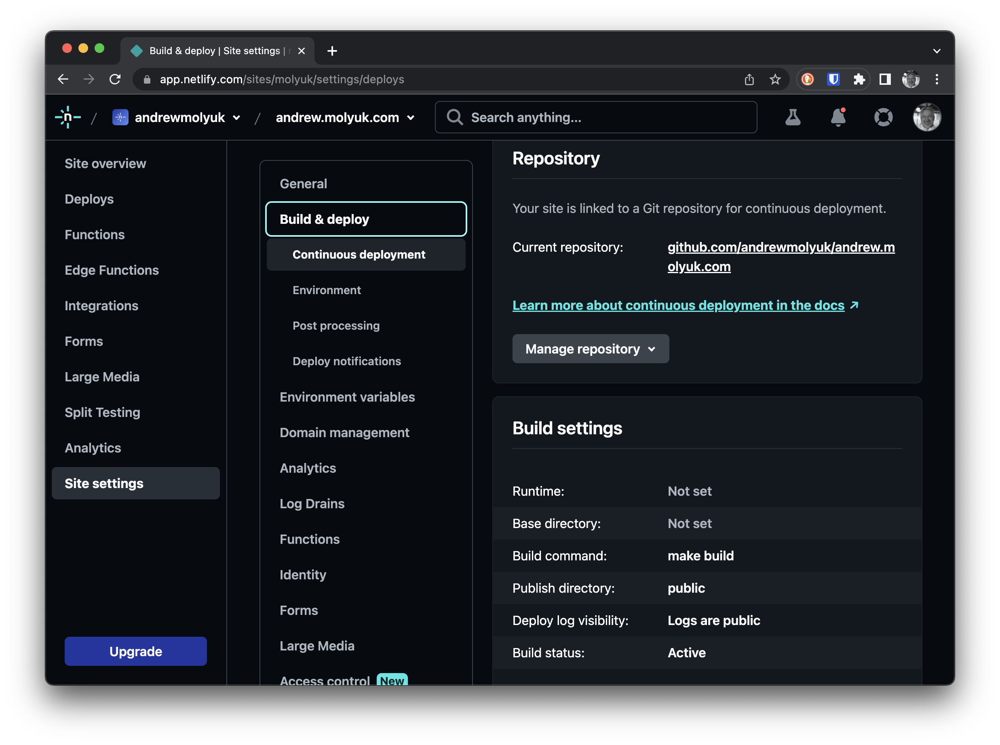
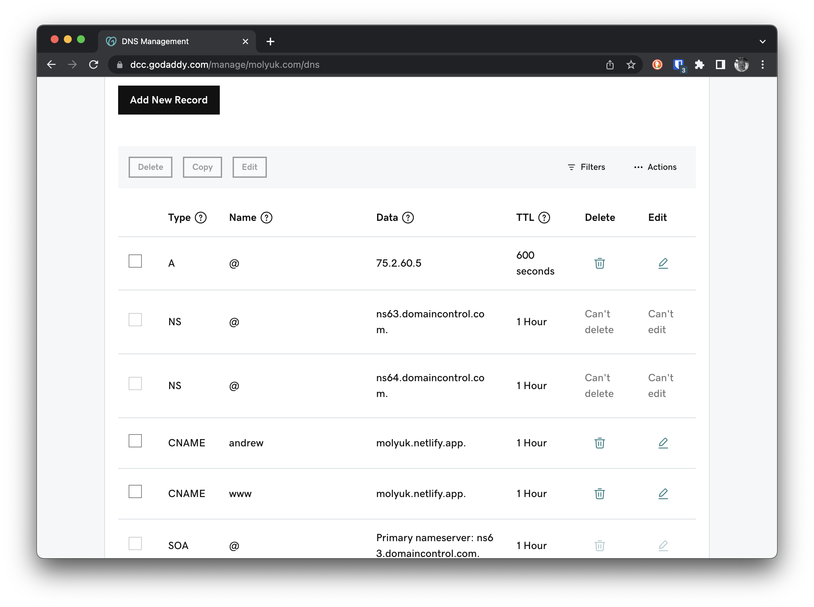
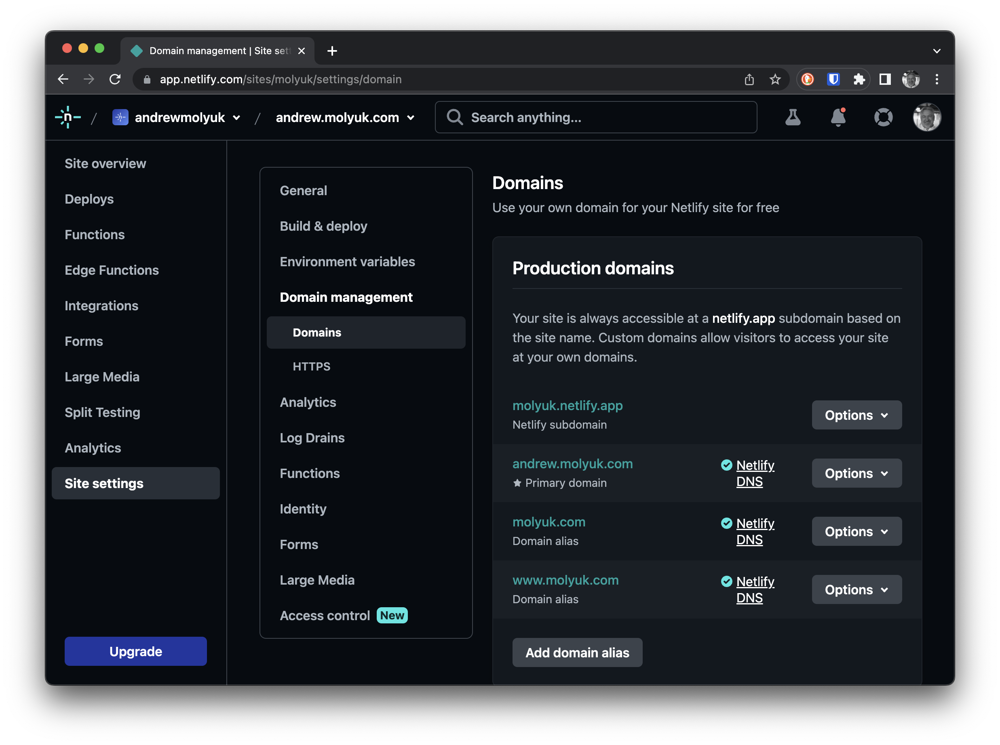
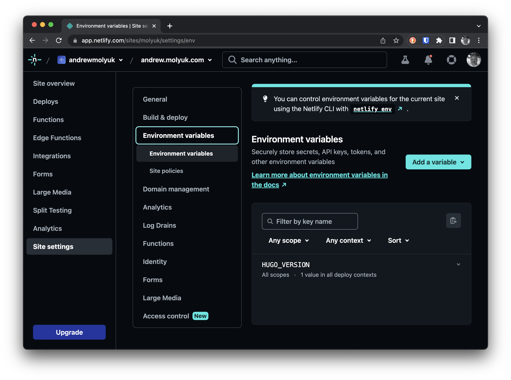

Я хотел, чтобы мой сайт был доступен под следующими именами: andrew.molyuk.com и molyuk.com и я не смог этого сделать на
Github Pages. Поэтому я решил использовать Netlify. Как оказалось, развернуть Hugo на Netlify очень просто. В этом посте
я расскажу вам, как я это сделал.

Для начала нам нужно создать аккаунт на Netlify. После этого нам нужно создать новый сайт. Нажмите на кнопку "Add a new
site" и продолжите согласно инструкциям. В принципе это все, что нам нужно сделать на Netlify, чтобы сайт стал публично
доступен.

Дополнительно я поправил команду сборки, чтобы Netlify мог собрать мой сайт. Теперь она выглядит следующим образом:

Чтобы мой сайт был доступен под следующими именами: andrew.molyuk.com и molyuk.com мне нужно было настроить DNS-записи.
Я зашел в аккаунт GoDaddy и добавил соответствующие DNS-записи. Вот как это выглядело:

Затем я добавил и верифицировал домены на Netlify. В итоге получилось следующее:

На этом все - теперь мой сайт доступен по адресам: andrew.molyuk.com и molyuk.com и я могу публиковать новые посты, не
заботясь о том, как их развернуть.

Есть небольшой нюанс, который я хотел бы упомянуть. Когда я строил свой сайт на Netlify, я столкнулся с тем, что моя
локальная версия Hugo отличается от той, что использовалась на Netlify. Это привело к падениям сборки. Я решил эту
проблему, добавив переменную окружения `HUGO_VERSION` в настройки Netlify. Теперь моя сборка работает как на локальной
машине, так и на Netlify.

## Заключение

Я надеюсь, что этот пост поможет вам развернуть ваш сайт на Netlify. Если у вас есть какие-либо вопросы, пожалуйста, не
стесняйтесь спрашивать в комментариях ниже. Спасибо за чтение!
