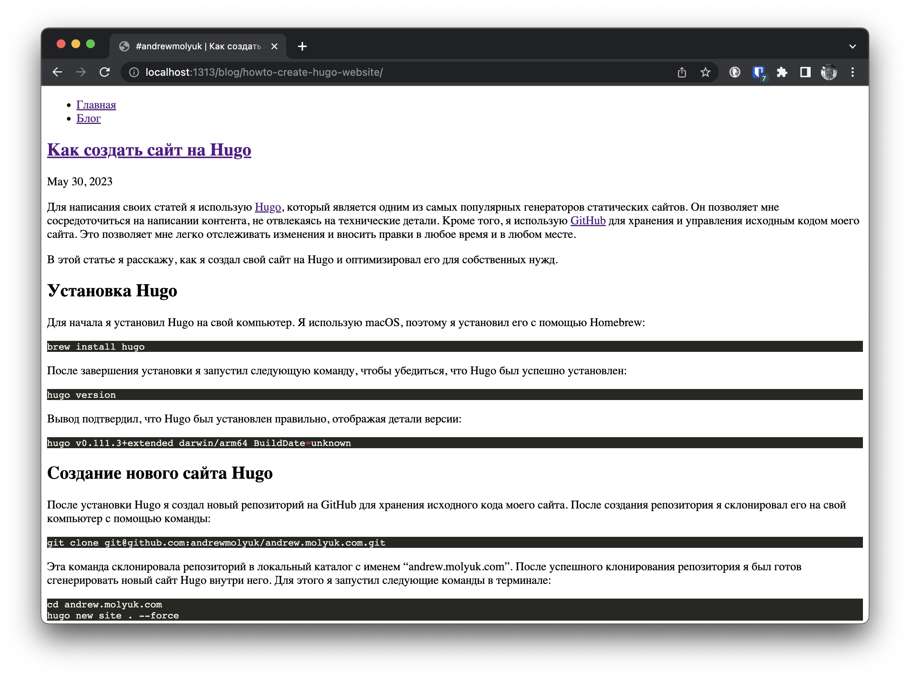

Для написания своих статей я использую [Hugo](https://gohugo.io/), который является одним из самых популярных
генераторов статических сайтов. Он позволяет мне сосредоточиться на написании контента, не отвлекаясь на технические
детали. Кроме того, я использую [GitHub](https://github.com/andrewmolyuk/andrew.molyuk.com) для хранения и управления
исходным кодом моего сайта. Это позволяет мне легко отслеживать изменения и вносить правки в любое время и в любом
месте.

В этой статье я расскажу, как я создал свой сайт на Hugo и оптимизировал его для собственных нужд.

## Установка Hugo

Для начала я установил Hugo на свой компьютер. Я использую macOS, поэтому я установил его с помощью Homebrew:

```shell
brew install hugo
```

После завершения установки я запустил следующую команду, чтобы убедиться, что Hugo был успешно установлен:

```shell
hugo version
```

Вывод подтвердил, что Hugo был установлен правильно, отображая детали версии:

```shell
hugo v0.111.3+extended darwin/arm64 BuildDate=unknown
```

## Создание нового сайта Hugo

После установки Hugo я создал новый репозиторий на GitHub для хранения исходного кода моего сайта. После создания
репозитория я склонировал его на свой компьютер с помощью команды:

```shell
git clone git@github.com:andrewmolyuk/andrew.molyuk.com.git
```

Эта команда склонировала репозиторий в локальный каталог с именем "andrew.molyuk.com". После успешного клонирования
репозитория я был готов сгенерировать новый сайт Hugo внутри него. Для этого я запустил следующие команды в терминале:

```shell
cd andrew.molyuk.com
hugo new site . --force
```

Выполнение этих команд создало новый сайт Hugo внутри каталога andrew.molyuk.com. Hugo автоматически создал необходимую
структуру каталогов и основные файлы для сайта. Поскольку каталог andrew.molyuk.com не был пуст из-за предыдущего
клонирования репозитория git, я использовал флаг --force, чтобы форсировать создание сайта Hugo в не пустом каталоге.

## Создание макета для сайта Hugo

Следующим шагом стало создание нового макета для сайта. Для этого я создал следующие файлы в директории layouts:

`/layouts/_default/baseof.html`: этот файл содержит базовый шаблон для всего сайта. Он определяет общую структуру и
элементы оформления, которые применяются на всех страницах.

`/layouts/index.html`: этот файл является шаблоном для главной страницы. Он определяет макет и содержимое основной
страницы моего сайта.

`/layouts/_default/single.html`: этот файл содержит шаблон по умолчанию для отдельных страниц в моем сайте на Hugo. Он
используется при отображении отдельных страниц контента, которые не соответствуют конкретному типу контента или макету.
Обычно он используется для страниц, таких как страница "О нас" и страница контактов.

`/layouts/blog/list.html`: этот файл содержит шаблон для страницы списка блога. Он определяет, как должен быть отображен
список статей блога.

`/layouts/blog/single.html`: этот файл определяет макет и структуру отдельной статьи блога.

`/layouts/404.html`: я создал этот файл как шаблон для страницы 404. Он определяет макет и содержимое, которые должны быть
отображены, когда пользователь обращается к несуществующей странице.

`/layouts/partials/head.html`: этот файл содержит шаблон для секции <head> каждой HTML-страницы. Он включает метаданные,
таблицы стилей CSS и любой другой код, который должен быть включен внутри тегов <head>.

`/layouts/partials/header.html`: этот файл является шаблоном для секции заголовка моего сайта. Обычно он включает логотип
сайта, навигационное меню и другие общие элементы, отображаемые в верхней части каждой страницы.

`/layouts/partials/footer.html`: этот файл содержит шаблон для секции подвала моего сайта. Обычно он включает информацию,
такую как авторские права, ссылки или любое другое содержимое, которое появляется в нижней части каждой страницы.

`/layouts/taxonomy/terms.html`: этот файл является шаблоном для страницы облака меток таксономии. Он определяет, как
должны быть отображены метки в виде облачной формы.

`/layouts/taxonomy/term.html`: я создал этот файл в качестве шаблона для страницы метки таксономии. Он определяет макет и
структуру страницы, на которой отображаются статьи блога, связанные с определенной меткой.

## config.toml

После создания нового макета я приступил к настройке файла config.toml. Я внес несколько изменений, чтобы настроить сайт
в соответствии с моими требованиями. Вот краткое описание изменений, которые я внес:

- Установил baseURL и canonicalURL в https://andrew.molyuk.com/.
- Указал languageCode как 'ru'.
- Определил заголовок, описание и ключевые слова для сайта.
- Включил enableRobotsTXT, чтобы разрешить поисковым роботам доступ к сайту.
- Включил enableSitemapXML, чтобы генерировать файл sitemap.xml для лучшей оптимизации поисковых систем.
- Настроил таксономию для меток блога, указав ее как blog/tags. Эта настройка таксономии позволяет мне применять метки
  только к контенту в разделе блога моего сайта. Такая конфигурация таксономии гарантирует, что метки применяются только
  к
  контенту, связанному с блогом, отделяя его от других разделов сайта.
- Включил RSS-ленты, указав форматы вывода для разных разделов сайта.
- Настроил формат вывода для RSS-ленты для генерации файла rss.xml вместо стандартного index.xml.

В итоге файл config.toml выглядел следующим образом:

```toml
baseURL = 'https://andrew.molyuk.com/'
canonicalURL = 'https://andrew.molyuk.com/'
languageCode = 'ru'
title = '#andrewmolyuk'
license = 'CC BY-SA 4.0'

enableRobotsTXT = true
enableSitemapXML = true

[author]
name = 'Andrew Molyuk'
email = 'andrew@molyuk.com'

[params]
description = 'Мой персональный сайт с блогом'
keywords = 'Технологии,Программирование,Советы'

[taxonomies]
tag = 'blog/tags'

[outputs]
page = ['HTML']
home = ['HTML']
section = ['HTML', 'RSS']
taxonomy = ['HTML']
term = ['HTML']

[outputFormats]
[outputFormats.RSS]
mediatype = "application/rss"
baseName = "rss"
```

## Добавление контента на сайт

После правильной настройки файла config.toml я приступил к добавлению контента на сайт. Я начал с создания нового файла
Markdown для блоговой статьи в директории content/blog с помощью следующей команды:

```shell
hugo new content/blog/getting-started.md
```

Затем я добавил метки таксономии во фронтматтер блоговой статьи, что позволило мне классифицировать статью. Вот пример,
как выглядел фронтматтер:

```shell
---
title: "Поехали!"
date: 2023-05-30T20:29:26+03:00
blog/tags: [ "сайт","блог","статьи","технологии","программирование","электроника","советы","уроки","личное развитие","проекты","open-source" ]
draft: false
---
```

## Запуск локального сайта Hugo

После настройки и добавления контента я был готов запустить сайт Hugo локально для предварительного просмотра изменений.
Запуск следующей команды в терминале запускал сервер Hugo и делал сайт доступным по адресу http://localhost:1313:

```shell
hugo server
```

Для упрощения процесса сборки я создал файл Makefile с двумя целями: build и dev. Цель build отвечала за сборку сайта, а
цель dev запускала сервер Hugo в режиме разработки. Вот как выглядел Makefile:

```makefile
.PHONY: build
build:
	hugo --gc --minify --cleanDestinationDir

.PHONY: dev
dev:
	hugo server --buildDrafts --buildFuture --disableFastRender --noHTTPCache  --navigateToChanged --templateMetricsHints --templateMetrics --verboseLog --verbose --watch --port 1313
```

В этих целях использовались различные флаги и опции для оптимизации процесса сборки и разработки. Запуск соответствующих
команд make build или make dev позволял легко собирать сайт или запускать сервер разработки Hugo.

```shell
make dev
```

После запуска сервера Hugo я мог получить доступ к сайту по адресу http://localhost:1313.



## Заключение

В этой статье я поделился своим личным опытом создания нового сайта на Hugo с нуля. Я предоставил пошаговое руководство
по процессу, включая настройку Hugo, настройку сайта, добавление контента и запуск сайта локально. Моя цель -
предоставить вам полезное руководство для начала работы над вашим собственным проектом на Hugo.

Я хочу подчеркнуть, что все исходные файлы, упомянутые в этой статье, доступны в
репозитории [GitHub](https://github.com/andrewmolyuk/andrew.molyuk.com), который вы можете исследовать и использовать в
качестве справочного материала для вашего собственного проекта на Hugo.

Спасибо за то, что уделили время чтению этой статьи. Я надеюсь, что она была полезной и информативной.
