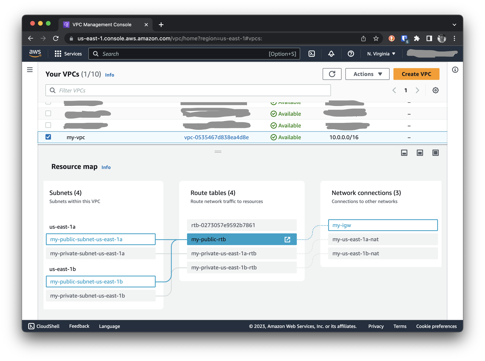

В который раз я сталкиваюсь с тем, что когда у нас в инфраструктуре начинается бардак, мы переносим все на Terraform, a
в последней итерации на AWS CDK, а вот затем начинается бардак по-настоящему. В итоге все боятся что-либо трогать,
чтобы совсем что-то не испортить и в итоге ничего не меняется. Снежный ком нарастает и становится все менее управляемым.
На каком-то этапе мне все это надоело я решил, что надо навести порядок, но наименее болезненным способом для
разработчиков.

Мы решили вернуться снова к Ansible для автоматизации небольших действий необходимых для управления нашей
инфраструктурой. В этом случае страх навредить оказался намного меньше, а читаемость и понимание кода возросли. В общем,
мне понравилось. Поэтому я решил начать делиться с вами своим опытом создания таких небольших плейбуков для управления
нашей инфраструктурой. В этой статье мы создадим VPC с помощью Ansible.

<!--more-->

## Подготовка

Для начала нам нужно установить Ansible. Как заядлый поклонник [Homebrew](https://brew.sh/) я установил Ansible с его
помощью:

```bash
brew install ansible
```

Помимо этого я также установил [ansible-lint](https://github.com/ansible/ansible-lint) для проверки синтаксиса и стиля в
наших плейбуках:

```bash
brew install ansible-lint
```

## Структура проекта

Для начала нам нужно создать структуру проекта. Я решил использовать следующую структуру:

```bash
.
├── requirements.yml
├── Makefile
├── group_vars
├── inventory
├── playbooks
│   └── create-vpc.yml
└── roles
    └── docker
        ├── tasks
        │   └── main.yml
        └── templates
```

### requirements.yml

Кроме того, я создал файл `requirements.yml`, где будут храниться все внешние роли и коллекции, которые мы будем
использовать в наших плейбуках. Для начала мы будем использовать только одну коллекцию, которая называется `amazon.aws`.
Она позволяет нам использовать модули Ansible для работы с AWS. Так выглядит наш файл `requirements.yml`:

```yaml
# This file is used by the Makefile to install the required roles from Ansible Galaxy.
collections:
  - name: amazon.aws
```

Для установки всех зависимостей нам нужно следующую команду:

```bash
ansible-galaxy install -r requirements.yml
```

### Makefile

Как всегда, я вынес все настройки в файл `Makefile`, чтобы не запоминать все эти команды. Вот как выглядит мой
файл `Makefile`:

```makefile
# Lint Ansible code
lint:
	ansible-lint
.PHONY : init

# Install Ansible Galaxy roles
init:
	ansible-galaxy install -r requirements.yml
.PHONY : init

# Create VPC
create-vpc:
	ansible-playbook playbooks/create-vpc.yml
.PHONY : create-vpc
```

Теперь мы можем установить все зависимости с помощью команды `make init`. А также мы можем запустить линтер с помощью
команды `make lint`. Ну и наконец, мы можем запустить наш плейбук с помощью команды `make create-vpc`.

### group_vars

Здесь мы будем хранить все переменные, которые будут использоваться в наших плейбуках. Я пока не выделил никаких
переменных для этого проекта, но в будущем мы будем использовать эту папку для хранения всех наших переменных.

### inventory

Здесь мы будем хранить наши файлы с хостами и группами хостов. В нашем случае у нас нет необходимости хранить здесь ни
одного файла, поэтому мы просто создадим пустую папку на будущее.

### playbooks

Я решил разделить наш проект на две части: `playbooks` и `roles`. В папке `playbooks` будут храниться наши плейбуки, а в
папке `roles` будут храниться роли, которые мы будем использовать в наших плейбуках.

### roles

В папке `roles` мы будем хранить все роли, которые мы будем использовать в наших плейбуках. Для примера я создал роль с
именем `docker`. Внутри этой роли я создал папку `tasks`, где будут храниться все таски, которые мы будем использовать в
этой роли. Также я создал папку `templates`, где будут храниться все шаблоны, которые мы будем использовать в этой роли.

## Создание плейбука

Мне было необходимо создать VPC с двумя публичными и двумя приватными подсетями. Для всех публичных подсетей должна быть
общая таблица маршрутизации, а для каждой приватной подсети должна быть своя таблица маршрутизации. Все публичные
подсети должны быть подключены к общему интернет шлюзу. Все приватные подсети должны быть подключены к своему NAT
Gateway.

Все эти настройки мы вынесем в наши переменные в `group_vars` в самом файле `create-vpc.yml`. В дальнейшем, возможно мы
перенесем их в отдельный файл, но пока что мы будем использовать только один файл для хранения всех переменных.

Теперь, когда мы подготовили все необходимое, мы можем приступить к созданию нашей VPC. Для начала нам нужно создать наш
плейбук `create-vpc.yml` в папке `playbooks`. Вот как он выглядит:

```yaml
---
- name: Create VPC with Subnets and NAT Gateways
  hosts: localhost
  gather_facts: false
  vars:
    name: "my"
    vpc_cidr_block: 10.0.0.0/16
    availability_zones:
      - us-east-1a
      - us-east-1b
    public_subnet_cidr_blocks:
      - 10.0.1.0/24
      - 10.0.2.0/24
    private_subnet_cidr_blocks:
      - 10.0.11.0/24
      - 10.0.12.0/24

  tasks:
    - name: Create VPC
      amazon.aws.ec2_vpc_net:
        name: "{{ name }}-vpc"
        cidr_block: "{{ vpc_cidr_block }}"
        tags:
          Name: {{ name }}-vpc
        state: present
      register: vpc

    - name: Create Public Subnets
      amazon.aws.ec2_vpc_subnet:
        vpc_id: "{{ vpc.vpc.id }}"
        cidr: "{{ item.1 }}"
        az: "{{ item.0 }}"
        tags:
          Name: {{ name }}-public-subnet-{{ item.0 }}
        state: present
      with_together:
        - "{{ availability_zones }}"
        - "{{ public_subnet_cidr_blocks }}"
      register: public_subnets

    - name: Create Private Subnets
      amazon.aws.ec2_vpc_subnet:
        vpc_id: "{{ vpc.vpc.id }}"
        cidr: "{{ item.1 }}"
        az: "{{ item.0 }}"
        tags:
          Name: {{ name }}-private-subnet-{{ item.0 }}
        state: present
      with_together:
        - "{{ availability_zones }}"
        - "{{ private_subnet_cidr_blocks }}"
      register: private_subnets

    - name: Create Internet Gateway
      amazon.aws.ec2_vpc_igw:
        vpc_id: "{{ vpc.vpc.id }}"
        tags:
          Name: {{ name }}-igw
        state: present
      register: internet_gateway

    - name: Create Public Route Table
      amazon.aws.ec2_vpc_route_table:
        vpc_id: "{{ vpc.vpc.id }}"
        subnets: "{{ public_subnets.results | map(attribute='subnet.id') | list }}"
        routes:
          - dest: 0.0.0.0/0
            gateway_id: "{{ internet_gateway.gateway_id }}"
        state: present
        tags:
          Name: {{ name }}-public-rtb
      register: public_route_table

    - name: Allocate Elastic IP Addresses
      amazon.aws.ec2_eip:
        tags:
          Name: {{ name }}-{{ item }}-eip
        release_on_disassociation: true
        state: present
      loop: "{{ availability_zones }}"
      register: elastic_ip_addresses

    - name: Create NAT Gateway
      amazon.aws.ec2_vpc_nat_gateway:
        state: present
        subnet_id: "{{ item.0.subnet.id }}"
        eip_address: "{{ item.1.public_ip }}"
        tags:
          Name: {{ name }}-{{ item.0.subnet.availability_zone }}-nat
        wait: true
      with_together:
        - "{{ private_subnets.results }}"
        - "{{ elastic_ip_addresses.results }}"
      register: nat_gateways
      failed_when: nat_gateways is failed

    - name: Create Private Route Tables per AZ
      amazon.aws.ec2_vpc_route_table:
        vpc_id: "{{ vpc.vpc.id }}"
        subnets: "{{ [ item.2.subnet.id ] }}"
        routes:
          - dest: 0.0.0.0/0
            gateway_id: "{{ item.1.nat_gateway_id }}"
        state: present
        tags:
          Name: "{{ name }}-private-{{ item.0 }}-rtb"
      with_together:
        - "{{ availability_zones }}"
        - "{{ nat_gateways.results }}"
        - "{{ private_subnets.results }}"
      register: private_route_tables

    - name: Print VPC Details
      ansible.builtin.debug:
        msg: |
          VPC ID: {{ vpc.vpc.id }}
          Public Subnets: {{ public_subnets.results | map(attribute='subnet.id') | list }}
          Private Subnets: {{ private_subnets.results | map(attribute='subnet.id') | list }}
          Internet Gateway: {{ internet_gateway.gateway_id }}
          Public Route Table: {{ public_route_table.route_table.id }}
          Elastic IP Addresses: {{ elastic_ip_addresses.results | map(attribute='allocation_id') | list }}
          NAT Gateways: {{ nat_gateways.results | map(attribute='nat_gateway_id') | list }}
          Private Route Tables: {{ private_route_tables.results | map(attribute='route_table.id') | list }}
```

Вы можете разбить плейбук на несколько файлов. Например, вы можете вынести создание VPC в отдельный файл, создание
подсетей в отдельный файл, и т.д. Но я хотел оставить плейбук цельным, чтобы его было легче читать и понимать.

Если вы хотите узнать больше о том, как разбить плейбук на несколько файлов, вы можете
прочитать [эту статью](https://www.digitalocean.com/community/tutorials/how-to-use-ansible-roles-to-abstract-your-infrastructure-environment).

Я не думаю, что есть смысл в пояснении каждой строки плейбука, потому что он довольно простой. Но я хочу обратить ваше
внимание на модули, которые я использую:

`ec2_vpc_net` - этот модуль создает VPC и возвращает его ID, CIDR и теги. Я сохраняю эти данные в переменной `vpc`.

`ec2_vpc_subnet` - этот модуль создает подсети и возвращает их ID, CIDR, AZ и теги. Я сохраняю эти данные в
переменных `public_subnets` и `private_subnets`.

`ec2_vpc_igw` - этот модуль создает Internet Gateway и возвращает его ID и теги. Я сохраняю эти данные в
переменной `internet_gateway`.

`ec2_vpc_route_table` - этот модуль создает маршрутные таблицы и возвращает их ID и теги. Я сохраняю эти данные в
переменных `public_route_table` и `private_route_tables`.

`ec2_eip` - этот модуль создает Elastic IP Addresses и возвращает их ID и теги. Я сохраняю эти данные в
переменной `elastic_ip_addresses`.

`ec2_vpc_nat_gateway` этот модуль создает NAT Gateway и возвращает его ID и теги. Я сохраняю эти данные в
переменной `nat_gateways`.

`debug` - модуль для вывода информации о созданных ресурсах.

## Запуск плейбука

Для запуска плейбука нам необходимо настроить доступ к AWS. Для этого мы можем использовать переменные окружения или
файлы конфигурации. Я предпочитаю использовать файлы конфигурации, потому что они более безопасны. Для этого нам нужно
запустить команду `aws configure` и ввести данные доступа к AWS.

```shell
aws configure

AWS Access Key ID [None]: accesskey
AWS Secret Access Key [None]: secretkey
Default region name [None]: us-east-1
Default output format [None]: json
```

Теперь, когда у нас есть доступ к AWS, мы можем запустить плейбук. Для этого нам нужно выполнить следующую команду:

```shell
make create-vpc
```

После того как плейбук отработает, вы увидите вновь созданную VPC и все ее ресурсы в AWS.



## Удаление VPC

Для удаления VPC нам нужно удалить все ресурсы, которые мы создали. В первую очередь, нам нужно удалить все NAT
Gateways, затем адреса Elastic IP и в конце саму VPC со всеми ее ресурсами. Вы можете написать плейбук для удаления VPC
или же удалить все ресурсы вручную.

## Заключение

В этой статье мы рассмотрели, как создать VPC в AWS с помощью Ansible. Мы создали VPC, подсети, Internet Gateway, NAT
Gateways, маршрутные таблицы и адреса Elastic IP. Теперь вы можете использовать этот плейбук для создания VPC в AWS. Я
надеюсь, что эта статья была полезной для вас. Если у вас есть какие-либо вопросы или предложения, пожалуйста, напишите
их в комментариях ниже.
