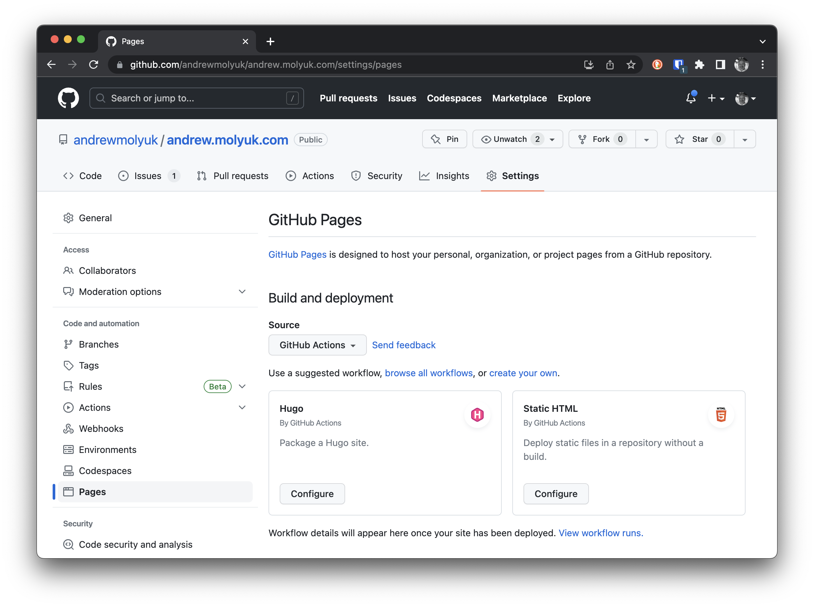
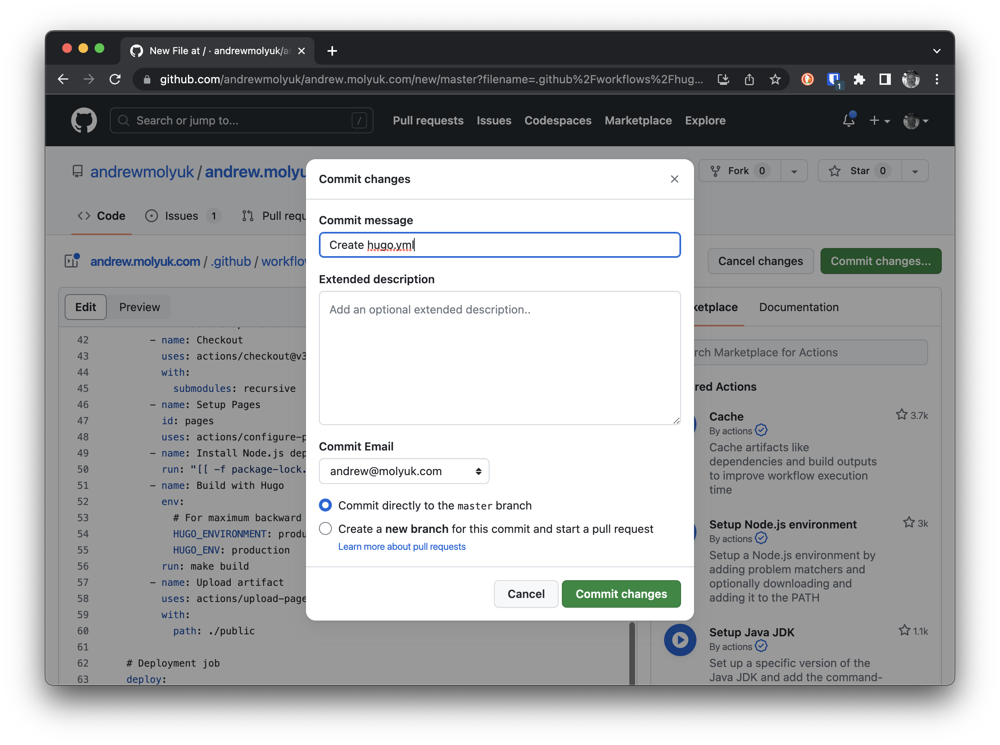
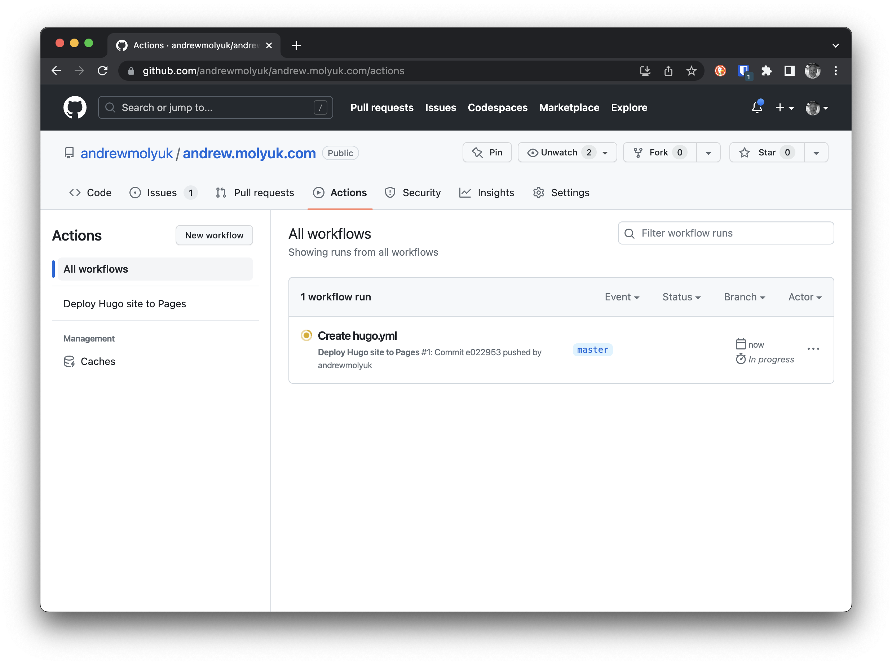
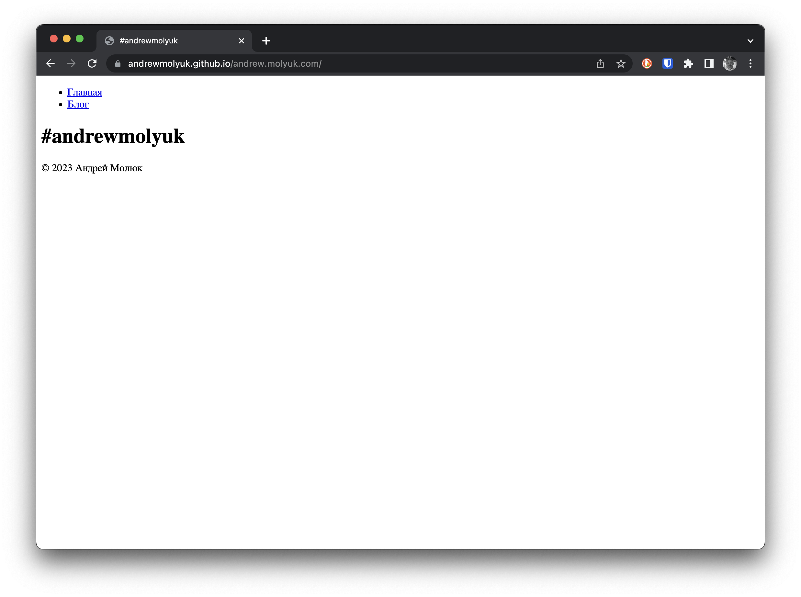
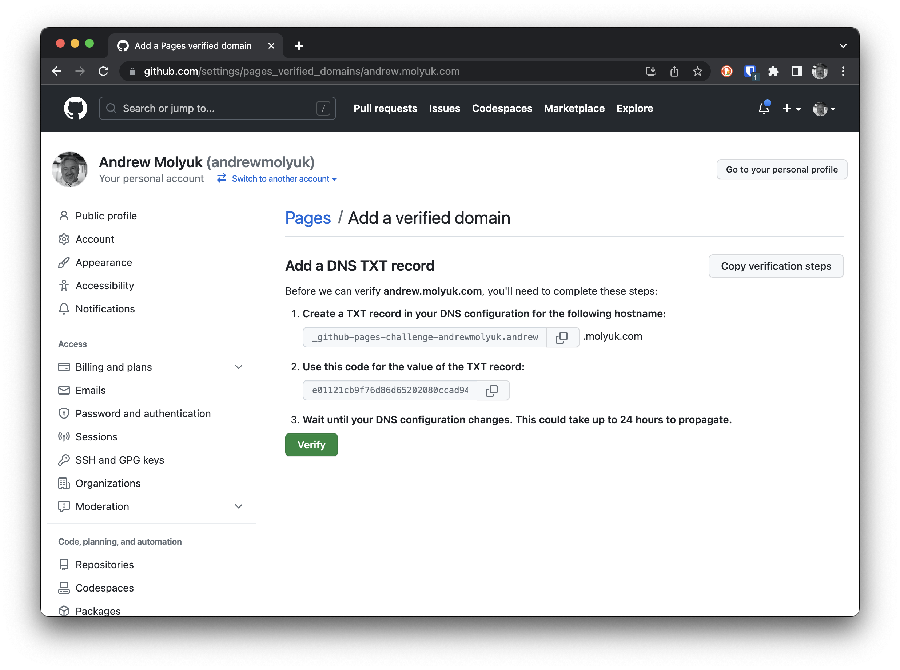
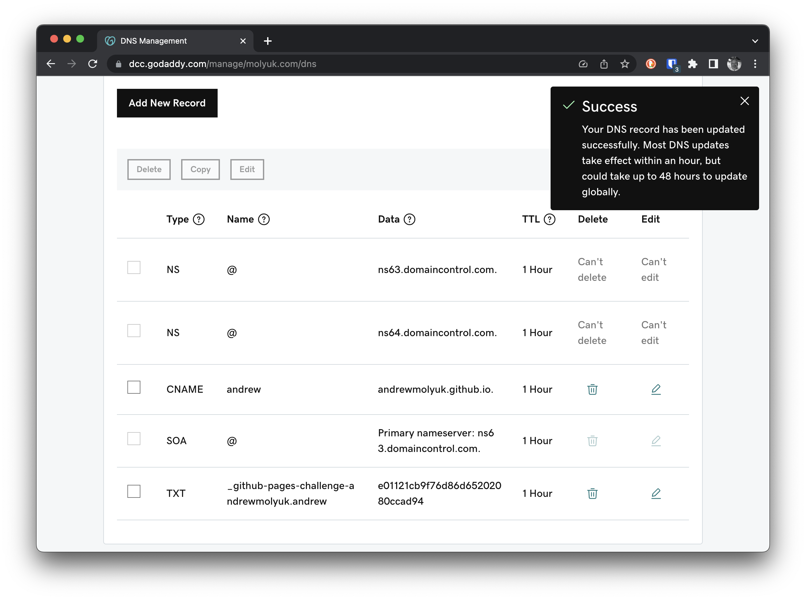
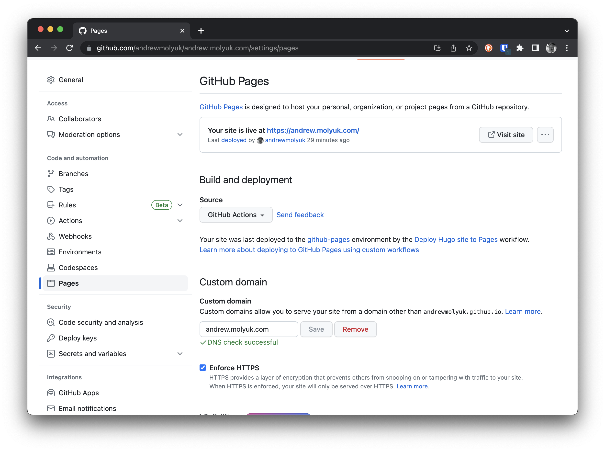

Для того чтобы сайт был доступен в интернете имеет смысл его опубликовать на каком-либо хостинге. Таким хостингом может
быть Netlify, GitHub Pages, GitLab Pages, Amazon S3, Google Cloud Storage, Firebase Hosting, Surge.sh, Aerobatic,
CloudCannon, Neocities, GitBook, Heroku, Rackspace, OpenShift, CloudFront, Fastly, и другие.

Я решил опубликовать свой сайт на GitHub Pages потому как это бесплатно и удобно. Кроме того раз уж я использую GitHub
для хранения и управления исходным кодом моего сайта, то это будет логичным решением. В этой статье я расскажу что нужно
сделать, чтобы опубликовать сайт на GitHub Pages с помощью GitHub Actions.

<!--more-->

## Создание workflow

В GitHub Actions есть такое понятие как workflow. Workflow это набор задач, которые выполняются при определенных
условиях и при определенных событиях. Например, workflow может быть запущен при каждом push в репозиторий или при
создании pull request. Workflow может быть запущен вручную или по расписанию. Workflow может быть запущен при
определенных событиях внутри репозитория, например, при создании нового issue или при создании нового комментария.

Для того чтобы опубликовать сайт на GitHub Pages, нам нужно создать workflow, который будет запускаться при каждом push
в репозиторий. Можно создать workflow вручную, но в нашем случае это не нужно, так как GitHub предоставляет нам шаблон
для работы с Hugo. Для того чтобы использовать этот шаблон, нужно перейти в раздел Settings в нашем репозитории и
выбрать Pages в меню слева. Далее нужно в Source выбрать GithHub Actions и нажать на кнопку Configure для
шаблона Hugo.



В общем случае, этот шаблон можно сразу использовать, но в нашем случае нам нужно сделать некоторые изменения. Для того
чтобы не дублировать команду построения сайта, надо заменить следующие строки:

```yaml
run: |
  hugo \
    --minify \
    --baseURL "${{ steps.pages.outputs.base_url }}/"
```

на следующие:

```yaml
run: make build
```

В этом случае команда `make build` будет запускаться с теми же параметрами, что и в оригинальном шаблоне на нашем
локальном компьютере. Далее нажимаем на кнопку `Commit changes...` и затем на кнопку `Commit changes` во всплывающем
окне.



После этого GitHub создаст файл `.github/workflows/hugo.yml` в нашем репозитории. Этот файл и есть наш workflow. В
дальнейшем мы можем изменять этот файл, чтобы добавить новые задачи или изменить условия запуска workflow.

С этого момента при каждом push в репозиторий будет запускаться workflow, который будет собирать сайт и публиковать его
в GitHub Pages. Мы можем переключиться на вкладку Actions в нашем репозитории и посмотреть на результаты работы
workflow.



Как только workflow успешно завершится, мы можем перейти на вкладку Settings и затем выбрать Pages в нашем репозитории и
увидеть, что сайт опубликован и также увидеть ссылку на него. Нажав на эту ссылку, мы увидим наш сайт.



## Добавление домена

По умолчанию сайт будет доступен по адресу `https://andrewmolyuk.github.io/andrew.molyuk.com/`. Но мы можем добавить
свой домен и сделать сайт доступным по адресу `https://andrew.molyuk.com/`.

Для этого нам нужно подтвердить, что домен принадлежит нам и верифицировать его на GitHub. Для этого нужно добавить в
раздел Settings нашего аккаунта, а не репозитория. Это важный момент. Затем Выбрать в левом меню Pages и нажать на
кнопку `Add domain`.



Далее идем к регистратору доменов и добавляем DNS запись CNAME для домена `andrew.molyuk.com`, которая будет указывать
на `andrewmolyuk.github.io` и верификационную DNS запись TXT для домена `_github-challenge-andrew.molyuk.com`.



Теперь нам нужно подождать некоторое время, пока DNS записи обновятся. После этого мы можем вернуться в раздел Settings
аккаунта и верифицировать домен. Далее возвращаемся в раздел Settings репозитория и добавляем домен. Обязательно
поставьте галочку `Enforce HTTPS` - это позволит использовать HTTPS протокол для доступа к сайту.



После этого сайт будет доступен по адресу `https://andrew.molyuk.com/`.

## Добавление Google Analytics 4

Для того чтобы добавить Google Analytics 4 в Hugo сайт, нужно добавить следующий код в
файл `layouts/partials/head.html`:

```html
{{ if .Site.IsServer }}
{{ template "_internal/google_analytics.html" . }}
{{ end }}
```

Далее нужно добавить следующие параметры в файл `config.toml`:

```toml
googleAnalytics = 'G-J9DSCZ2KKH'
```

После этого нужно запустить команду `make build` и затем запушить изменения в репозиторий. После этого Google Analytics
4 будет работать на сайте.

## Заключение

В этой статье мы рассмотрели, как опубликовать Hugo вебсайт на GitHub Pages и как добавить к нему домен. Также мы
добавили Google Analytics 4 для отслеживания посещений сайта. Все исходные коды можно найти в
[GitHub репозитории](https://github.com/andrewmolyuk/andrew.molyuk.com) этого сайта. 
