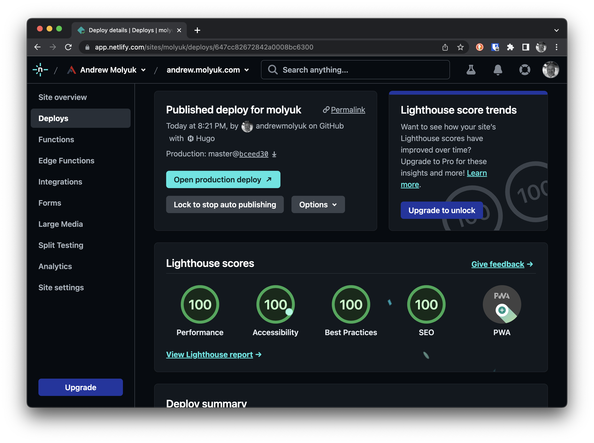

В последнее время все чаще и чаще можно услышать о производительности веб-сайтов. Это не удивительно, так как в наше
время люди стали более требовательными к скорости загрузки сайтов. Поэтому важно следить за производительностью своего
сайта. Сделать это можно с помощью Lighthouse.

LightHouse - это инструмент для анализа производительности веб-страниц и в Netlify есть возможность запускать Lighthouse
для каждого деплоя. Это очень удобно, так как позволяет отслеживать изменения в производительности сайта. По умолчанию
Lighthouse запускается только для домашней страницы. Но что делать если вам необходимо проверить производительность
других страниц? В этой статье я расскажу как это сделать.

<!--more-->

## Настройка Netlify

Для начала нужно настроить Netlify. Для этого перейдите в раздел `Build & deploy` и нажмите на кнопку `Edit settings` в
разделе `Post processing`. В открывшемся окне включите опцию `Run Lighthouse tests after every deploy` и нажмите на
кнопку `Save`. Теперь Lighthouse будет запускаться после каждого деплоя.



## Настройка Lighthouse

Нам необходимо установить Lighthouse как локальный пакет. Для этого выполните следующую команду:

```bash
npm install @netlify/plugin-lighthouse
```

Нет необходимости устанавливать Lighthouse как глобальный пакет. Netlify будет использовать локальную версию, которую мы
можем настроить через файл `netlify.toml`.

Для того чтобы Lighthouse запускался не только для домашней страницы, нужно создать файл `netlify.toml` в корне проекта.
В этом файле нужно указать список страниц, для которых нужно запускать Lighthouse. В моем случае это выглядит так:

```toml
[[plugins]]
package = "@netlify/plugin-lighthouse"

[plugins.inputs.settings]
locale = "ru"

[plugins.inputs.thresholds]
performance = 0.9
accessibility = 0.9
best-practices = 0.9
seo = 0.9
pwa = 0.7

[[plugins.inputs.audits]]
path = "index.html"

[[plugins.inputs.audits]]
path = "blog/index.html"

[[plugins.inputs.audits]]
path = "projects/index.html"

[[plugins.inputs.audits]]
path = "blog/tags/hugo/index.html"

[[plugins.inputs.audits]]
path = "blog/howto-deploy-hugo-to-netlify/index.html"
```

В этом файле я указал список страниц, которые нужно проверять. Также я указал локаль `ru` и пороговые значения для всех
метрик. По умолчанию пороговые значения равны `1.0`, но я понизил их до `0.9`, чтобы не получать ошибки при деплое. Я
также существенно понизил порог для PWA метрики, так как мой сайт не является PWA и я не собираюсь тратить время на
повышение этой метрики. Возможно в будущем я сделаю свой сайт PWA, но пока что нет.

Также можно задеплоить результаты каждой проверки Lighthouse на собственно сайт. Для этого нужно добавить следующий

```toml
[[plugins.inputs.audits]]
path = "index.html"
output_path = "lighthouse.html"
```

В этом случае результаты проверки будут доступны по адресу `https://andrew.molyuk.com/lighthouse.html`. Но я не стал
этого делать, так как я не хочу загромождать сайт лишними страницами. Вместо этого я использую Netlify панель
управления, которая позволяет смотреть на результаты проверки.


Хотелось бы отметить, что я намеренно настраивал Netlify посредством UI, а не через `netlify.toml`. Это позволяет мне не
хранить в репозитории информацию о настройках деплоя с точки зрения безопасности.

## Заключение

В этой статье я рассказал как настроить Lighthouse для Netlify. Теперь вы можете проверять производительность своего
сайта после каждого деплоя. Это очень удобно, так как позволяет отслеживать изменения в производительности сайта. Я
также описал как нам можно настроить Lighthouse для проверки не только домашней страницы, но и других страниц. Теперь у
вас есть возможность проверять производительность любой страницы вашего сайта.

Я надеюсь, что эта статья была полезна и вы сможете применить ее на практике. Не стесняйтесь задавать вопросы в
комментариях. Я постараюсь ответить на них как можно скорее.
