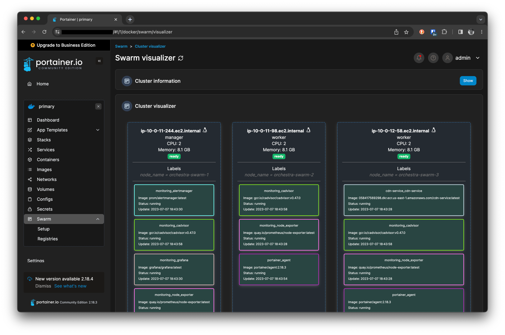
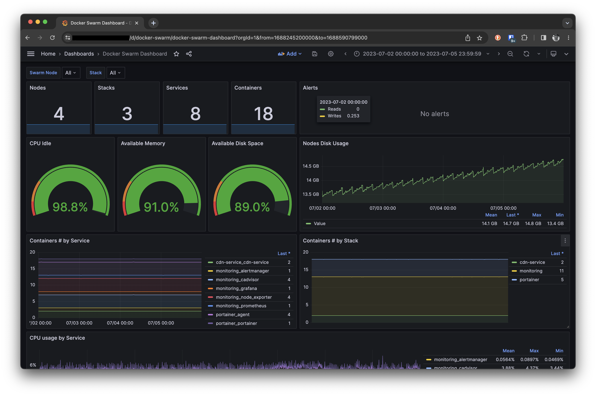
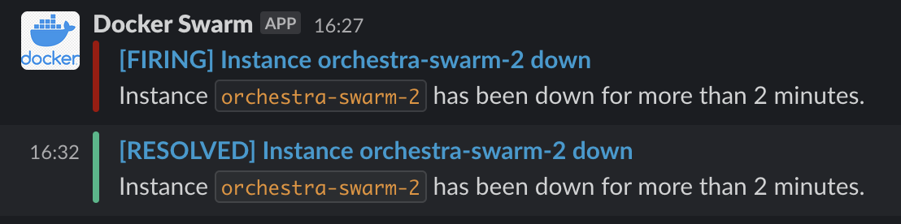

Масштабирование приложений и доступность сервисов - это важная часть любого проекта и на каком-то этапе развития
проекта это становится необходимостью. Kubernetes - это один из инструментов, который может ответить на все вопросы, но
за это придется заплатить свою цену - поддержка и настройка. Но в итоге, это того стоит для больших проектов. А что
делать малым проектам? Чтобы не стрелять из пушки по воробьям мы решили использовать Docker Swarm. Он не требует таких
больших затрат на поддержку и настройку, но при этом позволяет масштабировать приложения и обеспечивать доступность
сервисов на высоком уровне. В этой статье я расскажу как можно запустить кластер Docker Swarm и настроить мониторинг с
помощью Prometheus и Grafana с оповещениями в Slack.

<!--more-->

Материала будет много и потому хотелось разбить его на несколько частей. Но вспомнив как я сам искал информацию по этой
теме, то решил собрать все в одной статье. Поэтому сразу предупреждаю, что статья будет длинной и по большей части
техническая. Поехали!

## Что такое Docker Swarm?

Docker Swarm - это инструмент для оркестрации docker контейнеров. Он тесно интегрирован с Docker Engine и позволяет
начать работу без установки дополнительного софта. Как и любой другой оркестратор, Docker Swarm позволяет масштабировать
приложения и обеспечивать доступность сервисов.

Для начала определимся с терминологией. В Docker Swarm есть несколько основных понятий:

* **Node** - это сервер, на котором запущен Docker Engine. В кластере Docker Swarm может быть несколько нод. Ноды могут
  быть как виртуальными, так и физическими серверами. Нода, на которой инициализируется кластер Docker Swarm, называется
  менеджером. Ноды, которые присоединяются к кластеру, называются рабочими нодами. На менеджере хранится состояние
  кластера и он отвечает за его управление. Рабочие ноды выполняют задачи, которые им назначает менеджер. Рабочие ноды
  не хранят состояние кластера.

* **Stack** - это набор сервисов, которые логически объединены вместе. Например, это может группа сервисов, которые
  отвечают за работу определенной части приложения, например мониторинг. Stack описывается в файле docker-compose.yml и
  запускается с помощью команды `docker stack deploy`. В кластере Docker Swarm может быть несколько Stack'ов.

* **Service** - это описание одного сервиса в Stack'е. Например, это может быть описание веб-сервера или базы данных.
  Service описывается в файле docker-compose.yml и запускается с помощью команды `docker service create`. В Stack'е
  может быть несколько Service'ов. Мы никогда не запускаем Service напрямую, только в Stack'е.

* **Task** - это запущенный контейнер. Каждый Service запускает один или несколько Task'ов. Каждый Task запускается
  на одной из рабочих нод, включенных в кластер. Если какая-то нода выходит из строя, то менеджер запускает Task на
  другой ноде. Таким образом, сервис всегда доступен. Этот термин сильно не прижился и мы по прежнему используем слово
  контейнер.

## Установка Docker Swarm и настройка кластера

Для начала нам нужно установить Docker Engine на сервера, которые будут входить в кластер. В нашем случае это будет 4
EC2 инстанса в AWS. Для установки Docker Engine на EC2 инстансах можно воспользоваться следующими командами:

```bash
sudo yum update
sudo yum install docker
sudo usermod -a -G docker ec2-user
newgrp docker

wget https://github.com/docker/compose/releases/latest/download/docker-compose-$(uname -s)-$(uname -m) 
sudo mv docker-compose-$(uname -s)-$(uname -m) /usr/local/bin/docker-compose
sudo chmod -v +x /usr/local/bin/docker-compose

sudo systemctl enable docker.service
sudo systemctl start docker.service

sudo systemctl status docker.service
docker version
docker-compose version
``` 

После установки Docker Engine на всех серверах, мы можем начать настройку кластера Docker Swarm. Для этого на одном из
серверов нужно выполнить следующую команду:

```bash
docker swarm init
```

После выполнения этой команды, мы получим вывод в котором будет указана комманда для присоединения других серверов к
кластеру. Например, такой:

```bash
docker swarm join --token SWMTKN-1-0ormsemzi3mkkflc0gbexkypl0i8bnh3k823sc7xi8mkell2yv-7jv9yij8nrxqm1roolckhpuv0 10.0.128.109:2377
```

Эту команду нужно выполнить на всех остальных серверах. После этого мы можем проверить состояние кластера с помощью
команды:

```bash
docker node ls
```

В выводе этой команды мы увидим список всех нод в кластере.

Если ноды не видят друг друга, то нам необходимо открыть порты `2377`, `7946` и `4789` в AWS Security Group.

На этом настройка кластера Docker Swarm завершена. Теперь мы можем запускать на нем Stack'и и Service'ы.

## Установка Portainer

Portainer - это веб-интерфейс для управления Docker. Он позволяет управлять Docker Swarm, запускать Stack'и и Service'ы,
масштабировать сервисы и многое другое.

Portainer требует доступа к Docker API через сокет, поэтому убедитесь, что у вас включен TCP Socket в Docker Engine.

Portainer можно запустить как обычный контейнер, но мы будем запускать его в виде Stack'а. Для этого зайдем на
менеджерскую ноду и выполним следующие команды:

```bash
curl -L https://downloads.portainer.io/ce2-18/portainer-agent-stack.yml -o portainer-agent-stack.yml
docker stack deploy --with-registry-auth --compose-file portainer-agent-stack.yml portainer
```

Эти команды скачают файл docker-compose.yml с описанием Stack'а и запустят его.

Особое внимание обратите на опцию `--with-registry-auth`. Она нужна для того чтобы Portainer мог работать с приватными
репозиториями Docker и пробрасывать токен аутентификации в рабочие ноды. Нам это не понадобится потому что мы не будем
деплоить сервисы через Portainer.

Так как у нас машинка в приватной сети, то у нас нет доступа к портам Portainer. Для того чтобы получить доступ снаружи
мы используем SSM Agent с помощью команды:

```bash
aws ssm start-session --target i-0123456789abcdef --document-name AWS-StartPortForwardingSessionToRemoteHost --parameters '{"portNumber":["9443"], "localPortNumber":["9443"]}'
```

После этого Portainer будет доступен по адресу `https://127.0.0.1:9443`. При первом запуске Portainer попросит нас
ввести
пароль для администратора. После этого мы попадем на главную страницу Portainer. Из всех доступных нам опций мне больше
всего нравится раздел визуализации. В нем мы можем увидеть все ноды кластера, запущенные на них контейнеры и их
состояние.



Но пока у нас их там не так много, поэтому мы перейдем к следующему шагу.

## Установка Prometheus, Grafana и настройка нотификаций в Slack

Prometheus - это система мониторинга и трейсинга. Она позволяет собирать метрики с различных сервисов и визуализировать
их в Grafana. Prometheus состоит из нескольких компонентов: сервера, экспортеров и клиента. Сервер собирает метрики с
экспортеров и хранит их в базе данных. Клиенты собирают метрики с приложений и отправляют их на сервер. Экспортеры
собирают метрики с различных сервисов и отправляют их на сервер.

Мы будем использовать Prometheus для сбора метрик с Docker Swarm и отправки их в Grafana. Для сбора метрик мы
используем `cadvisor` и `node-exporter`. `cadvisor` собирает метрики с контейнеров, а `node-exporter` с нод. Для
нотификаций в Slack мы будем использовать `alertmanager`.

Prometheus можно запустить как обычный контейнер, но мы будем запускать его в виде Stack'а. Для этого зайдем на
менеджерскую ноду и создадим `monitoring.yml` файл со следующим содержимым:

```yaml
version: "3.8"

services:
  prometheus:
    image: prom/prometheus:latest
    ports:
      - "9090:9090"
    networks:
      - monitoring
    volumes:
      - /var/run/docker.sock:/var/run/docker.sock:ro
      - /etc/prometheus:/etc/prometheus
      - prometheus-data:/prometheus
    user: root # only user root can use the docker socket
    command: "--web.enable-lifecycle --config.file=/etc/prometheus/prometheus.yml"
    deploy:
      mode: replicated
      replicas: 1
      placement:
        constraints: [ node.role == manager ]
    depends_on:
      - cadvisor
      - node_exporter
      - alertmanager

  grafana:
    image: grafana/grafana:latest
    ports:
      - "3000:3000"
    networks:
      - monitoring
    volumes:
      - grafana-data:/var/lib/grafana
    deploy:
      mode: replicated
      replicas: 1
      placement:
        constraints: [ node.role == manager ]
    depends_on:
      - prometheus

  node_exporter:
    image: quay.io/prometheus/node-exporter:latest
    ports:
      - target: 9100
        published: 9100
        protocol: tcp
        mode: host
    command:
      - "--path.rootfs=/host"
    networks:
      - monitoring
    volumes:
      - '/:/host:ro,rslave'
    deploy:
      mode: global

  cadvisor:
    image: gcr.io/cadvisor/cadvisor:v0.47.0
    volumes:
      - /:/rootfs:ro
      - /var/run:/var/run:rw
      - /sys:/sys:ro
      - /var/lib/docker/:/var/lib/docker:ro
    ports:
      - target: 8080
        published: 8080
        protocol: tcp
        mode: host
    networks:
      - monitoring
    deploy:
      mode: global

  alertmanager:
    image: prom/alertmanager:latest
    command:
      - '--config.file=/etc/alertmanager/alertmanager.yml'
      - '--storage.path=/alertmanager'
    ports:
      - "9093:9093"
    networks:
      - monitoring
    volumes:
      - /etc/alertmanager:/etc/alertmanager
      - alertmanager-data:/alertmanager
    deploy:
      replicas: 1
      placement:
        constraints:
          - node.role==manager

volumes:
  prometheus-data:
    name: prometheus-data
    driver: local
  grafana-data:
    name: grafana-data
    driver: local
  alertmanager-data:
    name: alertmanager-data
    driver: local

networks:
  monitoring:
    driver: overlay
```

Этот файл описывает Stack, который состоит из нескольких сервисов: `prometheus`, `grafana`, `node_exporter`, `cadvisor`
и `alertmanager`. Для каждого сервиса мы указываем образ, порты, сети, команду запуска, количество реплик и т.д. Для
сервисов `prometheus`, `grafana`  и `alertmanager` мы указываем, что они должен запускаться только на менеджерской ноде.
Для сервисов `node_exporter` и `cadvisor` мы указываем, что он должен запускаться на всех нодах.

Для экспортеров нет необходимости в особой конфигурации, а вот для `prometheus` и `alertmanager` нужно создать
конфигурационные файлы. Для `prometheus` мы создадим файл `/etc/prometheus/prometheus.yml` со следующим содержимым:

```yaml
# Prometheus global config
global:
  scrape_interval: 15s # Set the scrape interval to every 15 seconds. Default is every 1 minute.
  evaluation_interval: 15s # Evaluate rules every 15 seconds. The default is every 1 minute.

scrape_configs:
  - job_name: 'prometheus'
    static_configs:
      - targets: [ 'localhost:9090' ]

  - job_name: 'alertmanager'
    static_configs:
      - targets: [ 'alertmanager:9093' ]

  - job_name: 'docker'
    dockerswarm_sd_configs:
      - host: unix:///var/run/docker.sock
        role: nodes
    relabel_configs:
      # Fetch metrics on port 9323.
      - source_labels: [ __meta_dockerswarm_node_address ]
        target_label: __address__
        replacement: $1:9323
      # Set labels
      - source_labels: [ __meta_dockerswarm_node_label_node_name ]
        target_label: node_name
      - source_labels: [ __meta_dockerswarm_node_hostname ]
        target_label: instance

  - job_name: 'node'
    dockerswarm_sd_configs:
      - host: unix:///var/run/docker.sock
        role: nodes
    relabel_configs:
      # Fetch metrics on port 8080.
      - source_labels: [ __meta_dockerswarm_node_address ]
        target_label: __address__
        replacement: $1:9100
      # Set labels
      - source_labels: [ __meta_dockerswarm_node_label_node_name ]
        target_label: node_name
      - source_labels: [ __meta_dockerswarm_node_hostname ]
        target_label: instance

  - job_name: 'cadvisor'
    dockerswarm_sd_configs:
      - host: unix:///var/run/docker.sock
        role: nodes
    relabel_configs:
      # Fetch metrics on port 8080.
      - source_labels: [ __meta_dockerswarm_node_address ]
        target_label: __address__
        replacement: $1:8080
      # Set labels
      - source_labels: [ __meta_dockerswarm_node_label_node_name ]
        target_label: node_name
      - source_labels: [ __meta_dockerswarm_node_hostname ]
        target_label: instance

# Alertmanager configuration
rule_files:
  - "alerts.yml"

alerting:
  alertmanagers:
    - scheme: http
      static_configs:
        - targets:
            - "alertmanager:9093"
```

Обратите внимание, что мы указываем, что при описании экспортеров мы прописываем метки `node_name` и `instance`. Это
нужно для последующей визуализации в Grafana. Кроме того мы указываем файл с правилами `alerts.yml`, который мы создадим
в той же папке с таким содержимым:

```yaml
groups:
  - name: Docker Swarm Alerts
    rules:

      # Alert for any instance that is unreachable for >2 minutes.
      - alert: service_down
        expr: sum(up{node_name!=""}) by(node_name) / count(up{node_name!=""}) by(node_name) != 1
        for: 2m
        annotations:
          title: "Instance {{ $labels.node_name }} down"
          description: "Instance `{{ $labels.node_name }}` has been down for more than 2 minutes."

      # Alert for any instance that is over 60% load for >2 minute.
      - alert: node_high_load
        expr: sum(node_load1) by(node_name) / count(node_cpu_seconds_total{mode="idle"}) by (node_name) > 0.6
        for: 2m
        annotations:
          title: "Instance {{ $labels.node_name }} under high load"
          description: "Instance `{{ $labels.node_name }}` is over 60% load more than 2 minutes."
```

В этом файле мы описываем правила, по которым будут срабатывать алерты. В данном случае мы описываем два правила - если
нода падает и если нода под нагрузкой. При этом мы указываем, что алерт должен срабатывать, если условие выполняется
более 2 минут.

Это базовые правила, которые можно доработать под свои нужды. Добавляйте новые правила, меняйте существующие. Все это мы
сможем делать в дальнейшем.

Для `alertmanager` мы создадим файл `/etc/alertmanager/alertmanager.yml` со следующим содержимым:

```yaml
global:
  resolve_timeout: 1m

route:
  receiver: 'slack'
  group_by: [ '...' ]
  repeat_interval: 1h

receivers:
  - name: 'slack'
    slack_configs:
      - api_url: 'https://hooks.slack.com/services/T012345678/ABCDABCD123/0123456789abcd0123456789abcd'
        channel: '#alerts'
        send_resolved: true
        username: 'Docker Swarm'
        title: |-
          [{{ .Status | toUpper }}] {{ range .Alerts -}}{{ .Annotations.title }}{{ end }}
        text: >-
          {{ range .Alerts -}}{{ .Annotations.description }}{{ end }}
```

У нас небольшой кластер, поэтому нет смысла в группировке алертов. В случае большого кластера, можно группировать алерты
по нодам или типам сервисов. Мы отключили группировку алертов, чтобы получать уведомления о каждом алерте отдельно.

Api url для Slack можно получить в настройках интеграции Incoming WebHooks.

Для сбора метрик с самого `docker` мы будем использовать его родные метрики. Для этого нам нужно добавить
в `/etc/docker/daemon.json` следующее:

```json
{
  "dns": [
    "1.1.1.1",
    "8.8.8.8",
    "8.8.4.4"
  ],
  "metrics-addr": "0.0.0.0:9323"
}
```

DNS сервера можно указать свои. Мы указали DNS от Cloudflare и Google. Их также можно прописать в `/etc/resolv.conf` или
же в `docker-compose.yml` в секции `dns`.

После этого мы можем запустить сервисы с помощью команды:

```bash
docker stack deploy -c monitoring.yml monitoring
```

После этого мы можем зайти в Grafana и добавить Prometheus как источник данных. После этого можно начинать создавать
визуализации и дашборды.

В нашем случае мы будем использовать кастомизированные дашборды для Docker Swarm, которые можно найти в интернете.
Например, вот так наш выглядит дашборд для Docker Swarm:



Можете скачать дашборд [здесь](dashboard-swarm.json).

Алерты в Slack будут выглядеть примерно так:



Вы можете их кастомизировать под себя. Мне краткие уведомления в Slack нравятся больше, чем длинные.

Для более удобного доступа к Grafana можно использовать ELB. Для этого нужно создать ELB и добавить в него все ноды из
кластера. Не забудьте создать правило в Security Group для входящего трафика в ELB. Не давайте публичный доступ к своим
инфраструктурным сервисам. В нашем случае, мы разрешили доступ только с наших офисов и домашних адресов.

## Установка сервиса из AWS ECR

Мы используем GitHUb Actions для сборки и публикации Docker образов в AWS ECR. Выглядит это примерно так:

```yaml
name: Deploy

on:
  push:
    branches:
      - "main"

jobs:
  docker:
    runs-on: ubuntu-latest
    env:
      DOCKER_IMAGE: 1234567890.dkr.ecr.us-east-1.amazonaws.com/service
      AWS_ACCESS_KEY_ID: ${{ secrets.AWS_ACCESS_KEY_ID }}
      AWS_SECRET_ACCESS_KEY: ${{ secrets.AWS_SECRET_ACCESS_KEY }}
      AWS_REGION: us-east-1

    steps:
      - name: Checkout source code
        uses: actions/checkout@v3

      - name: Login to Amazon ECR
        id: login-ecr
        uses: aws-actions/amazon-ecr-login@v1

      - name: Build and push to Amazon ECR
        id: docker_build
        uses: docker/build-push-action@v4
        with:
          file: ./Dockerfile
          context: .
          push: true
          build-args: |
            BUILD_REF=${{ github.sha }}
            BUILD_DATE=$(date -u +"%Y-%m-%dT%H:%M:%SZ")
          tags: ${{ env.DOCKER_IMAGE }}:latest,${{ env.DOCKER_IMAGE }}:${{ github.sha }}

      - name: Read docker-compose file
        id: file
        uses: jaywcjlove/github-action-read-file@main
        with:
          path: "docker-compose.prod.yml"

      - name: Update service in Docker Swarm
        uses: debugger24/action-aws-ssm-run-command@v1
        id: ssm
        with:
          aws-region: us-east-1
          instance-ids: ${{ vars.INSTANCE_ID }}
          working-directory: /home/ec2-user
          commands: |
            echo '${{ steps.file.outputs.content }}' > service.yml
            aws ecr get-login-password --region us-east-1 | docker login --username AWS --password-stdin 1234567890.dkr.ecr.us-east-1.amazonaws.com
            docker stack deploy --with-registry-auth --compose-file service.yml service

      - name: Get the SSM command id
        run: echo "The Command id is ${{ steps.ssm.outputs.command-id }}"
```

Вот здесь параметр `--with-registry-auth` очень важен. Без него Docker Swarm не сможет залить образы на рабочие ноды
кластера.

## Заключение

В этой статье мы рассмотрели, как можно запустить Docker Swarm кластер, настроить мониторинг с помощью Prometheus и
Grafana. Мы также настроили нотификации в Slack. Все это позволяет нам оперативно реагировать на проблемы в кластере и
устранять их. Если у вас есть вопросы, то можете задать их в комментариях под этой статьей.
