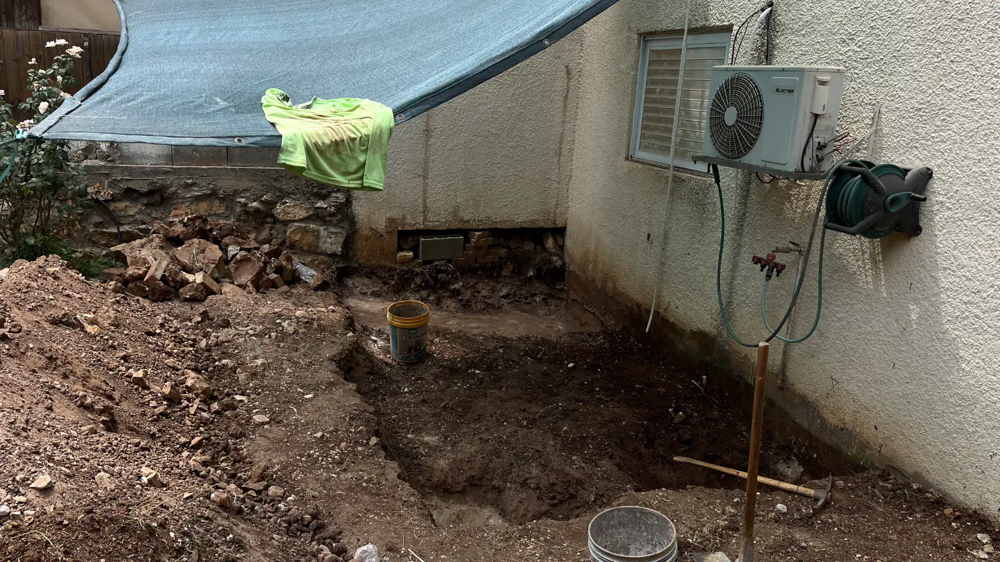

Утро бодрое! Я бы хотел извиниться за длительное молчание потому что я был занят строительством комнаты для
собственного офиса. Так исторически сложилось, что иногда я работаю из дома и мне нужно было место, где я мог бы
полностью отдаваться любимому делу и не отвлекаться на бытовые вопросы. Поэтому я решил построить себе комнату для офиса
в своем доме. Длилось все это около двух месяцев и я был занят практически каждый день с утра до вечера. Но теперь все
это позади и я могу снова заняться своими проектами.

<!--more-->

Помимо офиса жена захотела чтобы у нас был застекленный балкон, где можно было бы выращивать цветы, поэтому офис внизу
стал основой для балкона сверху. Вот как это выглядело в самом начале:

Для строительства комнаты нам необходимо было нанять архитектора, который бы разработал проект и согласовал его с
городскими властями, а затем разработал бы план строительства совместно с инженером. Когда все разрешения были получены
и мы получили разрешение на строительство, мы начали строительство. На переднем дворе у нас не было места для
разрешенного строительства, поэтому мы решили построить комнату на заднем дворе. Для работы мы решили остановиться на
арабском подрядчике и, забегая вперед, были очень довольны результатом.

В самом начале наши планы немного были нарушены скалой, на которой стоял дом и это потребовало некоторых изменений в
изначальном плане, но инженер все утвердил и мы начали заливать фундамент. Он получился немного больше, так как
углубиться в скалу не получилось и под столбы необходимо было сделать основание. Приехала громадная дура и миксер с
бетоном и процесс пошел. Для проверки качества заливки берется проба бетона во время заливки. Приехали ребята и прям из
миксера взяли пробу.

К утру бетон застыл достаточно для того, чтобы начать строить стены. Запустили сначала ответственного четырехлапого
приемщика работ и он сразу же принялся за дело.

Затем пришли рабочие и начали строить стены из кирпича. Все прошло достаточно быстро и уже к вечеру стены были почти
готовы.

На следующий день рабочие приехали и начали строить опалубку для столбов и потом заливать бетон. Один столб мы оставили
для проверки качества бетона на следующий день.

После заливки столбов занялись построением опалубки для потолка. В самой комнате понаставили столбов и на них постелили
деревянные балки. Затем проложили арматуру. После этого история с миксером повторилась и мы залили потолок. Бонусом к
потолку залили участок между строящейся комнатой и перголой.

Когда бетон застыл на балконе подняли стены из кирпича и последний слой проложили арматурой и залили бетоном. Появились
очертания комнаты и балкона.

Сняли внешнюю опалубку, пересадили все розы на передний дворик и разбросали землю по двору.

Один из кондиционеров оказался на проходе, а второй и вовсе в комнате, а потому мы их перенесли на крышу, запрятав все
трубы в короба. Стены решили не штробить. Жара стояла ужасная и рабочие работали с утра до вечера. Но все было сделано в
течение дня. Ребята отработали на ура. Все было сделано качественно и быстро.

На балкон и окно положили плиты и затем занялись черновой штукатуркой.

А затем и финишной. Пришел плиточник и постелил плитку в комнате и на проходе.

Прыгать на балкон через окно надоело и пришло время прорубить дверь. Экспансия на втором этаже началась.

Балкон загерметизировали битумом и застелили плиткой. После этого подключили электрику и воду. Начался этап финишной
отделки. Поставили двери и окна. Стены покрасили в легкий песочно-желтый цвет. Скорее всего так покрасим весь дом.

Когда все было закончено, под контролем ответственного четырехлапого приемщика работ, мы начали наполнять комнату
мебелью и техникой.

Это не конечный вариант, но уже можно работать. Пока что все вещи, которые были в гостевой комнате, где я работал, мы
просто перенесли в новый офис и в дальнейшем будем их расставлять по местам.

Вот такая история. Я очень доволен результатом. Комната получилась очень уютной и теплой. Я провел в ней уже несколько
вечеров и мне очень нравится. Я думаю, что это было хорошее вложение денег и времени. Я надеюсь, что Вам понравилась эта
история и Вы с удовольствием прочитали ее.

Теперь на повестке дня застекление балкона и постройка перголы над проходом в комнату.

До скорой встречи!
