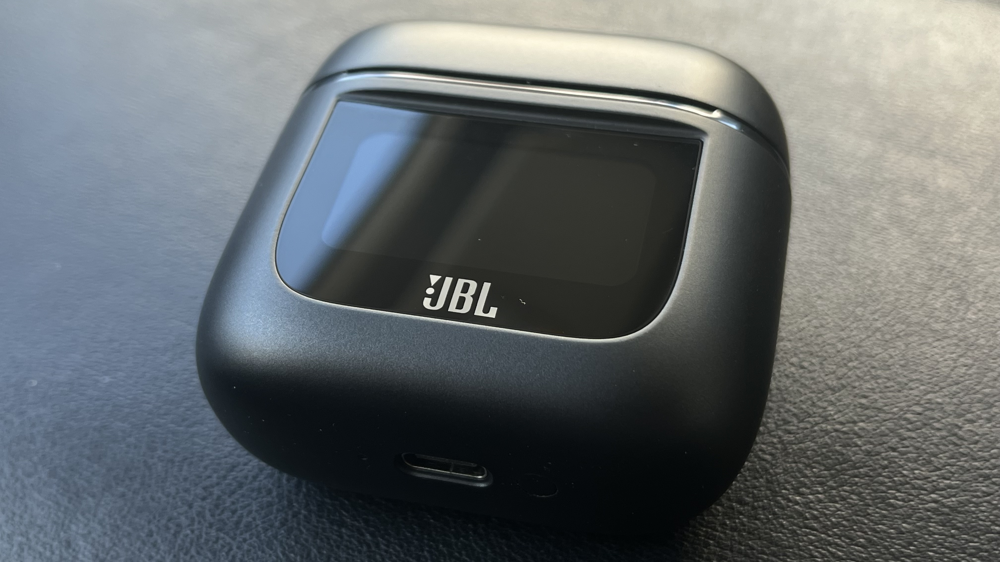
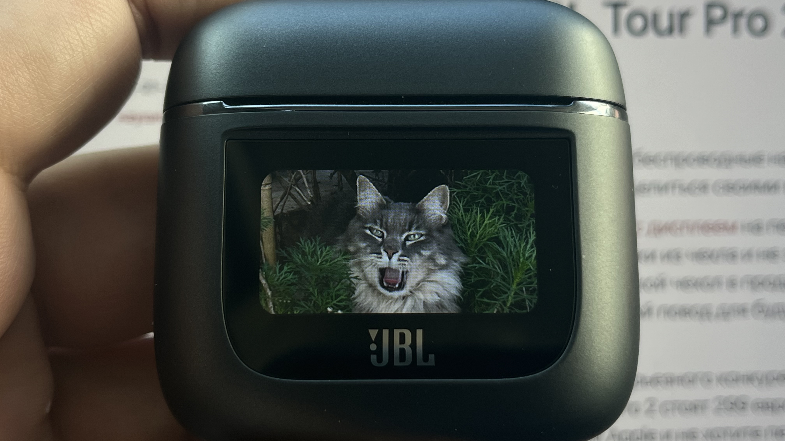
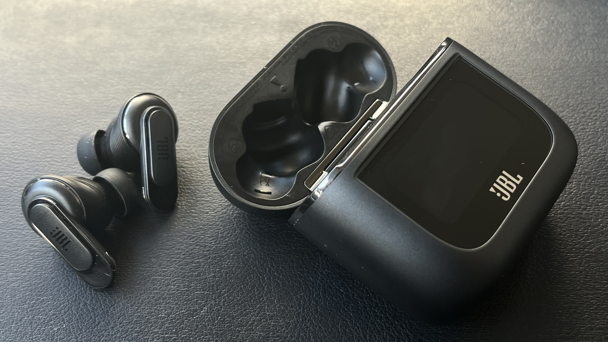

В этом обзоре я расскажу о наушниках Jbl Tour Pro 2. Это беспроводные наушники с активным шумоподавлением. Я их получил
в подарок от Снегурочки на Новый год и решил поделиться своими впечатлениями. Поехали!

Менее года назад Apple
запатентовала [чехол для AirPods с дисплеем](https://www.patentlyapple.com/2023/03/apple-invents-an-airpods-case-with-a-frontside-touch-display-allowing-users-to-interact-with-apps-for-music-apple-tv-maps.html
) на передней панели. Это позволит пользователям взаимодействовать с приложениями, не доставая наушники из чехла и не
запуская приложение на телефоне. Это все еще только патент, но вполне возможно, что в будущем мы увидим такой чехол в
продаже. Пока же Apple занимается патентованием того, что другие производители уже выпустили на рынок и это явный повод
для будущих судебных разбирательств. Один из ярких представителей - это чехол для наушников Jbl Tour Pro 2.

<!--more-->

В целом, наушники JBL Tour Pro 2 представляют собой серьезного конкурента продукции Apple, особенно с учетом цены. В
Европе они доступны по цене 249 евро, в то время как AirPods Pro 2 стоят 299 евро на официальном сайте Apple и также 249
евро у других продавцов. Если вы не являетесь преданным фанатом Apple и не хотите переплачивать за бренд, то JBL Tour
Pro 2 являются прекрасным выбором.

Давайте обратим внимание на кейс, который сразу привлекает внимание. Большой сенсорный экран, размещенный точно
посередине, задняя сторона с площадкой для беспроводной зарядки, USB-C порт и кнопка сброса настроек снизу. Матовый
пластик делает кейс тяжелым и внушительным, но его толщина может создавать неудобства при ношении в кармане джинсов.
Однако для сумки или крупного кармана это не проблема.

Наушники JBL обеспечивают надежную посадку в ушах и имеют менее скользкую поверхность, что снижает риск случайного
выпадения. Вместо множества аксессуаров, предлагаемых для AirPods Pro 2, JBL Tour Pro 2 также предоставляют
разнообразные чехлы, хотя я не думаю, что кейс JBL не требует особой защиты, за исключением, возможно, защиты экрана.

Экран кейса играет ключевую роль, предоставляя удобное управление воспроизведением музыки, настройкой режимов
шумоподавления и многим другим. С его помощью можно даже украсить экран фотографиями любимых котиков. Яркий и
контрастный, он обеспечивает удобство использования даже при солнечном свете. Экран JBL становится ключевой
особенностью, выделяющей эти наушники на фоне других, и предоставляет уникальные возможности управления функциями без
необходимости извлечения смартфона.

Экран прекрасно дополняет наушники, обеспечивая свободу от необходимости извлекать телефон и придаёт дополнительную
тактильность. Переключение треков становится особенным, поскольку оно осуществляется без касания наушников или экрана
смартфона. Некоторые могут считать это лишним, но экранчик здесь не просто деталь, а вполне уместное дополнение,
особенно если вы привыкли постоянно вращать и вертеть кейсом.

Одной из замечательных черт этих наушников являются грамотные настройки энергосбережения. При этом наушники уходят в
спящий режим или полностью отключаются, что позволяет им и кейсу сохранять заряд практически не теряя его в фоновом
режиме. Даже после недельного пребывания в кейсе потеря заряда составляет лишь 5-10 процентов. Глубокий спящий режим
обеспечивает мгновенную готовность к работе и подключение к смартфону, хотя не так быстро, как у AirPods Pro 2.

Приложение для наушников предлагает внушительное количество настроек и режимов, что выделяет эти наушники среди многих
TWS-моделей. При первом подключении наушники предлагают определить наилучшую посадку, настроить шумоподавление и выбрать
голосового помощника. Обновление программного обеспечения может занять до 10 минут, после чего можно перейти к настройке
шумоподавления, адаптивности к окружающему шуму и компенсации утечки звука.

Наушники предоставляют возможность полного подавления шума или пропуска окружающих звуков, включая режим TalkThru,
который слегка приглушает все звуки вокруг, усиливая только речь человека рядом с вами. Эквалайзер предлагает пять
готовых пресетов и возможность создать персональный профиль. Все эти функции подчеркивают уникальность и персонализацию
данных наушников, делая их привлекательными для широкого спектра пользователей.

Полученные результаты тюнинга звука наушников сохраняются, предоставляя возможность быстрого переключения между
настройками до и после тюнинга. Пользователь может не только сравнить звучание наушников после настройки, но и усилить
собственный голос при общении в голосовых чатах, настроить прозрачность окружающего звука, ограничить максимальную
громкость или опробовать фирменное пространственное аудио, добавляющее объем всем трекам.

Отдельно следует выделить режим тишины — SilentNow, который отключает наушники от телефона, создавая тихое пространство
с активным шумоподавлением. Этот режим также предоставляет возможность настройки длительности перерыва и включения
будильника через определенное время, что может быть полезно для коротких вздремываний в поездке.

Среди других настроек пользователь может переназначать управление обоих наушников, включать или отключать автоматическое
воспроизведение при снятии или надевании их, выполнять поиск наушников и использовать умную оптимизацию под
воспроизведение музыки или просмотр видео с минимальной задержкой.

Однако на первом плане остается звук. JBL Tour Pro 2 поражают качеством звука, который они предоставляют сразу после
распаковки, без дополнительных настроек. Звучание наушников яркое и сочное, и хотя по умолчанию может показаться, что им
не хватает плотности и баса, шумоподавление быстро корректирует этот недостаток. Возможность настройки через эквалайзеры
предоставляет пользователю полный контроль над звуковым опытом. Время работы наушников, функции быстрой зарядки и
беспроводной зарядки, а также защита от брызг делают их весьма привлекательными.

Хотя выбор между JBL Tour Pro 2 и AirPods Pro 2 может зависеть от индивидуальных предпочтений, JBL Tour Pro 2 впечатляют
не только качеством звука, но и долгим временем работы и разнообразием настроек, что делает их привлекательным выбором
для тех, кто ценит качество звучания и функциональность.

## Выводы

В итоге, JBL Tour Pro 2 представляют собой впечатляющий выбор в мире беспроводных наушников. Они не только конкурируют
успешно с продукцией Apple, но и предлагают уникальные функциональные особенности. Умный кейс с сенсорным экраном,
обилие настроек в приложении, продуманный режим тишины, и, конечно же, впечатляющее качество звука делают их
замечательным выбором для тех, кто ценит инновации и высокую производительность.

Эргономичный дизайн наушников, позволяющий носить их безопасно и комфортно, а также разнообразие чехлов для кейса
подчеркивают внимание к деталям. Долгое время автономной работы и быстрая зарядка обеспечивают удобство использования в
течение всего дня. При этом, невзирая на богатство функций, управление наушниками остается интуитивно понятным.

JBL Tour Pro 2 демонстрируют, что инновации и качественный звук могут сочетаться в одном продукте. С широким
функционалом, который они предлагают, эти наушники обещают удовлетворить запросы как опытных меломанов, так и обычных
пользователей, и устанавливают высокую планку в мире беспроводных наушников.
