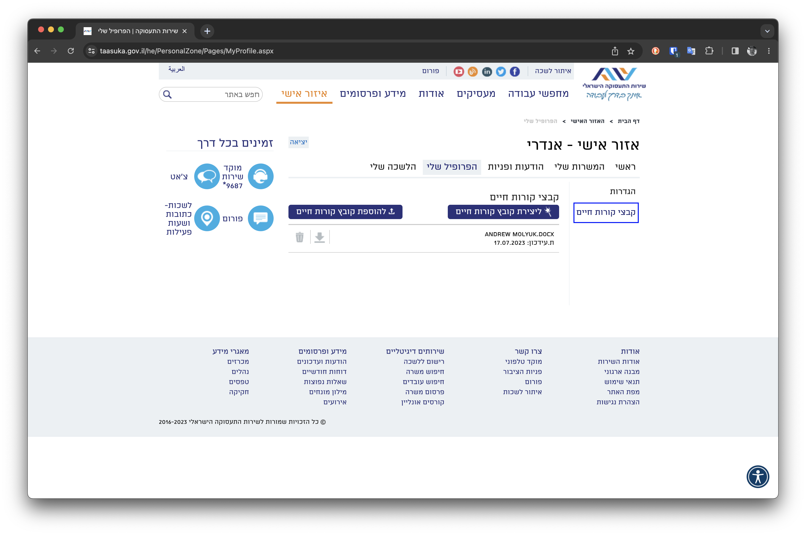
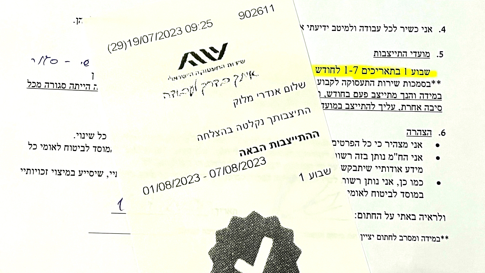

Каждый раз, когда ты оказываешься без работы, ты попадаешь в состояние стресса. Что делать и куда бежать я опишу шаг за
шагом по мере прохождения всего этапа до получения выходного пособия. Естественно, что вся эта информация имеет
отношение только к проживающим в Израиле. Но в целом, я думаю, что в любой стране есть что-то подобное.

В конце прошлого месяца совет директоров принял решение закрыть компанию. Мы получили официальное уведомление о
приглашении на `шимуа`. Это такая предварительная встреча, на которой ты можешь оспорить решение компании об увольнении.
Закон обязывает проводить такие встречи, но работник может отказаться и сразу продолжить процесс увольнения. Я не стал
настаивать на встрече, так как понимал, что это не имеет смысла. В итоге теряется рабочие день-два и если вам очень
нужны деньги, то имеет смысл дождаться `шимуа` и там уже получить увольнительное письмо. Но мне имело смысл получить его
сразу и не затягивать процесс на лишний месяц, так как иначе я бы смог начать все процессы только через месяц.

<!--more-->

На сайте Битуах Леуми есть куча информации на русском языке о том, что делать, когда ты уволен. Но я решил все-таки все
это описать, так как вся информация разбросана по разным страницам и не всегда понятно, что именно нужно делать. В этой
статье я опишу все шаги, которые нужно сделать, чтобы получить пособие по безработице.

Информация на сайте Битуах Леуми:

https://www.btl.gov.il/RussianHomePage/Benefits_ru/avtala_ru/Pages/default.aspx

## Лишкат Таасука

Необходимые документы для регистрации в Лишкат Таасука:

```shell
- теудат зеут
- увольнительное письмо
- CV
```

Получив увольнительное письмо, я зарегистрировался
на [сайте Лишкат Таасука](https://www.taasuka.gov.il/he/PersonalZone/Pages/jobseekerslogin.aspx?Source=/he/PersonalZone/).
Это такая биржа труда, которая помогает в поиске работы и посылает на всевозможные курсы повышения квалификации, если
что-то подходит под ваш профиль. Без регистрации и посещения Лишкат Таасука вы не сможете получать пособие по
безработице. Поэтому это первый шаг, который нужно сделать. На сайте есть много полезной информации, но она на иврите.
Если вы не знаете иврит, то вам придется пользоваться переводчиком. Но в целом, все понятно и без переводчика.

Вот собственно адрес сайта:

https://www.taasuka.gov.il/he/PersonalZone/Pages/jobseekerslogin.aspx?Source=/he/PersonalZone/

Идем на [сайт](https://www.taasuka.gov.il/he/PersonalZone/Pages/jobseekerslogin.aspx?Source=/he/PersonalZone/) и
регистрируемся. Все заполняется легко и просто, нужно указать свои данные, почту, получить логин и пароль. Подтверждаем
почту и теперь нужно зарегистрироваться как безработный, а также залить свой CV на сайт. Причем принимают они его
только в Word формате.



На этом наши действия на сайте закончились. Теперь смотрим на расписание их офиса по месту жительства и идем туда в день
и время приема посетителей. Это государственная организация и они работают только в рабочие дни и только в рабочее
время. Отношение к посетителям у них очень хорошее, но очереди могут быть большими. Поэтому лучше приходить пораньше.

На приеме вам нужно будет показать письмо об увольнении и подписать бумагу о том когда нужно будет приходить отмечаться.
Периодичность зависит от возраста: до 50 лет необходимо отмечаться каждую неделю, но в моем случае с меня потребовали
приходить раз в месяц. После этого сняли отпечаток пальца, чтобы отмечаться без очереди и участия служащих. Все это
заняло около 15 минут.

Отмечаться необходимо, потому как если вы не придете, то вам могут отказать в пособии по безработице. Поэтому не
забывайте об этом. При выходе из офиса я отметился в первый раз, получил бумажку с датой следующего прихода и пошел
домой.



После этого отметку можно будет видеть на сайте Лишкат Таасука. В случае, если вы нашли работу, то нужно будет отметить
это на сайте и прийти в офис, чтобы закрыть дело. Если вы не отметились, то вам могут не заплатить часть пособия по
безработице.

## Битуах Леуми

Необходимые документы для регистрации в Битуах Леуми:

```shell
- теудат зеут
- увольнительное письмо
- Последние 8 зарплатных тлушей
- Бумага от работодателя (אישור מעסיק על תקופת העסקה ושכר)
```

Битуах Леуми - это институт национального страхования, государственная организация, которая занимается выплатой пособий
по безработице. Для того чтобы получать пособие по безработице, нужно быть зарегистрированным в Лишкат Таасука.

Без бумаги от работодателя нет пособия по безработице. Поэтому если вы не получили ее, то нужно обратиться в бухгалтерию
и запросить ее. Саму бумагу могут выдать только после увольнения. На ней должны быть указаны даты работы и зарплата.
Поэтому ждем финального расчета и только после этого идем в бухгалтерию за бумагой.

Вот собственно адрес самой формы для заполнения:

[https://www.btl.gov.il/טפסים ואישורים/Documents/t1514.pdf](https://www.btl.gov.il/%D7%98%D7%A4%D7%A1%D7%99%D7%9D%20%D7%95%D7%90%D7%99%D7%A9%D7%95%D7%A8%D7%99%D7%9D/Documents/t1514.pdf)

Несмотря на то, что бумага получена уже после увольнения, пособие по безработице начинает начисляться с даты регистрации
в Лишкат Таасука или даты увольнения, в зависимости от того, что позже плюс 5 дней. То есть если вы зарегистрировались в
Лишкат Таасука через 10 дней после увольнения, то пособие по безработице начисляется с даты увольнения плюс 15 дней.
Поэтому регистрацию в Лишкат Таасука имеет смысл сделать как можно быстрее, по крайней мере до формального увольнения.
Пять дней не оплачиваются в любом случае.

Финальный расчет должен быть произведен до 15 числа следующего месяца после увольнения. Поэтому если вас уволили в
конце июля, то финальный расчет должен быть произведен до 15 августа. Если вы не получили финальный расчет до 15 числа,
то вы можете обратиться в Битуах Леуми, и они выдадут вам пособие по безработице на основании зарплатных тлушей.

Для работы с Битуах Леуми нужно зарегистрироваться на сайте [https://www.btl.gov.il/](https://www.btl.gov.il/) и
получить код, если у вас его нет. Без этого кода у вас не будет доступа к личному кабинету и вы не сможете делать
никаких операций с Битуах Леуми.

Кроме того, необходимо убедиться, что в Битуах Леуми указана ваша правильная дата рождения и банковский счет.

----------------------
## Ждем бумаги из бухгалтерии и продолжения банкета.
----------------------
