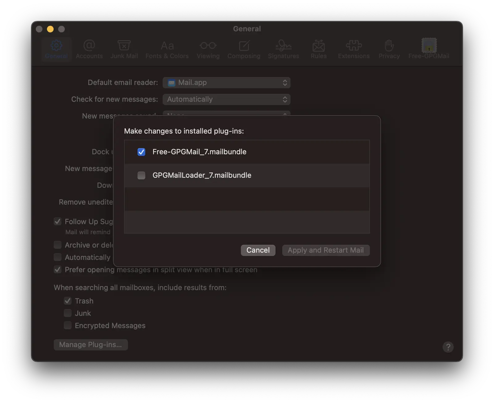
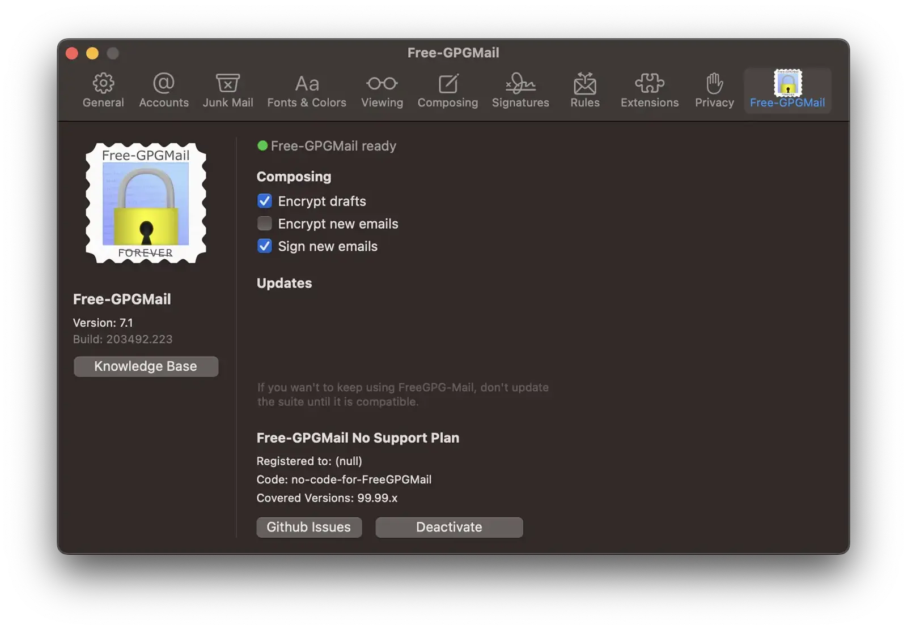
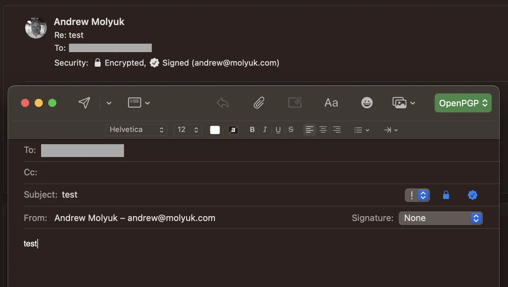

Я пользуюсь GPG уже давно, но все никак не доходили руки до того, чтобы
настроить его в Apple Mail. Все время было что-то важнее. Но вот недавно я
все-таки сделал это. Причем основная загвоздка осталась в том, что я не могу
найти приемлемое решение для iOS. Этот вопрос я так и не решил, но если будет
необходимость в работе с постоянно зашифрованном виде, то я скорее буду
использовать [ProtonMail](https://protonmail.com/ru/) или
[Tutanota](https://tutanota.com/ru/).

<!--more-->

Итак, PGP позволяет подписать и зашифровать сообщение. Подпись позволяет
убедиться, что сообщение не было изменено после того, как его подписал
отправитель. Шифрование позволяет убедиться, что сообщение не будет прочитано
третьими лицами. Подпись и шифрование можно использовать вместе или по
отдельности. Я включаю подпись всегда, а шифрование только при необходимости.

## Установка GPG

Для начала нам нужно установить Free GPG Mail. Обычный GPG Mail стоит денег, но
его код открыт, поэтому есть бесплатная версия, которая называется Free GPG
Mail. Ее можно скачать с
[репозитория на GitHub](https://github.com/Free-GPGMail/Free-GPGMail/releases)
или же установить через [Homebrew](https://brew.sh/).

```shell
brew install --cask free-gpgmail
```

Если появится ошибка с сообщением о доступе к диску, то терминалу нужно дать
соответствующие разрешения в настройках безопасности системы. Далее рестартуем
Mail и идем в настройки в Preferences -> General -> Manage Plug-ins...



Необходимо убедиться, что только плагин Free GPG Mail включен, а не его платный
собрат.

Если кнопка Manage Plug-ins... отсутствует, то нужно выполнить следующую команду
в терминале:

```shell
sudo defaults write "/Library/Preferences/com.apple.mail" EnableBundles 1
defaults write com.apple.mail EnableBundles -bool true
```

Затем нужно перезапустить Mail и кнопка появится.

## Создание ключей

Создание ключей я рассмотрел в статье о том
[как прикрутить GPG подпись к GitHub](/blog/howto-add-gpg-to-github/). Поэтому я
не буду повторяться и просто буду использовать те же ключи.

## Настройка GPG Mail

Для начала нужно открыть настройки Free GPG Mail. Для этого нужно зайти в Mail
-> Preferences -> Free GPG Mail.



Здесь не так много настроечных параметров. Как я уже говорил, я использую
подпись всегда, а шифрование только при необходимости. Поэтому я включаю только
подпись, а шифрование включаю только для локальных черновиков.

## Использование Free GPG Mail

Для того чтобы использовать GPG в Apple Mail, сначала нужно импортировать ключи.
Для этого нужно открыть GPG Keychain приложение и импортировать ключи. Для этого
нужно нажать на кнопку Import и выбрать файл с ключами. После этого нужно нажать
на кнопку Import.

После этого можно открыть Mail и написать новое письмо. Справа сверху появится
зеленая кнопка выбора типа шифрования и подписи, а также две синие иконки для
шифрования и подписи. Мы установили OpenGPG поддержку и будем использовать ее
для шифрования и подписи писем.



Подпись я рекомендую включать всегда. В случае обмена письмами с человеком,
который не использует GPG, подпись не будет им мешать. А в случае обмена
письмами с человеком, который использует GPG, подпись будет говорить о том, что
письмо не было изменено после того, как его подписал отправитель.

Помимо этого при переписке с человеком, который использует GPG, импортируется
его открытый ключ. После этого можно будет доступна опция шифрования письма. И
при необходимости отправки каких-то конфиденциальных данных, можно будет
зашифровать письмо. Надо иметь в виду, что шифрование письма скроет только
текстовую часть письма. Тема письма и вложения не будут зашифрованы.

## Регистрация ключа в OpenPGP Keyserver

Для того чтобы другие люди могли найти ваш открытый ключ, его нужно
зарегистрировать в OpenPGP Keyserver. Для этого надо открыть GPG Keychain и
нажать на кнопку Send Public Key to Keyserver. Также можно зарегистрировать ключ
вручную загрузив его на сайт [keys.openpgp.org](https://keys.openpgp.org/).

С этого момента, люди смогут найти ваш открытый ключ и убедиться в том, что
письмо, которое они получили, действительно от вас.

Можно также проверить наличие ключа на сервере, для этого нужно ввести в
терминале следующую команду:

```shell
gpg --search-key andrew@molyuk.com
```

Мой публичный ключ можно свободно скачать по следующей
[ссылке](https://keys.openpgp.org/vks/v1/by-fingerprint/5A462993E1691B4510390F6C8B43AD0BAE6616A7).

Этой информации достаточно для того, чтобы найти мой ключ на сервере и убедиться
в том, что письмо, которое вы получили, действительно от меня. Или же отправить
мне зашифрованное письмо.

Если вы хотите обновить ключи на сервере, то нужно выполнить следующую команду:

```shell
gpg --refresh-keys
```

Для базового и безопасного использования GPG, этого достаточно. Но если вы
хотите использовать GPG для более сложных вещей, то вам нужно будет изучить
документацию и узнать больше о GPG.

## Заключение

В этой статье я рассказал о том, как я настроил GPG в Apple Mail. Я рассказал о
том, как установить GPG поддержку в Apple Mail, как настроить GPG Mail и как
использовать GPG Mail. Также я рассказал о том, как зарегистрировать ключ в
Keyserver. Надеюсь, что эта статья была полезна для вас. Если у вас есть
какие-то вопросы или предложения, то пишите их в комментариях. Я буду рад
ответить на них.
