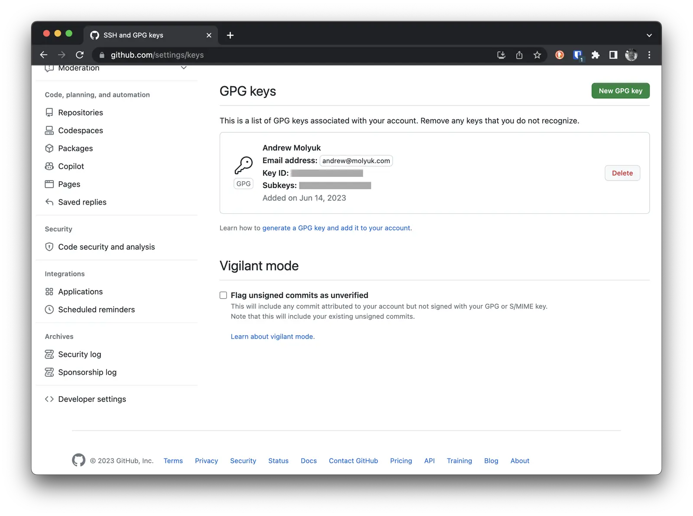
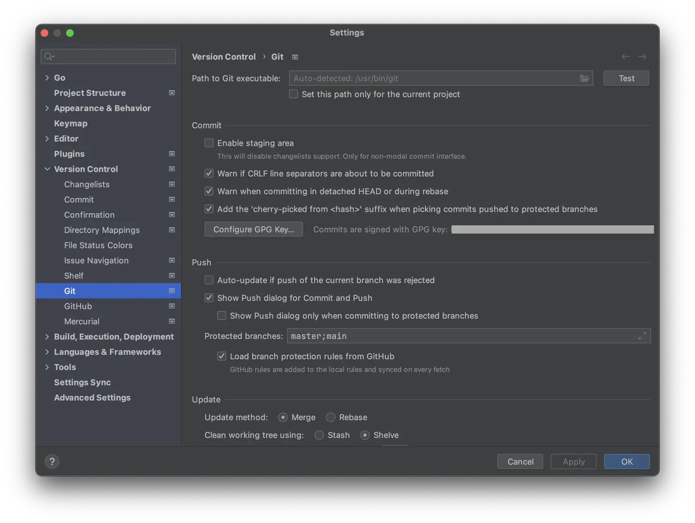
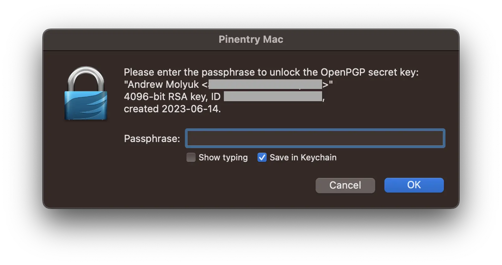
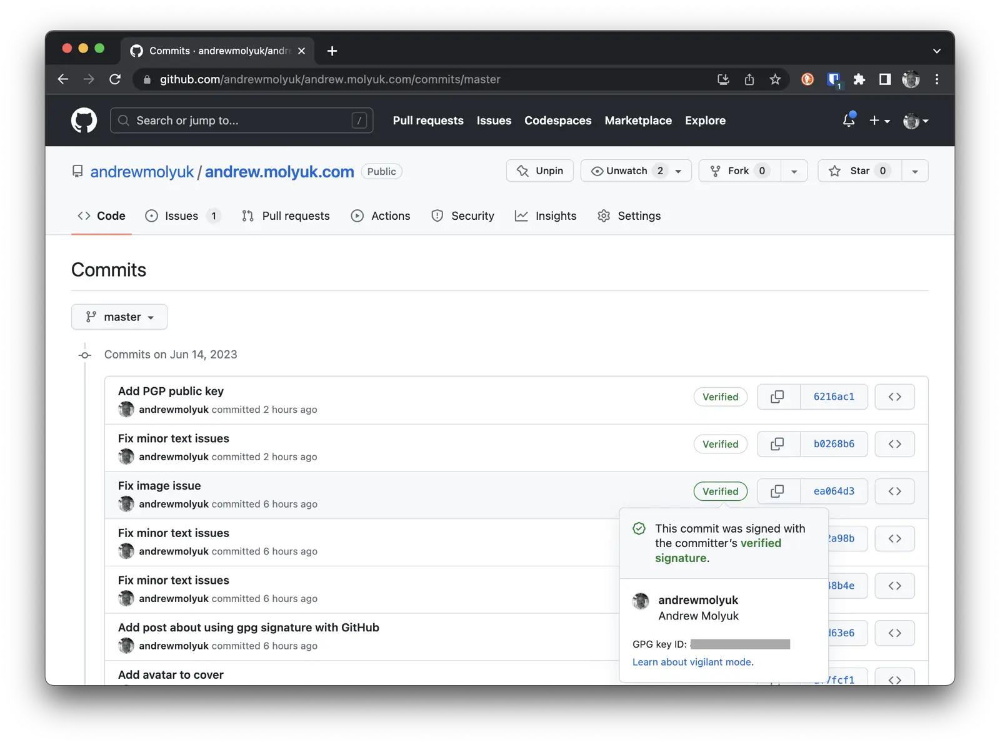

Основная проблема безопасности в современном мире - это идентификация. Как мы можем быть уверены, что человек, с которым
мы переписываемся или обмениваемся файлами, действительно тот, за кого себя выдает? Как мы можем быть уверены, что
файлы, которые мы получаем, не были изменены по пути? Как мы можем быть уверены, что файлы, которые мы получаем,
действительно были отправлены тем, кто их отправил?

Эти вопросы решаются с помощью подписи передаваемых данных. Подпись - это некоторая информация, которая генерируется с
помощью закрытого ключа и может быть проверена с помощью публичного ключа. Если подпись верна, то данные не были
изменены в пути и они были отправлены тем, кто их отправил и подписал.

Для того чтобы обезопасить свои данные, я использую GPG. GPG - это программа, которая позволяет создавать и проверять
подписи и шифровать данные. В этом посте я расскажу, как я добавил GPG подпись к своему GitHub аккаунту.

<!--more-->

## Установка GPG

Для начала нам нужно установить GPG. Homebrew - это мой выбор для установки программ на MacOS, поэтому я установил GPG с
его помощью:

```shell
brew install gnupg
```

## Создание ключа

Для того чтобы создать ключ, нам нужно запустить команду `gpg --full-generate-key`. Она попросит нас выбрать тип ключа и
другие параметры. По умолчанию выбран тип ключа RSA и RSA. Я выбрал его, но вы можете выбрать любой другой тип ключа,
если вам так удобнее. Главное, чтобы он
поддерживался [GitHub](https://docs.github.com/en/authentication/managing-commit-signature-verification/generating-a-new-gpg-key#supported-gpg-key-algorithms).

Далее нам нужно выбрать размер ключа. Я выбрал 4096, но вы можете выбрать любой другой размер в пределах 1024-4096. Чем
больше размер, тем безопаснее ключ, но и тем дольше он будет генерироваться.

Далее нам нужно выбрать срок действия ключа. Я выбрал бессрочный ключ, но вы можете выбрать любой другой срок действия.

Далее нам нужно ввести свои данные. Все эти данные будут использоваться для создания ключа. Важно ввести правильное имя
и e-mail, так как именно они будут использоваться для идентификации ключа. Все остальные данные можно ввести любые.

Далее нам нужно ввести пароль для ключа. Этот пароль будет использоваться для того, чтобы подписывать данные. Важно не
забыть его, так как без него мы не сможем подписывать данные.

После этого ключ будет создан, и мы сможем его использовать.

Теперь можно посмотреть список ключей с помощью команды `gpg --list-secret-keys --keyid-format=long`. Она выведет список
всех доступных ключей. Нам нужно найти ключ, который мы только что создали.

```shell
gpg --list-secret-keys --keyid-format=long
```

Результат будет примерно таким:

```shell
[keyboxd]
---------
sec   rsa4096/0123456789ABCDEF 2023-06-14 [SC]
      D190D5376FC0D7F459DF06010143CD29108D6A3E
uid                 [ultimate] Andrew Molyuk <andrew@molyuk.com>
ssb   rsa4096/0123456789ABCDEF 2023-06-14 [E]
```

Важно запомнить идентификатор ключа, который находится во второй строке. В моем случае
это `D190D5376FC0D7F459DF06010143CD29108D6A3E`. Он будет использоваться для того, чтобы указать, какой ключ мы хотим
использовать.

Чтобы отобразить публичный ключ, нужно запустить команду `gpg --armor --export <KEY_ID>`. В моем случае это будет
выглядеть так:

```shell
gpg --armor --export D190D5376FC0D7F459DF06010143CD29108D6A3E
```

## Резервное копирование ключа

Я настоятельно рекомендую сделать резервную копию ключа. Если вы потеряете ключ, то вы не сможете подписывать данные и
не сможете доказать, что вы являетесь владельцем аккаунта. Для того чтобы сделать резервную копию ключа, нужно запустить
следующую команду:

```shell
gpg --armor --export andrew@molyuk.com > mygpgkey.asc
gpg --armor --export-secret-key andrew@molyuk.com > mysecretpgpkey.asc
gpg --export-ownertrust > trustdb.txt
```

Я также сделал резервную копию trustdb.txt, так как в нем хранится информация о доверии к ключам. Эти файлы необходимо
хранить в безопасном месте, так как они могут быть использованы для подделки подписей. Я рекомендую хранить их в
зашифрованном виде.

## Добавление ключа на GitHub

Для того чтобы добавить ключ на GitHub, нужно перейти в настройки аккаунта, выбрать вкладку SSH and GPG keys и нажать на
кнопку `New GPG key`. Далее нужно ввести имя и публичный ключ. Ключ можно взять из файла mygpgkey.asc, который мы
создали ранее.

В итоге у вас должно получиться что-то вроде этого:



## Настройка Git для использования GPG

Для того чтобы настроить Git для использования GPG, нужно запустить следующие команды:

```shell
git config --global user.signingkey D190D5376FC0D7F459DF06010143CD29108D6A3E
git config --global commit.gpgsign true
git config --global gpg.program gpg
```

Не забудьте заменить `D190D5376FC0D7F459DF06010143CD29108D6A3E` на идентификатор вашего ключа. Это позволит Git
автоматически подписывать все коммиты.

## Настройка терминала для использования GPG

Для того чтобы подписать коммит, нужно запустить команду `git commit -S`. Она создаст коммит и подпишет его с помощью
GPG. Чтобы это работало, нужно чтобы в переменной окружения `GPG_TTY` было указано имя терминала. Это нужно для того,
чтобы GPG мог показать диалоговое окно для ввода пароля. Если этого не сделать, то коммит не будет подписан. Чтобы не
вводить эту команду каждый раз, можно добавить ее в файл `~/.bashrc` или `~/.zshrc`.

Для того чтобы добавить команду в файл, нужно запустить следующую команду:

```shell
echo 'export GPG_TTY=$(tty)' >> ~/.zshrc
```

Если вы используете bash, то нужно заменить `~/.zshrc` на `~/.bashrc`.

## Настройка IDE для использования GPG

При использовании IDE, таких как IntelliJ IDEA, можно настроить автоматическую подпись коммитов. Для этого нужно в
настройках Git выбрать опцию `Sign commits using GPG`.



Но при этом коммиты все еще не будут подписываться и мы получим ошибку со следующим сообщением:

```shell
error: gpg failed to sign the data
fatal: failed to write commit object
```

Это происходит потому что IDE не может показать диалоговое окно для ввода пароля. Поэтому нам нужно использовать
приложение `pinentry-mac` которое позволит показать диалоговое окно и ввести пароль.

Для установки `pinentry-mac` нужно запустить следующую команду:

```shell
brew install pinentry-mac
```

Проверьте где установлен `pinentry-mac` с помощью команды `which pinentry-mac`. В моем случае он установлен в
`/opt/homebrew/bin/pinentry-mac`. После этого нужно добавить соответствующую строку в файл `~/.gnupg/gpg-agent.conf`:

```shell
echo "pinentry-program /opt/homebrew/bin/pinentry-mac" >> ~/.gnupg/gpg-agent.conf
```

Рестартуем gpg-agent:

```shell
gpgconf --kill gpg-agent
```

Проверим, что все работает:

```shell
echo "test" | gpg --clearsign
```

Если все работает, то должно появиться диалоговое окно для ввода пароля:



Теперь можно запустить IDE и сделать коммит. При этом также должно появиться диалоговое окно для ввода пароля. Если мы
выберем опцию `Save in Keychain`, то пароль будет сохранен в macOS Keychain и больше не нужно будет вводить его. Если мы
не выберем эту опцию, то при каждом коммите будет появляться диалоговое окно для ввода пароля.

## Проверка подписи на GitHub

С этого момента все коммиты будут подписываться с помощью GPG. Если вы зайдете на GitHub, то увидите, что коммиты будут
иметь значок Verified. Это значит, что коммит подписан и его можно проверить. Если вы нажмете на значок, то увидите имя
и email автора коммита. Это проверенные данные, которые были указаны при создании ключа.



## Заключение

В этой статье я рассказал, как настроить Git для использования GPG. Теперь все коммиты будут подписываться с помощью GPG
и вы сможете доказать, что вы являетесь владельцем аккаунта на GitHub. Если вы хотите узнать больше о GPG, то я
рекомендую посмотреть следующие ресурсы:

- [The GNU Privacy Handbook](https://www.gnupg.org/gph/en/manual.html)
- [The GNU Privacy Handbook](https://www.gnupg.org/gph/en/manual/x110.html)
- [OpenPGP Best Practices](https://riseup.net/en/security/message-security/openpgp/best-practices)

Если вам понравилась статья, то поделитесь ей с друзьями. Если у вас есть вопросы или предложения, то пишите в
комментариях. Я буду рад ответить на них.
