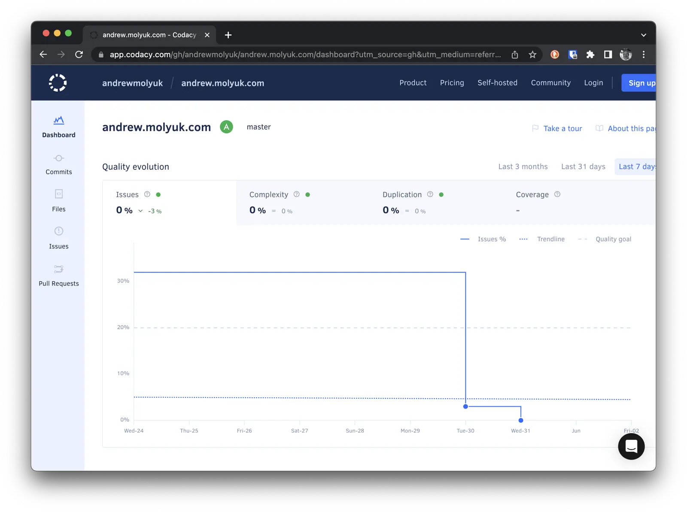

В [предыдущей статье](/blog/howto-create-hugo-website/) я рассказал, как я создал свой сайт на Hugo и оптимизировал его
для собственных нужд. В этой статье я расскажу, как я добавил линтеры к Hugo, чтобы убедиться, что мой сайт
соответствует общепринятым стандартам.

<!--more-->

Являясь разработчиком-перфекционистом, я всегда стремлюсь к тому, чтобы мой код соответствовал общепринятым стандартам и
требую этого от своих коллег. Поэтому я решил добавить линтеры к Hugo, чтобы убедиться, что мой сайт соответствует
стандартам и не содержит ошибок в исходном коде.

Для валидации исходного кода моего сайта я использую следующие линтеры:

- [stylelint](https://stylelint.io/) для проверки CSS-кода
- [ESLint](https://eslint.org/) для проверки HTML и JavaScript-кода
- [remark-lint](https://github.com/remarkjs/remark-lint) для проверки Markdown-кода

## Установка линтеров

Для начала я установил все необходимые линтеры с помощью следующих команд:

```shell
npm install --save-dev stylelint stylelint-config-standard-scss stylelint-order
npm install --save-dev eslint eslint-plugin-tailwindcss
npm install --save-dev remark-cli remark-preset-lint-consistent remark-preset-lint-recommended remark-lint-list-item-indent remark-frontmatter
```

## Конфигурация линтеров

После установки линтеров я создал конфигурационные файлы для каждого из них. Вот как выглядит конфигурационный
файл `.remarkrc`:

```json
{
  "plugins": [
    "remark-preset-lint-consistent",
    "remark-preset-lint-recommended",
    ["remark-lint-list-item-indent", "space"],
    "remark-frontmatter"
  ]
}
```

В этом примере я использую два пресета: `remark-preset-lint-consistent` и `remark-preset-lint-recommended`. Эти два
пресета включают набор плагинов, которые проверяют общие проблемы в файлах Markdown. Я также добавил плагин под
названием `remark-lint-list-item-indent`, который проверяет, есть ли пробел после элемента списка. Наконец, я добавил
плагин под названием `remark-frontmatter`, который проверяет, есть ли раздел frontmatter в файле Markdown.

Вот как выглядит конфигурационный файл `.stylelintrc`:

```json
{
  "extends": "stylelint-config-recommended-scss",
  "plugins": ["stylelint-order", "stylelint-scss"],
  "rules": {
    "order/properties-alphabetical-order": true,
    "scss/at-rule-no-unknown": null,
    "scss/at-import-no-partial-leading-underscore": null
  }
}
```

В этом примере я использую конфигурацию `stylelint-config-recommended-scss`. Я также добавил плагин под
названием `stylelint-order`, который проверяет, есть ли правильный порядок свойств CSS. Наконец, я добавил плагин под
названием `stylelint-scss`, который проверяет, есть ли правильный порядок свойств SCSS.

А так выглядит конфигурационный файл `.eslintrc`:

```json
{
  "root": true,
  "extends": ["eslint:recommended", "plugin:tailwindcss/recommended"],
  "env": {
    "browser": true,
    "node": true,
    "es6": true
  }
}
```

В этом примере я использую конфигурацию `eslint:recommended`. Я также добавил плагин `tailwindcss/recommended`, который
проверяет код на соответствие правилам Tailwind CSS.

Это начальные установки для каждого из линтеров. В будущем я могу добавить больше правил, но пока этого достаточно.
Теперь я могу запустить линтеры с помощью следующих команд:

```shell
npx remark --frail .
npx stylelint "**/*.{css,scss}"
npx eslint "**/*.{html,js}"
```

## Добавление линтеров в Makefile

Я добавил следующие команды в файл `Makefile`:

```makefile
.PHONY: lint
lint:
	npx remark . --quiet --frail
	npx eslint "**/*.js" --quiet
	npx stylelint "**/*.{css,scss}" --quiet
```

Теперь я могу запустить все линтеры с помощью команды `make lint`.

## Добавление Codacy в проект

Я добавил Codacy в свой проект, чтобы он мог проверять мой код на соответствие стандартам. Я создал аккаунт на Codacy и
добавил свой GitHub репозиторий. Теперь код проверяется на соответствие общепринятым стандартам при каждом коммите в
репозиторий. Если код не соответствует стандартам, Codacy отправляет мне уведомление.

Кроме того можно добавить бейдж в файл `README.md`:

```markdown
[](https://app.codacy.com/gh/andrewmolyuk/andrew.molyuk.com/dashboard?utm_source=gh&utm_medium=referral&utm_content=&utm_campaign=Badge_grade)
```

Выглядит это так:

[](https://app.codacy.com/gh/andrewmolyuk/andrew.molyuk.com/dashboard?utm_source=gh&utm_medium=referral&utm_content=&utm_campaign=Badge_grade)

Ссылка ведет на страницу Codacy, где можно увидеть, какие ошибки были найдены в коде.



## Добавление линтеров в Git Pre-Commit Hook

Я добавил линтеры в Git Pre-Commit Hook, чтобы они запускались при каждом коммите в репозиторий. Для этого надо
установить пакет `husky`:

```shell
npm install husky --save-dev
```

Нам также понадобится пакет `lint-staged` чтобы запускать линтеры только для измененных файлов:

```shell
npm install lint-staged --save-dev
```

Теперь мы можем установить hook, который будет запускать линтеры при каждом коммите в репозиторий:

```shell
npm pkg set scripts.prepare="husky install"
npm run prepare
npx husky add .husky/pre-commit "npx lint-staged"
```

Нам также нужно добавить конфигурационный файл `.lintstagedrc` в корень проекта:

```json
{
  "*.md": ["npx remark --quiet --frail"],
  "*.{css,scss}": ["npx stylelint --quiet"],
  "*.js}": ["npx eslint --quiet"]
}
```

Теперь линтеры будут запускаться при каждом коммите в репозиторий и не позволят сделать коммит, если код не
соответствует стандартам. Это поможет избежать ошибок в коде и сэкономит время на исправление ошибок в будущем.

## Заключение

В этой статье я рассказал, как я добавил линтеры к Hugo, чтобы убедиться, что мой сайт соответствует стандартам кода и
не содержит ошибок. Я также рассказал, как я добавил Codacy в свой проект, чтобы он мог проверять мой код на
соответствие общепринятым стандартам. Также я добавил линтеры в Git Pre-Commit Hook, чтобы они запускались при каждом
коммите в репозиторий.

Если у вас есть вопросы или комментарии, пожалуйста, напишите их ниже в комментариях. Спасибо за чтение!
