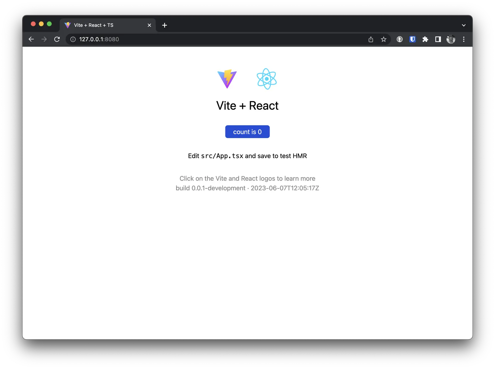

Когда мы собираем имидж докера нашего приложения мы уже знаем какая версия приложения в нем будет. Но зачастую мы не
утруждаем себя передачей этой информации внутрь контейнера. Особенно когда речь идет о веб приложениях. А ведь это может
быть полезно. Например, для мониторинга ошибок, вам однозначно будет полезно знать какая версия приложения упала и когда
она была собрана.

В этой статье я расскажу как передать информацию о версии приложения внутрь контейнера. Как для приложений на Go, так и
веб приложений на Node.js. И как использовать эту информацию внутри контейнера.

<!--more-->

## Аргументы в Dockerfile

Для передачи информации о версии внутрь контейнера, нам нужно передать эту информацию во время сборки. Для этого мы
можем использовать аргументы сборки. Для передачи аргументов сборки в Dockerfile используется директива `ARG`. Вот так
мы можем передать аргумент `BUILD_REF` и `BUILD_DATE` внутрь контейнера:

```dockerfile
ARG BUILD_REF
ARG BUILD_DATE
```

Далее мы можем использовать эти аргументы внутри Dockerfile. Например, вот так мы можем использовать информацию о версии
в метаданных образа:

```dockerfile
LABEL org.opencontainers.image.revision="${BUILD_REF}" \
      org.opencontainers.image.created="${BUILD_DATE}"
```

Я использую [Open Container Initiative](https://opencontainers.org/) метаданные, но вы можете использовать любые
метаданные какие вам угодно. Важно, что эти метаданные будут доступны внутри контейнера. Я все же рекомендую
использовать [Open Container Initiative](https://opencontainers.org/) метаданные, так как они стандартизированы и
поддерживаются большинством инструментов. Например, вы можете использовать эти метаданные
в [Sentry](https://sentry.io/), чтобы отображать версию приложения в отчетах об ошибках. Или вы можете использовать их
в [Prometheus](https://prometheus.io/), чтобы отображать версию приложения в метриках.

## Сборка Go приложения

Для передачи информации о версии в Go приложение, мы можем использовать `ldflags` флаг компилятора. Для этого нам нужно
прописать в Dockerfile следующие параметры для сборки Go приложения:

```dockerfile
RUN go build -ldflags "-X main.BuildRef=${BUILD_REF} -X main.BuildDate=${BUILD_DATE}" -o /app
```

Обратите внимание, что я использую `main.BuildRef` и `main.BuildDate` переменные. Это означает, что эти переменные будут
доступны внутри пакета `main`. Если вы хотите использовать эти переменные в других пакетах, то вам нужно будет
использовать другие имена переменных.

Теперь, когда мы соберем наше приложение, мы сможем увидеть информацию о версии внутри собранного в контейнере бинарного
файла:

```bash
$ docker run --rm -it go-app:latest /app -version
```

Конечно, что для этого нам нужно будет добавить в наше приложение код, который будет обрабатывать флаг `-version`. Но
это не сложно:

```go
package main

import (
	"flag"
	"fmt"
	"os"
)

var (
	BuildRef  string = "unknown"                         //nolint:gochecknoglobals // Populated by ldflags.
	BuildDate string = "Mon, 02 Jan 2006 15:04:05 -0700" //nolint:gochecknoglobals // Populated by ldflags.
)

func main() {
	version := flag.Bool("version", false, "Print version information")
	flag.Parse()

	if *version {
		fmt.Printf("Build: %s\n", BuildRef)
		fmt.Printf("Date: %s\n", BuildDate)
		os.Exit(0)
	}
}
```

Информация о версии передается в приложение в момент сборки. Поэтому, если вы хотите обновить информацию о версии в уже
собранном приложении, вам будет необходимо пересобрать приложение.

## Переменные окружения

Для передачи информации о версии в Node.js приложение, мы можем использовать переменные окружения. Для этого нам нужно в
Dockerfile прописать следующие параметры для сборки Node.js приложения:

```dockerfile
ENV BUILD_REF=${BUILD_REF}
ENV BUILD_DATE=${BUILD_DATE}
```

Теперь, когда мы соберем наше приложение, мы сможем использовать эти переменные внутри приложения в любом месте:

```js
console.log(`Build: ${process.env.BUILD_REF}`);
console.log(`Date: ${process.env.BUILD_DATE}`);
```

## Используем package.json

Передача информации о версии в приложение через переменные окружения имеет свои преимущества и недостатки. Основное
преимущество этого метода в простоте. С другой стороны этот метод устанавливает информацию о версии в окружении
приложения, которое не является частью самого приложения, таким образом, это не часть кода приложения. В большинстве
случаев это не проблема, но мне с этим не очень комфортно и я предпочитаю добавлять информацию о версии во время сборки
в `package.json` файл и использовать эту информацию в приложении.

Добавим в `package.json` файл следующие параметры:

```json
{
  "version": "0.0.1",
  "buildRef": "unknown",
  "buildDate": "Mon, 02 Jan 2006 15:04:05 -0700"
}
```

Создадим вспомогательный скрипт `deploy/update-package-json.js`:

```js
// This script is used to update the package.json file with the build reference and build date from the build process.
import fs from 'fs';

const buildRef = process.argv[2];
const buildDate = process.argv[3];

if (!buildRef || !buildDate) {
  console.log('Please provide a build reference and build date');
  process.exit(1);
}

fs.readFile('./package.json', (err, data) => {
  if (err) throw err;

  let packageJsonObj = JSON.parse(data.toString());
  packageJsonObj.buildRef = `${buildRef}`;
  packageJsonObj.buildDate = `${buildDate}`;
  packageJsonObj = JSON.stringify(packageJsonObj);

  fs.writeFile('./package.json', packageJsonObj, (err) => {
    if (err) throw err;
    console.log('The file has been saved!');
  });
});
```

Теперь мы можем использовать этот скрипт в нашем `Dockerfile`:

```dockerfile
COPY deploy/update-package-json.js deploy/update-package-json.js

RUN chmod +x deploy/update-package-json.js && \
    node deploy/update-package-json.js "${BUILD_REF}" "${BUILD_DATE}"
```

Теперь, когда мы соберем наше приложение, мы сможем увидеть информацию о версии внутри собранного в контейнере веб
приложения. Например, мы можем использовать эту информацию в одном из файлов приложения на React:

```js
import packageJson from '../package.json';

console.log(`Build: ${packageJson.buildRef}`);
console.log(`Date: ${packageJson.buildDate}`);
```

Теперь мы можем использовать эту информацию в любом месте нашего приложения.



## Сборка на GiHub Actions

Теперь, когда мы знаем как передавать информацию о версии внутрь наших приложений, давайте посмотрим как мы можем это
сделать во время сборки нашего приложения в GitHub Actions. Для этого нам нужно будет использовать внутренние переменные
в GitHub Actions и передать их в наше приложение во время сборки. Например, мы можем использовать следующий код в нашем
workflow:

```yaml
- name: Set build reference and build date
  run: |
    echo "BUILD_REF=${{ github.sha }}" >> $GITHUB_ENV
    echo "BUILD_DATE=$(date -u '+%Y-%m-%d %H:%M:%S')" >> $GITHUB_ENV

- name: Display Environment Variables
    run: |
      echo "Build Ref: BUILD_REF"
      echo "Build Date: $BUILD_DATE"
```

Можно заметить, что мы используем переменную внутреннюю GitHub переменную `github.sha` для установки значения
переменной `BUILD_REF`. Можно использовать и более традиционный способ, например так:

```yaml
- name: Set build reference and build date
  run: |
    echo "BUILD_REF=$(git rev-parse HEAD)" >> $GITHUB_ENV
```

Я думаю, что использование внутренних переменных GitHub более удобно, так как они уже доступны во время выполнения
нашего workflow.

## Заключение

В этой статье мы рассмотрели несколько примеров и способов передачи информации о версии внутрь наших приложений. Я
показал как я это делаю в своих проектах на Go и Node.js. Я также показал как можно использовать внутренние переменные в
GitHub Actions для передачи информации о версии в момент сборки. Кроме того, мы использовали информацию о версии в
метаданных Docker образа. Это может быть полезно, если вы хотите отслеживать версии ваших образов в вашем Docker
реестре. Я надеюсь вам понравилась эта статья, и она была полезна для вас. Если у вас есть какие-либо вопросы или
предложения, то я с радостью выслушаю их в комментариях.
