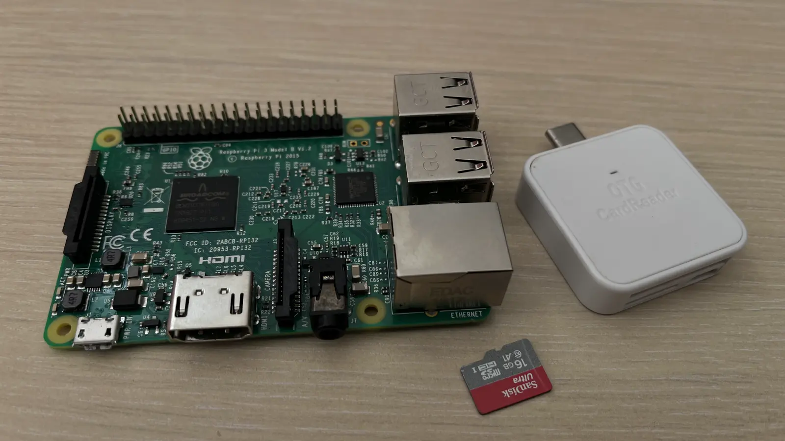
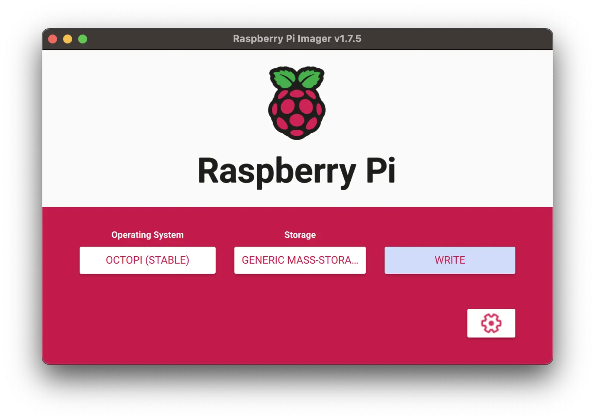
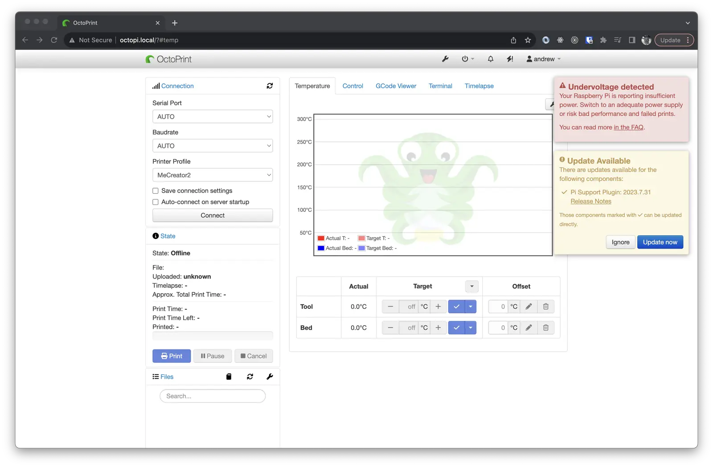
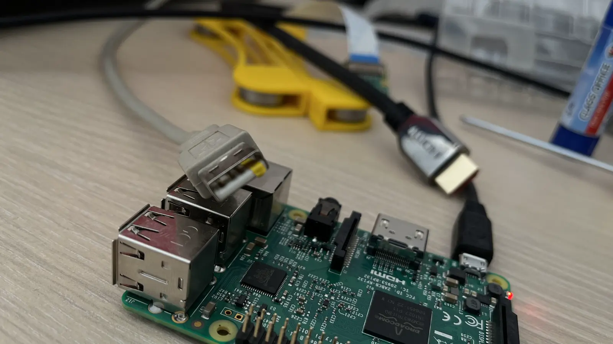
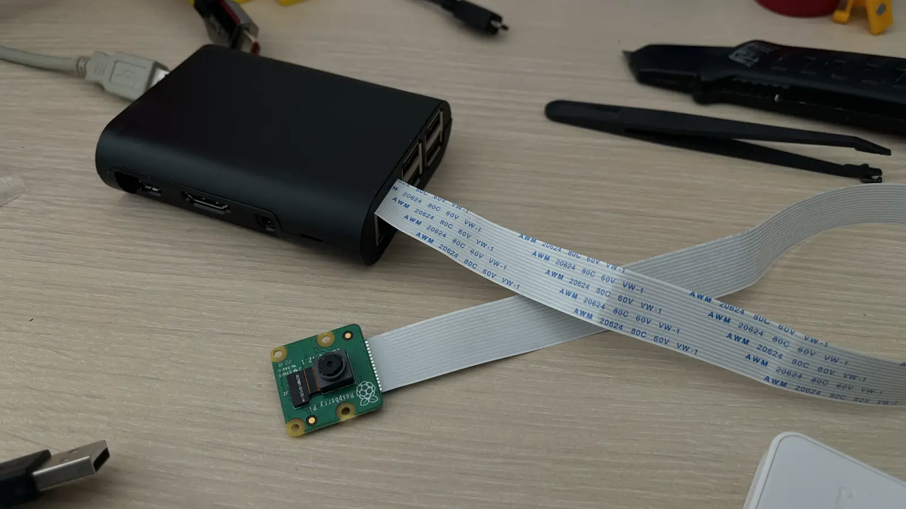

На кухне сломалась ручка, напечатанная на 3D принтере несколько лет назад и мне понадобилось завести мой старенький
Geeetech MeCreator 2 и распечатать новую ручку. Чтобы не пользоваться принтером напрямую у меня лежал Raspberry 3 и я
решил поставить на него OctoPI для более удобного управления печатным процессом.

Для установки ОctoPI можно использовать разнообразные пути, но наиболее быстрым и удобным из них я нашел использование
Raspberry Imager.

<!--more-->

Для начала необходимо скачать софтину с оригинального источника - https://www.raspberrypi.com/software/. Затем запускаем
ее и выбираем OctoPI из огромного списка доступных операционных систем. Для доступа к WiFi нам нужно будет зайти в
расширенные настройки - шестеренка справа на экране.

Там выбираем сетевые настройки, выбираем сеть и прописываем пароль. Также в целях безопасности имеет смысл сменить
дефолтного административного пользователя и его пароль. Если нужен SSH доступ - ставим галочку и для него.

На этом конфигурация заканчивается и можно спокойно нажимать записывать образ диска на SD карту.

После записи вынимаем карту и ставим в Raspberry PI. Включаем и заходим на http://octopi.local/. Если у Вас не
получается зайти по этому адресу, то можно попробовать зайти по IP адресу, который можно узнать в настройках роутера.
После непродолжительного и прозрачного сетапа все заработало.

Если у Вас такое же сообщение о недостающем питании системы, то смотрим, что у нас подключено лишнего - монитор,
клавиатура и прочая. Должен быть подключен только принтер и максимум камера. Если при выключенном принтере и включенном
Raspberry мы видим, что табло на принтере светится, то это означает, что Raspberry пытается запитать наш принтер и
самому напряжения не хватает.

Чтобы этого не происходило, я вырезал тонкую полоску из изоленты и заклеил правый плюсовой контакт на USB коннекторе.
Теперь это выглядит вот так:

С этого момента я перестал получать сообщения о недостающем напряжении и принтер получал питание только при его
включении.

Затем я подключил камеру и упаковал все в заранее подготовленную коробочку.

На этом все. Теперь можно заходить на веб-интерфейс OctoPI и управлять принтером. Если Вам понравилась статья, то
поделитесь ей с друзьями и поставьте лайк. Это поможет мне стать лучше и писать больше. Приятной печати!
