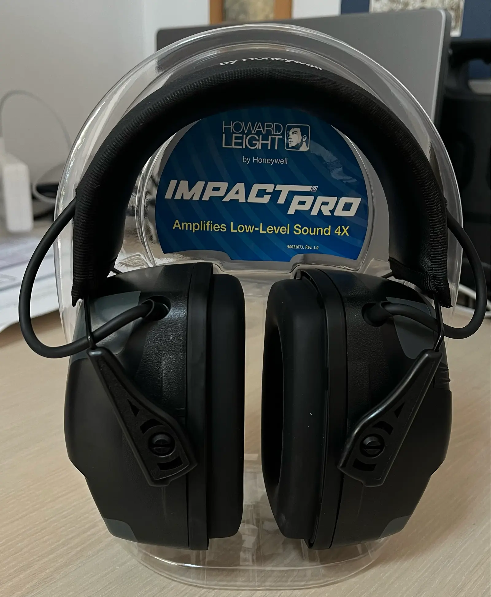
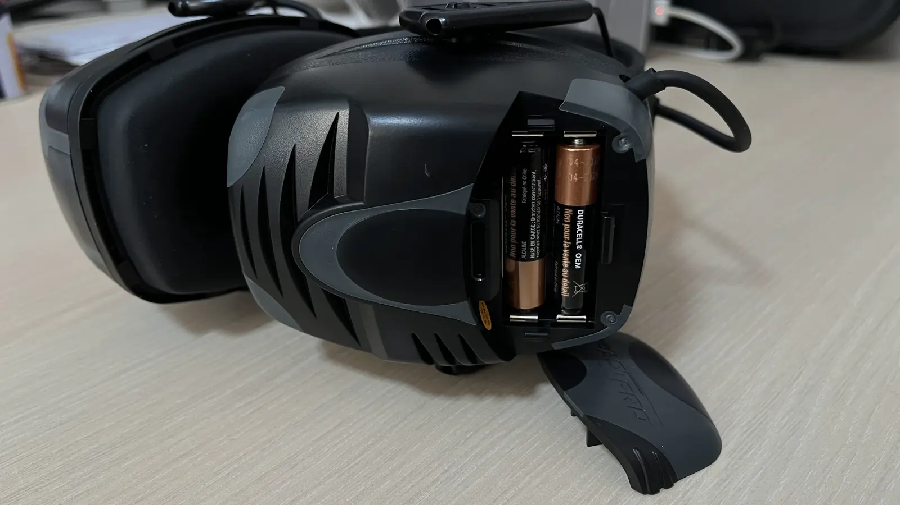

Пришла новая игрушка - наушники Howard Leight Impact Pro. Приобретены на
[Амазон](https://www.amazon.com/dp/B007BGSI5U) за 58 американских долларов, что
получилось практически за пол цены. Наушники пришли в коробке, в которой были
наушники, инструкция, 2 батарейки и провод для подключения к телефону или mp3
плееру. Наушники сделаны из добротного темного пластика и выглядят довольно
качественно. Вес приличный, но не слишком большой для того, чтобы мешать.

<!--more-->

Наушники Howard Leight Impact Pro представляют собой профессиональную версию
активных наушников, разработанных компанией Howard Leight. Их выдающаяся
особенность заключается в максимальном подавлении звука с рейтингом SNR 33 дБ,
что делает их лидером среди аналогов других производителей. В сравнении с
другими активными наушниками, как Caldwell E-Max, Howard Leight Impact SportB,
Peltor Tactical 6s и Peltor Tactical 100, которые имеют меньшие показатели (от
20 до 25 дБ), Impact Pro выделяется значительно более высокими характеристиками
подавления шума.

Активная электронная система наушников Howard Leight Impact Pro включает
отдельные стереофоны, установленные в правой и левой муфте. Это позволяет лучше
ориентироваться в окружающей обстановке, улучшая комфорт и безопасность во время
использования. Система также обладает интеллектуальной функцией: встроенные
микрофоны стерео усиливают окружающие звуки до безопасных 82 дБ, обеспечивая
естественное восприятие звука и повышенную связь. Когда звук достигает или
превышает 82 дБ, наушники автоматически переходят в пассивный режим, блокируя
громкие импульсивные звуки для предотвращения повреждения слуха.

Продуманный дизайн наушников Howard Leight Impact Pro включает в себя
регулируемое мягкое оголовье с телескопической регулировкой высоты, обеспечивая
комфортную и надежную посадку. Прорезиненные точки прижима предотвращают
появление царапин на ложе, что добавляет долговечности изделию. Внешний
аудиоразъем позволяет подключить наушники к различным устройствам, что является
очень сомнительным функционалом, особенно в наше время тотальной беспроводной
связи.

Благодаря использованию множества микрофонов, наушники выравнивают шумовой фон,
выделяют специфические звуки, такие как шорохи или звуки шагов, при этом
подавляя звуки рабочей техники, такие как шум двигателя автомобиля или выстрела.

Наличие двух батарей AAA обеспечивает продолжительную автономную работу
наушников (примерно 350 часов), а функция автоматического отключения после 4
часов бездействия экономит заряд батарей. Howard Leight Impact Pro предоставляет
высокий уровень защиты слуха для стрелков и любителей стрельбы, обеспечивая при
этом комфорт и функциональность на высшем уровне.

Наушники Howard Leight Impact Pro имеют два режима работы: активный и пассивный.
В пассивном режиме они работают как обычные наушники, просто уменьшая громкость
звука. В активном режиме они усиливают звук, что позволяет слышать звуки,
которые вы бы не услышали в обычных наушниках. При этом они блокируют звуки
выстрелов, что позволяет сохранить слух.

В то же время наушники не блокируют звуки, которые не являются опасными,
например, голос человека. Таким образом, вы можете разговаривать с человеком, не
снимая наушники. Также они блокируют звуки ветра, что позволяет слышать звуки
ветра, но не слышать шум ветра. Это очень удобно, так как ветер может быть очень
громким, особенно если вы находитесь на открытом воздухе.

На голове сидят отлично, плотно, но не давят. Даже на моей большой голове
уселись так как должно.

Проверив наушники тире, я остался ими очень доволен. Они отлично подавляют звук
выстрелов, но при этом позволяют вам спокойно разговаривать с людьми и слышать,
что происходит вокруг.

Единственным недостатком я бы отметил то, что они хорошо усиливают очень слабые
звуки, например, шорохи. Это может сильно отвлекать, особенно, если кто-то
открыл пакетик с чипсами и шуршит. С другой стороны, это можно рассматривать как
часть тренировки :)

## Заключение

В итоге наушники Howard Leight Impact Pro оказались очень удобными и
качественными. Они хорошо сидят на голове, не давят, довольно удобны и
практичны. Они не слишком дорогие, но и не слишком дешевые. Они хорошо подавляют
звук, но при этом не блокируют звуки, которые не являются опасными. Они хорошо
подходят для стрельбы или охоты. От себя лично ставлю офигенный и жирный 5 с
плюсом. Очень доволен покупкой.

Надеюсь, что вам понравился этот обзор. Если у вас есть какие-либо вопросы или
предложения, пожалуйста, напишите в комментариях ниже. Я буду рад услышать Вас и
постараюсь ответить на все ваши вопросы.
