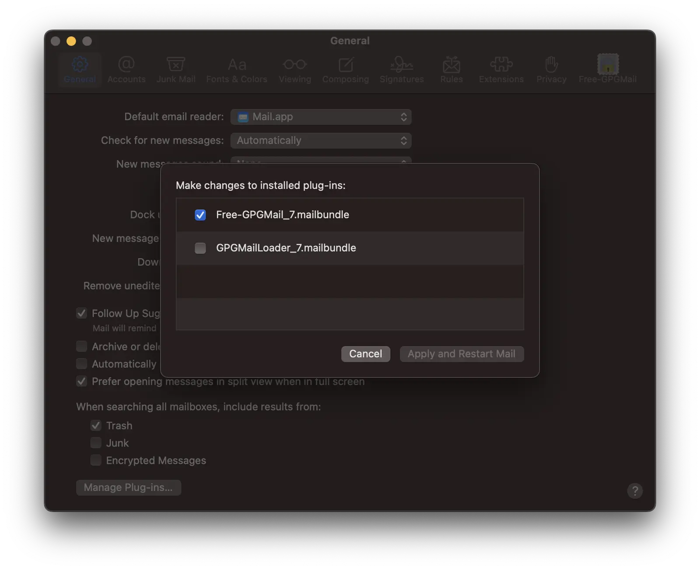
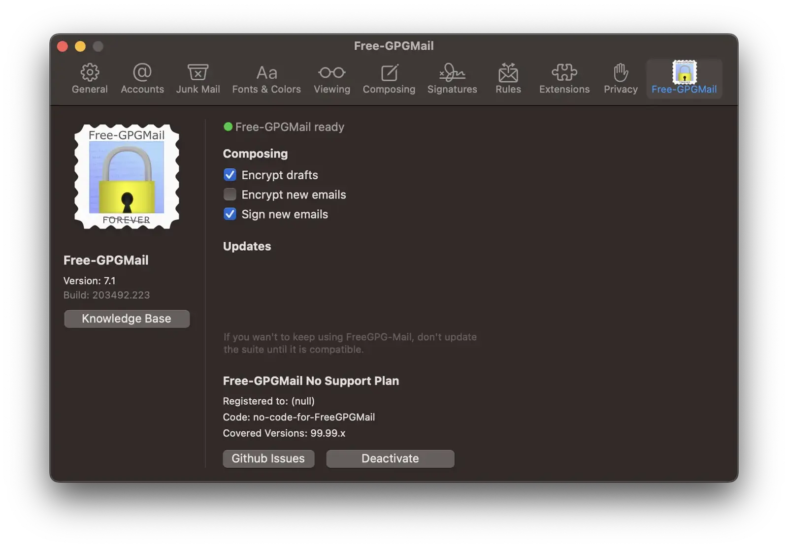
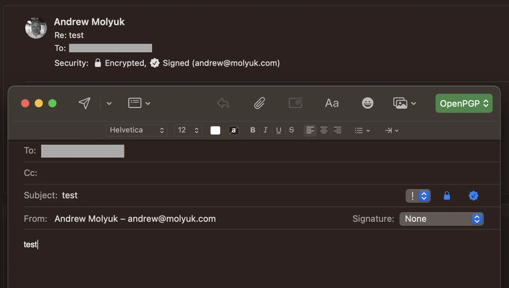

I have been using GPG for a long time, but I never got around to setting it up in Apple Mail. There was always something
more important. But recently, I finally did it. The main problem was that I couldn't find a suitable solution for iOS.
I haven't solved this issue yet, but if I need to work with constantly encrypted content, I would rather use
[ProtonMail](https://protonmail.com/ru/) or [Tutanota](https://tutanota.com/ru/).

So, PGP allows you to sign and encrypt a message. The signature ensures that the message has not been altered after it
was signed by the sender. Encryption ensures that the message will not be read by third parties. Signature and
encryption can be used together or separately. I always enable the signature, and encryption only when necessary.

<!--more-->

## GPG Installation

First, we need to install Free GPG Mail. The regular GPG Mail costs money, but its code is open, so there is a free
version called Free GPG Mail. It can be downloaded
from the [GitHub repository](https://github.com/Free-GPGMail/Free-GPGMail/releases) or installed
through [Homebrew](https://brew.sh/).

```shell
brew install --cask free-gpgmail
```

If an error message about disk access appears, the terminal needs to be given the appropriate permissions in the system
security settings. Then we restart Mail and go to settings in Preferences -> General -> Manage Plug-ins...



Make sure that only the Free GPG Mail plugin is enabled, not its paid counterpart.

If the Manage Plug-ins... button is missing, you need to execute the following command in the terminal:

```shell
sudo defaults write "/Library/Preferences/com.apple.mail" EnableBundles 1
defaults write com.apple.mail EnableBundles -bool true
```

Then you need to restart Mail and the button will appear.

## Key Creation

I discussed key creation in the article about [how to attach a GPG signature to GitHub](/blog/howto-add-gpg-to-github/).
So I won't repeat myself and will just use the same keys.

## Setting up GPG Mail

First, you need to open the settings of Free GPG Mail. To do this, go to Mail -> Preferences -> Free GPG Mail.



There are not so many settings here. As I already said, I always use the signature, and encryption only when necessary.
Therefore, I only enable the signature, and I enable encryption only for local drafts.

## Using Free GPG Mail

To use GPG in Apple Mail, you first need to import the keys. To do this, you need to open the GPG Keychain application
and import the keys. To do this, you need to click on the Import button and select the file with the keys. After that,
you need to click on the Import button.

After that, you can open Mail and write a new letter. At the top right, a green button for selecting the type of
encryption and signature will appear, as well as two blue icons for encryption and signature. We have installed OpenGPG
support and will use it for encrypting and signing letters.



I recommend always enabling the signature. In the case of exchanging emails with a person who does not use GPG, the
signature will not interfere with them. And in the case of exchanging emails with a person who uses GPG, the signature
will indicate that the email has not been changed after it was signed by the sender.

In addition to this, when corresponding with a person who uses GPG, their public key is imported. After this, the option
to encrypt the email will be available. And if necessary to send some confidential data, you can encrypt the email. Keep
in mind that encrypting the email will only hide the text part of the email. The subject of the email and attachments
will not be encrypted.

## Registering the key in OpenPGP Keyserver

In order for other people to be able to find your public key, it needs to be registered in the OpenPGP Keyserver. To do
this, you need to open the GPG Keychain and click on the Send Public Key to Keyserver button. You can also manually
register the key by uploading it to the [keys.openpgp.org](https://keys.openpgp.org/) website.

From this moment on, people will be able to find your public key and make sure that the email they received is indeed
from you.

You can also check the presence of the key on the server, for this you need to enter the following command in the terminal:

```shell
gpg --search-key andrew@molyuk.com
```

You can freely download my public key from the following
[link](https://keys.openpgp.org/vks/v1/by-fingerprint/5A462993E1691B4510390F6C8B43AD0BAE6616A7).

This information is enough to find my key on the server and make sure that the email you received is indeed from me. Or
to send me an encrypted email.

If you want to update the keys on the server, you need to execute the following command:

```shell
gpg --refresh-keys
```

For basic and secure use of GPG, this is enough. But if you want to use GPG for more complex things, you will need to
study the documentation and learn more about GPG.

## Conclusion

In this article, I talked about how I set up GPG in Apple Mail. I explained how to install GPG support in Apple Mail,
how to configure GPG Mail, and how to use GPG Mail. I also discussed how to register a key in the Keyserver. I hope this
article was useful to you. If you have any questions or suggestions, please write to me. I will be glad to answer them.
