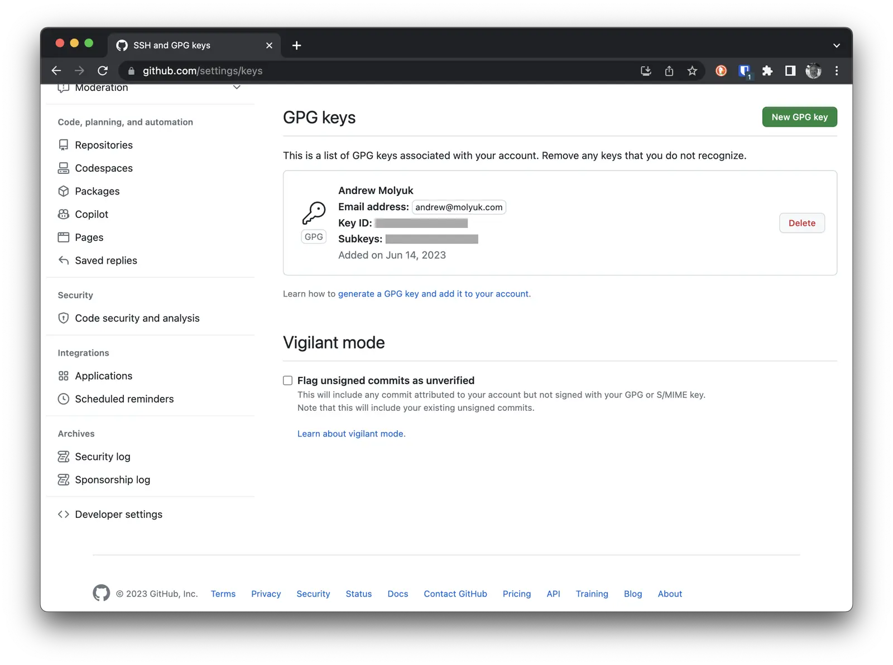
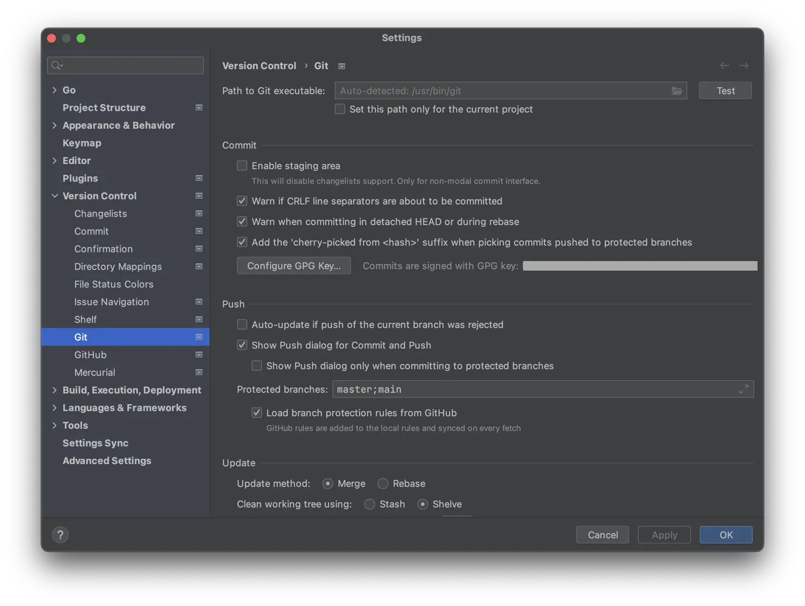
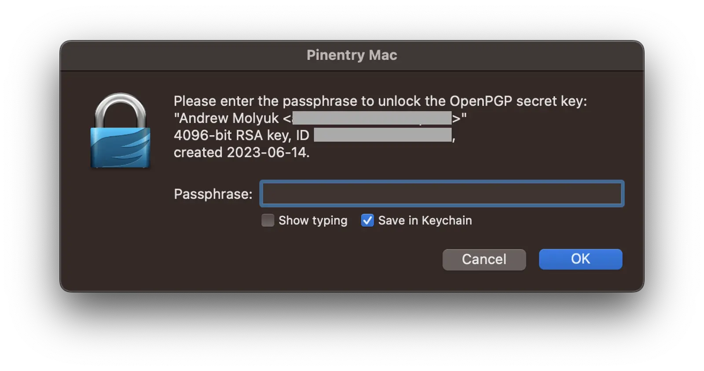
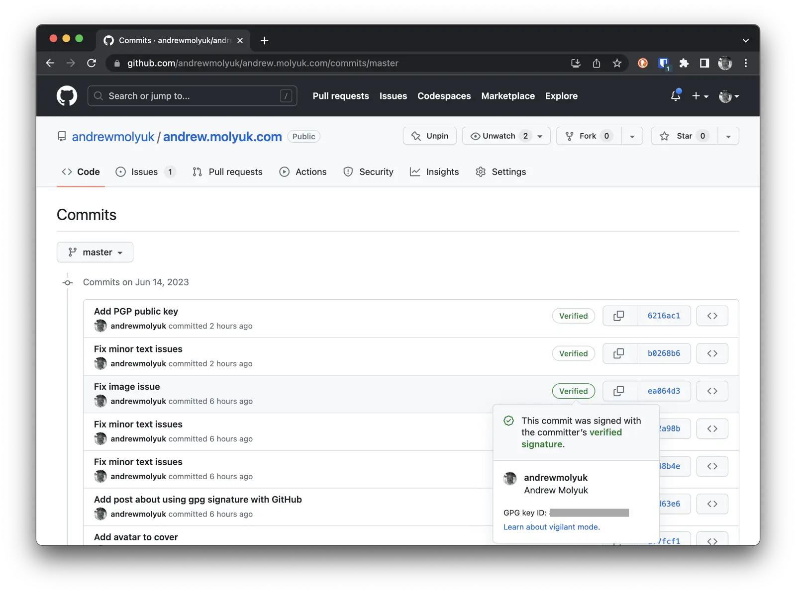

The main security issue in the modern world is identification. How can we be sure that the person we are corresponding
with or exchanging files with is really who they claim to be? How can we be sure that the files we receive have not been
altered along the way? How can we be sure that the files we receive were actually sent by the person who sent them?

These questions are solved by signing the data being transmitted. A signature is some information that is generated
using a private key and can be verified using a public key. If the signature is correct, then the data has not been
altered in transit and it was sent by the person who sent and signed it.

<!--more-->

To secure my data, I use GPG. GPG is a program that allows you to create and verify signatures and encrypt data. In this
post, I will explain how I added a GPG signature to my GitHub account.

## Installing GPG

First, we need to install GPG. Homebrew is my choice for installing software on MacOS, so I installed GPG with it:

```shell
brew install gnupg
```

## Creating a Key

To create a key, we need to run the command `gpg --full-generate-key`. It will ask us to choose the type of key and
other parameters. By default, the key type RSA and RSA is selected. I chose it, but you can choose any other type of
key, if it is more convenient for you. The main thing is that it is supported by
[GitHub](https://docs.github.com/en/authentication/managing-commit-signature-verification/generating-a-new-gpg-key#supported-gpg-key-algorithms).

Next, we need to choose the key size. I chose 4096, but you can choose any other size within 1024-4096. The larger the
size, the safer the key, but the longer it will take to generate.

Next, we need to choose the key's expiration date. I chose a perpetual key, but you can choose any other expiration
date.

Next, we need to enter our data. All this data will be used to create the key. It is important to enter the correct name
and e-mail, as they will be used to identify the key. All other data can be any.

Next, we need to enter a password for the key. This password will be used to sign the data. It is important not to
forget it, as without it we will not be able to sign the data.

After this, the key will be created, and we can use it.

Now you can view the list of keys using the command `gpg --list-secret-keys --keyid-format=long`. It will display a list
of all available keys. We need to find the key that we just created.

```shell
gpg --list-secret-keys --keyid-format=long
```

The result will look something like this:

```shell
[keyboxd]
---------
sec   rsa4096/0123456789ABCDEF 2023-06-14 [SC]
      D190D5376FC0D7F459DF06010143CD29108D6A3E
uid                 [ultimate] Andrew Molyuk <andrew@molyuk.com>
ssb   rsa4096/0123456789ABCDEF 2023-06-14 [E]
```

It's important to remember the key identifier, which is located in the second line. In my case, it's
`D190D5376FC0D7F459DF06010143CD29108D6A3E`. This will be used to specify which key we want to use.

To display the public key, you need to run the command `gpg --armor --export <KEY_ID>`. In my case, it will look like
this:

```shell
gpg --armor --export D190D5376FC0D7F459DF06010143CD29108D6A3E
```

## Key Backup

I strongly recommend making a backup of the key. If you lose the key, you will not be able to sign data and you will not
be able to prove that you are the owner of the account. To make a backup of the key, you need to run the following
command:

```shell
gpg --armor --export andrew@molyuk.com > mygpgkey.asc
gpg --armor --export-secret-key andrew@molyuk.com > mysecretpgpkey.asc
gpg --export-ownertrust > trustdb.txt
```

I also made a backup of trustdb.txt, as it stores information about trust in keys. These files need to be stored in a э
safe place, as they can be used to forge signatures. I recommend storing them in encrypted form.

## Adding the Key to GitHub

To add the key to GitHub, you need to go to account settings, select the SSH and GPG keys tab, and click on the
`New GPG key` button. Then you need to enter the name and public key. The key can be taken from the mygpgkey.asc file
that we created earlier.

In the end, you should get something like this:



## Configuring Git to use GPG

To configure Git to use GPG, you need to run the following commands:

```shell
git config --global user.signingkey D190D5376FC0D7F459DF06010143CD29108D6A3E
git config --global commit.gpgsign true
git config --global gpg.program gpg
```

Don't forget to replace `D190D5376FC0D7F459DF06010143CD29108D6A3E` with your key identifier. This will allow Git to
automatically sign all commits.

## Setting up the terminal for GPG usage

To sign a commit, you need to run the command `git commit -S`. It will create a commit and sign it using GPG. For this
to work, the `GPG_TTY` environment variable must specify the terminal name. This is necessary for GPG to display a
dialog box for password entry. If this is not done, the commit will not be signed. To avoid entering this command every
time, you can add it to the `~/.bashrc` or `~/.zshrc` file.

To add the command to the file, you need to run the following command:

```shell
echo 'export GPG_TTY=$(tty)' >> ~/.zshrc
```

If you are using bash, you should replace `~/.zshrc` with `~/.bashrc`.

## Setting up IDE for GPG usage

When using an IDE, such as IntelliJ IDEA, you can set up automatic commit signing. To do this, you need to select the
`Sign commits using GPG` option in the Git settings.



But even with this, commits will still not be signed and we will receive an error with the following message:

```shell
error: gpg failed to sign the data
fatal: failed to write commit object
```

This happens because the IDE cannot display a dialog box for password entry. Therefore, we need to use the
`pinentry-mac` application which will allow us to display the dialog box and enter the password.

To install `pinentry-mac`, you need to run the following command:

```shell
brew install pinentry-mac
```

Check where `pinentry-mac` is installed using the `which pinentry-mac` command. In my case, it is installed in
`/opt/homebrew/bin/pinentry-mac`. After that, you need to add the corresponding line to the `~/.gnupg/gpg-agent.conf`
file:

```shell
echo "pinentry-program /opt/homebrew/bin/pinentry-mac" >> ~/.gnupg/gpg-agent.conf
```

Restarting gpg-agent:

```shell
gpgconf --kill gpg-agent
```

Let's check that everything works:

```shell
echo "test" | gpg --clearsign
```

If everything works, a dialog box for password entry should appear:



Now you can start the IDE and make a commit. A dialog box for password entry should also appear. If we choose the
`Save in Keychain` option, the password will be saved in the macOS Keychain and you will no longer need to enter it. If
we do not choose this option, a dialog box for password entry will appear with each commit.

## Checking the signature on GitHub

From this point on, all commits will be signed with GPG. If you go to GitHub, you will see that commits will have a
Verified badge. This means that the commit is signed and can be checked. If you click on the badge, you will see the
name and email of the commit author. These are verified data that were specified when creating the key.



## Conclusion

In this article, I explained how to configure Git to use GPG. Now all commits will be signed using GPG, and you can
prove that you are the owner of the GitHub account. If you want to learn more about GPG, I recommend checking out the
following resources:

- [The GNU Privacy Handbook](https://www.gnupg.org/gph/en/manual.html)
- [The GNU Privacy Handbook](https://www.gnupg.org/gph/en/manual/x110.html)
- [OpenPGP Best Practices](https://riseup.net/en/security/message-security/openpgp/best-practices)

If you liked the article, share it with your friends. If you have any questions or suggestions, write to me and I will
be glad to answer them.
