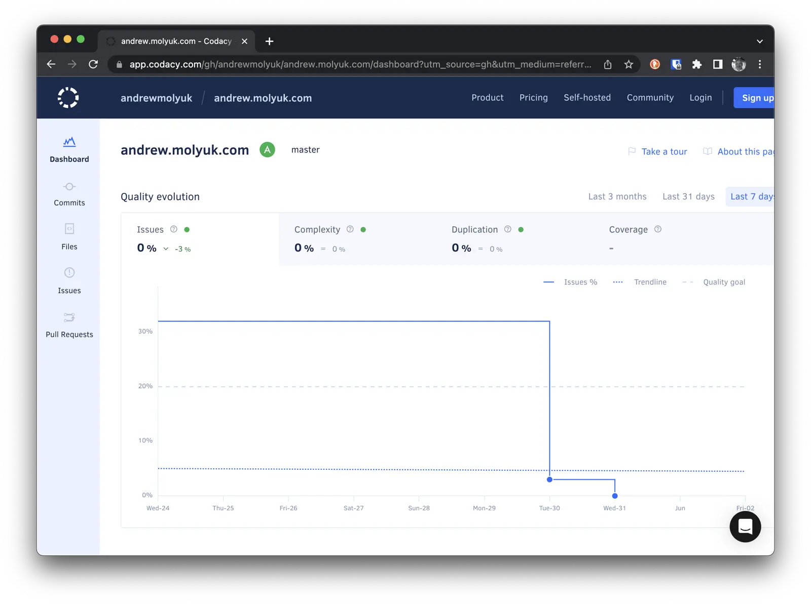

In the [previous article](/blog/howto-create-hugo-website/), I discussed how I created my Hugo website and optimized it for my own needs. In this article, I will explain how I added linters to Hugo to ensure that my website adheres to widely accepted standards.

As a perfectionist developer, I always strive to ensure that my code adheres to widely accepted standards and I demand the same from my colleagues. Therefore, I decided to add linters to Hugo to ensure that my website meets standards and does not contain errors in the source code.

<!--more-->

To validate the source code of my site, I use the following linters:

- [stylelint](https://stylelint.io/) for checking CSS code
- [ESLint](https://eslint.org/) for checking HTML and JavaScript code
- [remark-lint](https://github.com/remarkjs/remark-lint) for checking Markdown code

## Installing the linters

First, I installed all the necessary linters using the following commands:

```shell
npm install --save-dev stylelint stylelint-config-standard-scss stylelint-order
npm install --save-dev eslint eslint-plugin-tailwindcss
npm install --save-dev remark-cli remark-preset-lint-consistent remark-preset-lint-recommended
remark-lint-list-item-indent remark-frontmatter
```

## Linters Configuration

After installing the linters, I created configuration files for each of them. Here's what the configuration file `.remarkrc` looks like:

```json
{
  "plugins": [
    "remark-preset-lint-consistent",
    "remark-preset-lint-recommended",
    ["remark-lint-list-item-indent", "space"],
    "remark-frontmatter"
  ]
}
```

In this example, I use two presets: `remark-preset-lint-consistent` and `remark-preset-lint-recommended`. These two presets include a set of plugins that check for common issues in Markdown files. I also added a plugin named `remark-lint-list-item-indent`, which checks if there is a space after a list item. Finally, I added a plugin named `remark-frontmatter`, which checks if there is a frontmatter section in the Markdown file.

Here's what the configuration file `.stylelintrc` looks like:

```json
{
  "extends": "stylelint-config-recommended-scss",
  "plugins": ["stylelint-order", "stylelint-scss"],
  "rules": {
    "order/properties-alphabetical-order": true,
    "scss/at-rule-no-unknown": null,
    "scss/at-import-no-partial-leading-underscore": null
  }
}
```

In this example, I use the `stylelint-config-recommended-scss` configuration. I also added a plugin named `stylelint-order`, which checks if there is a correct order of CSS properties. Finally, I added a plugin named `stylelint-scss`, which checks if there is a correct order of SCSS properties.

And here's what the `.eslintrc` configuration file looks like:

```json
{
  "root": true,
  "extends": ["eslint:recommended", "plugin:tailwindcss/recommended"],
  "env": {
    "browser": true,
    "node": true,
    "es6": true
  }
}
```

In this example, I use the `eslint:recommended` configuration. I also added a plugin `tailwindcss/recommended`, which checks the code for compliance with Tailwind CSS rules.

These are the initial settings for each of the linters. In the future, I can add more rules, but for now, this is enough. Now, I can run the linters using the following commands:

```shell
npx remark --frail .
npx stylelint "**/*.{css,scss}"
npx eslint "**/*.{html,js}"
```

## Adding linters to Makefile

I added the following commands to the `Makefile`:

```shell
lint:
npx remark . --quiet --frail
npx eslint "**/\*.js" --quiet
npx stylelint "**/\*.{css,scss}" --quiet
.PHONY: lint
```

Now I can run all the linters with the command `make lint`.

## Adding Codacy to the project

I added Codacy to my project so that it can check my code for compliance with standards. I created an account on Codacy and added my GitHub repository. Now the code is checked for compliance with generally accepted standards with each commit to the repository. If the code does not meet the standards, Codacy sends me a notification.

In addition, you can add a badge to the `README.md` file:

```markdown
[](https://app.codacy.com/gh/andrewmolyuk/andrew.molyuk.com/dashboard?utm_source=gh&utm_medium=referral&utm_content=&utm_campaign=Badge_grade)
```

It looks like this:

[](https://app.codacy.com/gh/andrewmolyuk/andrew.molyuk.com/dashboard?utm_source=gh&utm_medium=referral&utm_content=&utm_campaign=Badge_grade)

The link leads to the Codacy page, where you can see what errors were found in the code.



## Adding Linters to Git Pre-Commit Hook

I added linters to the Git Pre-Commit Hook so they run with every commit to the repository. To do this, you need to install the `husky` package:

```shell
npm install husky --save-dev
```

We will also need the `lint-staged` package to run linters only on modified files:

```shell
npm install lint-staged --save-dev
```

Now we can set up a hook that will run the linters with every commit to the repository:

```shell
npm pkg set scripts.prepare="husky install"
npm run prepare
npx husky add .husky/pre-commit "npx lint-staged"
```

We also need to add a configuration file `.lintstagedrc` to the root of the project:

```json
{
  "*.md": ["npx remark --quiet --frail"],
  "*.{css,scss}": ["npx stylelint --quiet"],
  "*.js}": ["npx eslint --quiet"]
}
```

Now, the linters will run with every commit to the repository and will not allow a commit if the code does not meet the standards. This will help avoid errors in the code and save time on fixing errors in the future.

## Conclusion

In this article, I explained how I added linters to Hugo to ensure that my site meets code standards and does not contain errors. I also explained how I added Codacy to my project so it can check my code for compliance with generally accepted standards. Additionally, I added linters to the Git Pre-Commit Hook, so they run with every commit to the repository.

If you have any questions or comments, please write to me and I will try to answer them. Thank you for reading!
