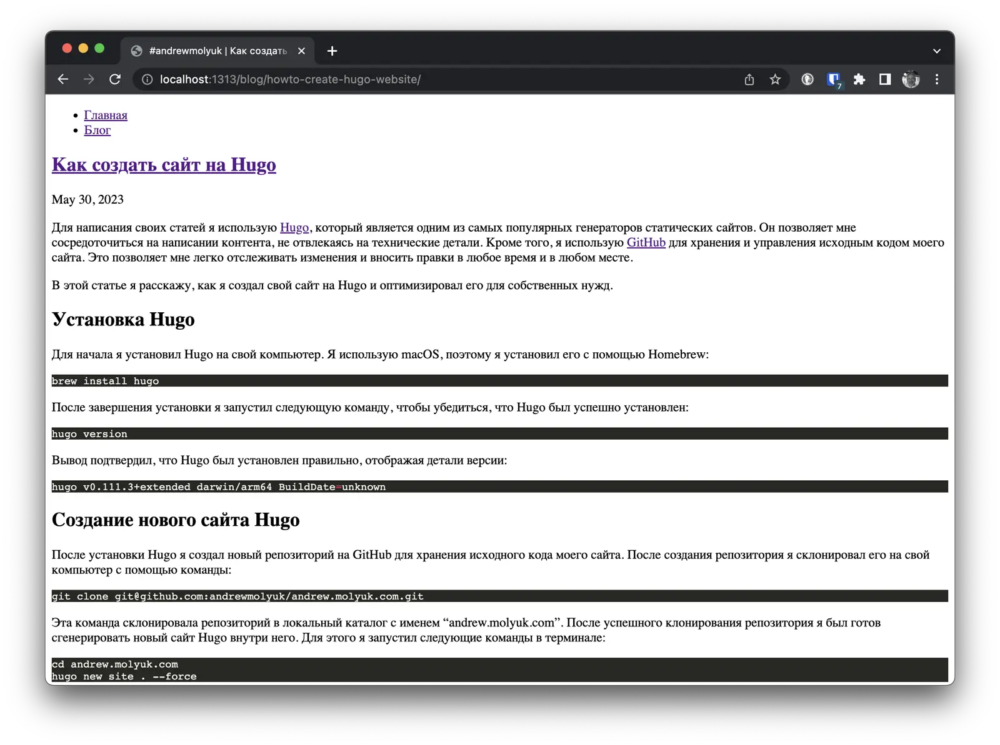

To write my articles, I use [Hugo](https://gohugo.io/), which is one of the most popular static site generators. It
allows me to focus on writing content without getting distracted by technical details. Additionally, I use
[GitHub](https://github.com/andrewmolyuk/andrew.molyuk.com) to store and manage the source code of my website. This
enables me to easily track changes and make edits anytime and anywhere.

In this article, I will explain how I created my website using Hugo and optimized it for my own needs.

<!--more-->

## Installing Hugo

To start, I installed Hugo on my computer. Since I'm using macOS, I installed it using Homebrew:

```shell
brew install hugo
```

Once the installation was complete, I ran the following command to verify that Hugo was installed successfully:

```shell
hugo version
```

The output confirmed that Hugo was installed correctly, displaying the version details:

```shell
hugo v0.111.3+extended darwin/arm64 BuildDate=unknown
```

## Creation of a new Hugo website

After installing Hugo, I created a new GitHub repository to store my site's source code. After creation repository, I
cloned it to my computer using the command:

```shell
git clone git@github.com:andrewmolyuk/andrew-molyuk-com.git
```

This command cloned the repository into a local directory named "andrew.molyuk.com". After successful cloning
repository, I was ready to generate a new Hugo site inside it. To do this I ran the following commands in the terminal:

```shell
cd andrew-molyuk-com
hugo new site . --force
```

Running these commands created a new Hugo site inside the andrew.molyuk.com directory. Hugo automatically created the
necessary directory structure and main files for the site. Since the andrew.molyuk.com directory was not empty due to
the previous cloning the git repository, I used the --force flag to force the Hugo site to be created in a non-empty
directory.

## Creating a layout for the Hugo website

The next step was to create a new layout for the site. To do this, I created the following files in the layouts
directory:

`/layouts/_default/baseof.html`: this file contains the base template for the entire site. It defines the overall
structure and design elements that apply to all pages.

`/layouts/index.html`: this file is a template for the main page. It defines the layout and content of the main pages of
my site.

`/layouts/_default/single.html`: this file contains the default template for individual pages on my Hugo site. It used
when displaying individual pages of content that do not fit a specific content type or layout. It is typically used for
pages such as the About Us page and Contact page.

`/layouts/blog/list.html`: this file contains the template for the blog list page. It defines how it should be displayed
list of blog articles.

`/layouts/blog/single.html`: this file defines the layout and structure of an individual blog article.

`/layouts/404.html`: I created this file as a template for a 404 page. It defines the layout and content that should be
displayed when the user accesses a non-existent page.

`/layouts/partials/head.html`: this file contains the template for the \<head> section of each HTML page. It includes
metadata, CSS style sheets, and any other code that needs to be included inside the \<head> tags.

`/layouts/partials/header.html`: this file is the template for the header section of my site. It usually includes logo
site, navigation menu and other common elements displayed at the top of each page.

`/layouts/partials/footer.html`: this file contains the template for the footer section of my website. It usually
includes information, such as copyrights, links or any other content that appears at the bottom of each page.

`/layouts/taxonomy/terms.html`: this file is the template for the taxonomy tag cloud page. It defines how the labels
should be displayed as a cloud form.

`/layouts/taxonomy/term.html`: I created this file as a template for a taxonomy label page. It defines the layout and
the page structure that displays blog articles associated with a specific tag.

## config.toml

After creating the new layout, I started setting up the config.toml file. I made a few changes to customize the site
according to my requirements. Here's a summary of the changes I made:

- Set baseURL and canonicalURL to [https://andrew.molyuk.com/](https://andrew.molyuk.com/).
- Specified languageCode as 'ru'.
- Defined title, description and keywords for the site.
- Enabled enableRobotsTXT to allow search robots access to the site.
- Enabled enableSitemapXML to generate a sitemap.xml file for better search engine optimization.
- Set up a taxonomy for blog tags, specifying it as blog/tags. This taxonomy setup allows me to apply tags only to the
  content in the blog section of my website. This taxonomy configuration ensures that tags are applied only to content
  related to the blog, separating it from other sections of the site.
- I enabled RSS feeds, specifying output formats for different sections of the site.
- Configured the output format for the RSS feed to generate an rss.xml file instead of the standard index.xml.

As a result, the config.toml file looked like this:

```toml
baseURL = 'https://andrew.molyuk.com/'
canonicalURL = 'https://andrew.molyuk.com/'
languageCode = 'ru'
title = '#andrewmolyuk'
license = 'CC BY-SA 4.0'

enableRobotsTXT = true
enableSitemapXML = true

[author]
name = 'Andrew Molyuk'
email = 'andrew@molyuk.com'

[params]
description = 'My personal website with blog'
keywords = 'Technology, Programming, Tips'

[taxonomies]
tag = 'blog/tags'

[outputs]
page = ['HTML']
home = ['HTML']
section = ['HTML', 'RSS']
taxonomy = ['HTML']
term = ['HTML']

[outputFormats]
[outputFormats.RSS]
mediatype = "application/rss"
baseName = "rss"
```

## Adding content to the site

After setting up the config.toml file correctly, I started adding content to the site. I started by creating a new file
Markdown for a blog article in the content/blog directory using the following command:

```shell
hugo new content/blog/getting-started.md
```

I then added taxonomy tags to the frontmatter of the blog article, which allowed me to categorize the article. Here's an
example, what the frontmatter looked like:

```shell
---
title: "Let's start!"
date: 2023-05-30T20:29:26+03:00
blog/tags: [ "website","blog","article" ]
draft: false
---
```

## Launching a local Hugo site

After setting up and adding content, I was ready to launch the Hugo site locally to preview the changes. Running the
following command in a terminal started the Hugo server and made the site available at
[http://localhost:1313](http://localhost:1313):

```shell
hugo server
```

To simplify the build process, I created a Makefile with two targets: build and dev. The build goal was responsible for
assembling the site, and the dev target ran the Hugo server in development mode. This is what the Makefile looked like:

```makefile
.PHONY: build
build:
	hugo --gc --minify --cleanDestinationDir

.PHONY: dev
dev:
	hugo server --buildDrafts --buildFuture --disableFastRender --noHTTPCache  --navigateToChanged --templateMetricsHints
  --templateMetrics --verboseLog --verbose --watch --port 1313
```

For these purposes, various flags and options were used to optimize the build and development process. Launch relevant
make build or make dev commands made it easy to build a website or run a Hugo development server.

```shell
make dev
```

After running the Hugo server I could access the site at [http://localhost:1313](http://localhost:1313).



## Conclusion

In this article, I shared my personal experience of creating a new Hugo website from scratch. I have provided a step by
step guide through the process, including setting up Hugo, setting up the site, adding content, and running the site
locally. My goal - provide you with a helpful guide to get started on your own project on Hugo.

I want to emphasize that all source files mentioned in this article are available in repositories
[GitHub](https://github.com/andrewmolyuk/andrew.molyuk.com) which you can explore and use in as a reference for your own
Hugo project.

Thank you for taking the time to read this article. I hope it was helpful and informative.

If you liked this article, please share it with others so they can benefit from it too. If you have any questions or
comments, write to me and I will try to answer them.
