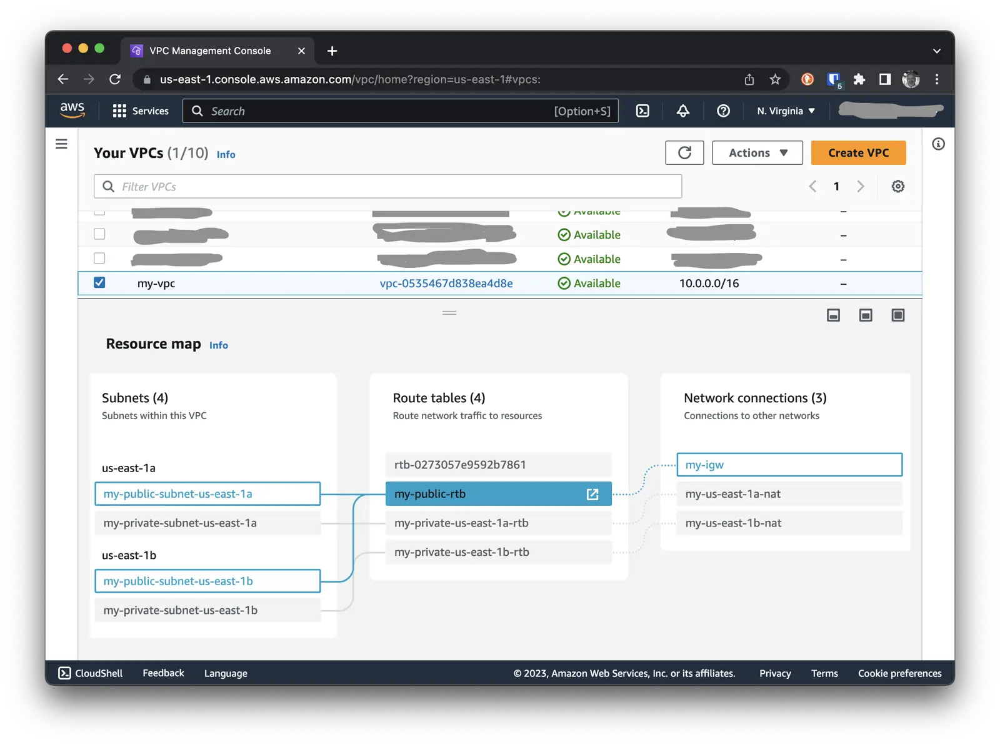

Once again, I come across the situation where our infrastructure becomes a mess, and we migrate everything to Terraform,
and in the latest iteration, to AWS CDK. But then the real mess begins. Eventually, everyone is afraid to make any
changes, fearing that something might break, and as a result, nothing gets changed. The snowball keeps growing and
becomes increasingly unmanageable. At some point, I got tired of it all and decided that we need to bring order, but in
the least painful way for the developers.

We decided to go back to Ansible for automating small tasks needed to manage our infrastructure. In this case, the fear
of causing harm was much less, and the code became more readable and understandable. Overall, I enjoyed it. So I decided
to share my experience with you in creating such small playbooks for managing our infrastructure. In this article, we
will create a VPC using Ansible.

<!--more-->

## Setup

To begin with, we need to install Ansible. As a devoted fan of [Homebrew](https://brew.sh/), I installed Ansible using
it:

```bash
brew install ansible
```

In addition to that, I also installed [ansible-lint](https://github.com/ansible/ansible-lint) to check the syntax and
style in our playbooks:

```bash
brew install ansible-lint
```

## Project Structure

To begin with, we need to create the project structure. I decided to use the following structure:

```bash
.
├── requirements.yml
├── Makefile
├── group_vars
├── inventory
├── playbooks
│   └── create-vpc.yml
└── roles
    └── docker
        ├── tasks
        │   └── main.yml
        └── templates
```

### requirements.yml

In addition, I created a `requirements.yml` file where all the external roles and collections that we will use in our
playbooks will be stored. To begin with, we will use only one collection, which is called `amazon.aws`.

It allows us to use Ansible modules to work with AWS. This is what our `requirements.yml` file looks like:

```yaml
# This file is used by the Makefile to install the required roles from Ansible Galaxy.
collections:
  - name: amazon.aws
```

To install all dependencies we need the following command:

```bash
ansible-galaxy install -r requirements.yml
```

### Makefile

As always, I put all the settings in the `Makefile` file so as not to remember all these commands. This is what my
`Makefile` looks like:

```makefile
# Lint Ansible code
lint:
	ansible-lint
.PHONY : init

# Install Ansible Galaxy roles
init:
	ansible-galaxy install -r requirements.yml
.PHONY : init

# Create VPC
create-vpc:
	ansible-playbook playbooks/create-vpc.yml
.PHONY : create-vpc
```

Now we can install all dependencies using the `make init` command. We can also run the linter using the `make lint`
command. Finally, we can run our playbook using the `make create-vpc` command.

### group_vars

Here we will store all the variables that will be used in our playbooks. I haven't defined any variables for this
project yet, but in the future, we will use this folder to store all our variables.

### inventory

Here we will store our host files and host group files. In our case, we don't need to store any files here, so we will
simply create an empty folder for future use.

### playbooks

I decided to divide our project into two parts: `playbooks` and `roles`. The `playbooks` folder will contain our
playbooks, and the `roles` folder will contain the roles that we will use in our playbooks.

### roles

In the `roles` folder we will store all the roles that we will use in our playbooks. For example, I created a role
called `docker`. Inside this role, I created a folder `tasks`, where all the tasks that we will use in this role will be
stored. I also created a `templates` folder where all the templates that we will use in this role will be stored.

## Creating a playbook

I needed to create a VPC with two public and two private subnets. All public subnets should have a common routing table,
and each private subnet should have its own routing table. All public subnets should be connected to a common internet
gateway. All private subnets should be connected to their own NAT Gateway.

We will move all these settings to our variables in `group_vars` in the `create-vpc.yml` file itself. In the future, we
may move them to a separate file, but for now, we will use only one file to store all variables.

Now that we have prepared everything necessary, we can start creating our VPC. First, we need to create our playbook
`create-vpc.yml` in the `playbooks` folder. Here's what it looks like.

```yaml
---
- name: Create VPC with Subnets and NAT Gateways
  hosts: localhost
  gather_facts: false
  vars:
    name: "my"
    vpc_cidr_block: 10.0.0.0/16
    availability_zones:
      - us-east-1a
      - us-east-1b
    public_subnet_cidr_blocks:
      - 10.0.1.0/24
      - 10.0.2.0/24
    private_subnet_cidr_blocks:
      - 10.0.11.0/24
      - 10.0.12.0/24

  tasks:
    - name: Create VPC
      amazon.aws.ec2_vpc_net:
        name: "{{ name }}-vpc"
        cidr_block: "{{ vpc_cidr_block }}"
        tags:
          Name: {{ name }}-vpc
        state: present
      register: vpc

    - name: Create Public Subnets
      amazon.aws.ec2_vpc_subnet:
        vpc_id: "{{ vpc.vpc.id }}"
        cidr: "{{ item.1 }}"
        az: "{{ item.0 }}"
        tags:
          Name: {{ name }}-public-subnet-{{ item.0 }}
        state: present
      with_together:
        - "{{ availability_zones }}"
        - "{{ public_subnet_cidr_blocks }}"
      register: public_subnets

    - name: Create Private Subnets
      amazon.aws.ec2_vpc_subnet:
        vpc_id: "{{ vpc.vpc.id }}"
        cidr: "{{ item.1 }}"
        az: "{{ item.0 }}"
        tags:
          Name: {{ name }}-private-subnet-{{ item.0 }}
        state: present
      with_together:
        - "{{ availability_zones }}"
        - "{{ private_subnet_cidr_blocks }}"
      register: private_subnets

    - name: Create Internet Gateway
      amazon.aws.ec2_vpc_igw:
        vpc_id: "{{ vpc.vpc.id }}"
        tags:
          Name: {{ name }}-igw
        state: present
      register: internet_gateway

    - name: Create Public Route Table
      amazon.aws.ec2_vpc_route_table:
        vpc_id: "{{ vpc.vpc.id }}"
        subnets: "{{ public_subnets.results | map(attribute='subnet.id') | list }}"
        routes:
          - dest: 0.0.0.0/0
            gateway_id: "{{ internet_gateway.gateway_id }}"
        state: present
        tags:
          Name: {{ name }}-public-rtb
      register: public_route_table

    - name: Allocate Elastic IP Addresses
      amazon.aws.ec2_eip:
        tags:
          Name: {{ name }}-{{ item }}-eip
        release_on_disassociation: true
        state: present
      loop: "{{ availability_zones }}"
      register: elastic_ip_addresses

    - name: Create NAT Gateway
      amazon.aws.ec2_vpc_nat_gateway:
        state: present
        subnet_id: "{{ item.0.subnet.id }}"
        eip_address: "{{ item.1.public_ip }}"
        tags:
          Name: {{ name }}-{{ item.0.subnet.availability_zone }}-nat
        wait: true
      with_together:
        - "{{ private_subnets.results }}"
        - "{{ elastic_ip_addresses.results }}"
      register: nat_gateways
      failed_when: nat_gateways is failed

    - name: Create Private Route Tables per AZ
      amazon.aws.ec2_vpc_route_table:
        vpc_id: "{{ vpc.vpc.id }}"
        subnets: "{{ [ item.2.subnet.id ] }}"
        routes:
          - dest: 0.0.0.0/0
            gateway_id: "{{ item.1.nat_gateway_id }}"
        state: present
        tags:
          Name: "{{ name }}-private-{{ item.0 }}-rtb"
      with_together:
        - "{{ availability_zones }}"
        - "{{ nat_gateways.results }}"
        - "{{ private_subnets.results }}"
      register: private_route_tables

    - name: Print VPC Details
      ansible.builtin.debug:
        msg: |
          VPC ID: {{ vpc.vpc.id }}
          Public Subnets: {{ public_subnets.results | map(attribute='subnet.id') | list }}
          Private Subnets: {{ private_subnets.results | map(attribute='subnet.id') | list }}
          Internet Gateway: {{ internet_gateway.gateway_id }}
          Public Route Table: {{ public_route_table.route_table.id }}
          Elastic IP Addresses: {{ elastic_ip_addresses.results | map(attribute='allocation_id') | list }}
          NAT Gateways: {{ nat_gateways.results | map(attribute='nat_gateway_id') | list }}
          Private Route Tables: {{ private_route_tables.results | map(attribute='route_table.id') | list }}
```

You can split the playbook into several files. For example, you can move VPC creation into a separate file, subnet
creation into a separate file, etc. But I wanted to keep the playbook cohesive to make it easier to read and understand.

If you want to know more about how to split a playbook into multiple files, you can read
[this article](https://www.digitalocean.com/community/tutorials/how-to-use-ansible-roles-to-abstract-your-infrastructure-environment).

I don't think there's any point in explaining every line of the playbook because it's pretty simple. But I want to draw
your attention to the modules that I use:

`ec2_vpc_net` - This module creates a VPC and returns its ID, CIDR and tags. I store this data in the `vpc` variable.

`ec2_vpc_subnet` - This module creates subnets and returns their ID, CIDR, AZ and tags. I save this data in variables
`public_subnets` and `private_subnets`.

`ec2_vpc_igw` - this module creates an Internet Gateway and returns its ID and tags. I save this data in variable
`internet_gateway`.

`ec2_vpc_route_table` - this module creates route tables and returns their IDs and tags. I save this data in variables
`public_route_table` and `private_route_tables`.

`ec2_eip` - This module creates Elastic IP Addresses and returns their IDs and tags. I save this data in variable
`elastic_ip_addresses`.

`ec2_vpc_nat_gateway` this module creates a NAT Gateway and returns its ID and tags. I save this data in variable
`nat_gateways`.

`debug` - module for displaying information about created resources.

## Launching the playbook

To run the playbook, we need to configure access to AWS. For this we can use environment variables or configuration
files. I prefer to use config files because they are more secure. To do this, we need to run the `aws configure` command
and enter the AWS access details.

```shell
aws configure

AWS Access Key ID [None]: accesskey
AWS Secret Access Key [None]: secretkey
Default region name [None]: us-east-1
Default output format [None]: json
```

Now that we have access to AWS, we can run the playbook. To do this, we need to execute the following command:

```shell
make create-vpc
```

After the playbook finishes running, you will see the newly created VPC and all its resources in AWS.



## Delete VPC

To delete the VPC, we need to delete all the resources we created. First, we need to delete all the NAT Gateways, then
the Elastic IP addresses, and finally the VPC itself with all its resources. You can write a playbook to delete the VPC
or delete all the resources manually.

## Conclusion

In this article, we looked at how to create a VPC in AWS using Ansible. We created VPCs, subnets, Internet Gateways, NAT
Gateways, routing tables and Elastic IP addresses. You can now use this playbook to create a VPC in AWS. I hope this
article was helpful to you. If you have any questions or suggestions, please email them to me.
