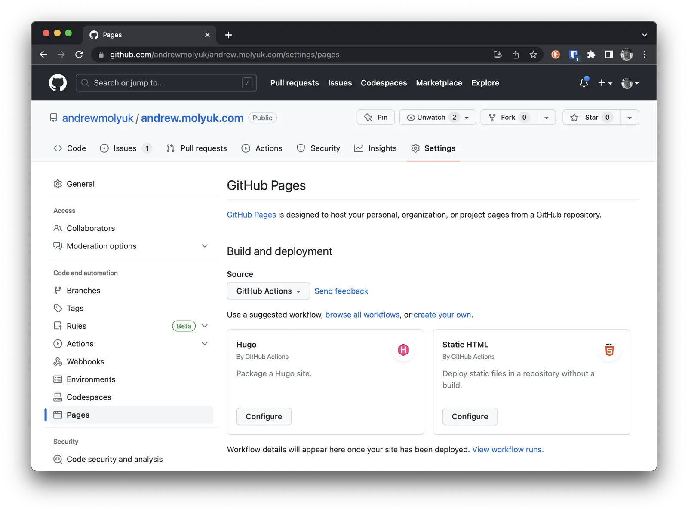
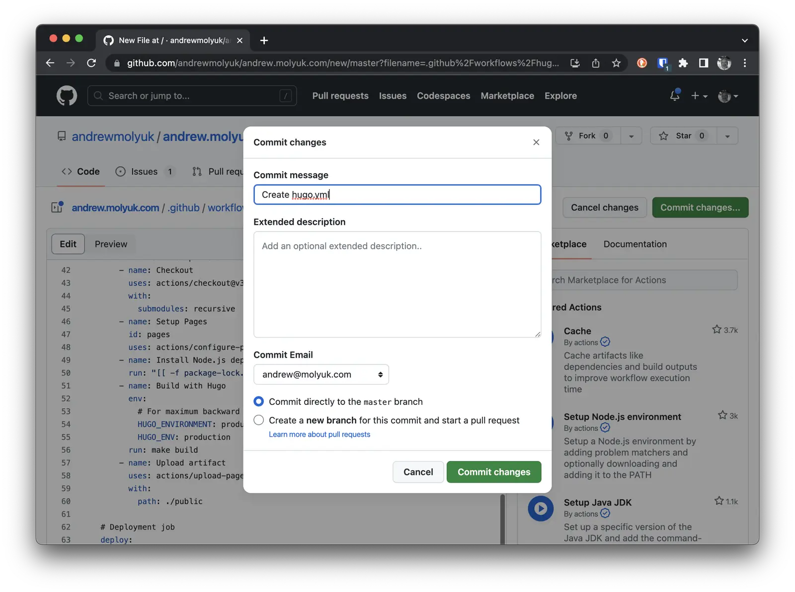
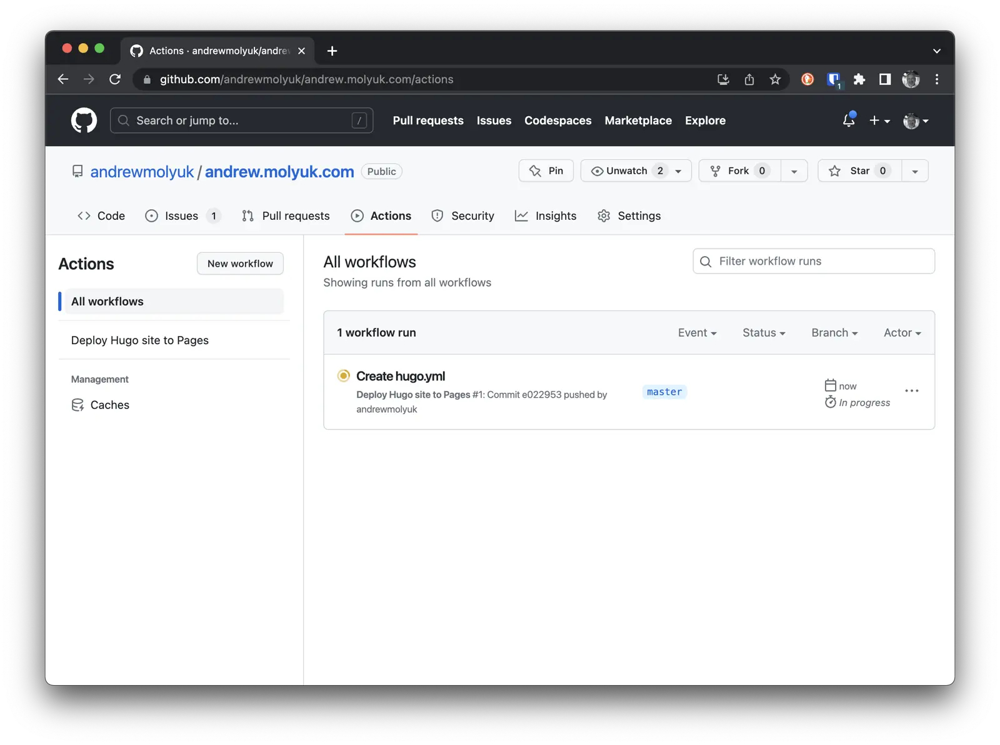
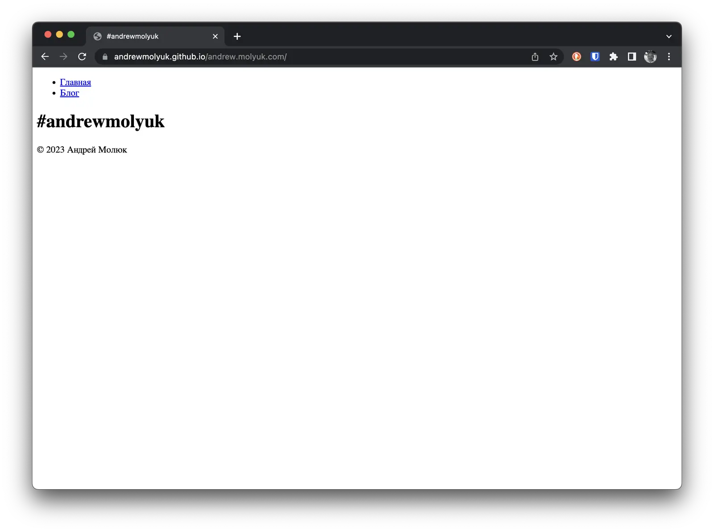
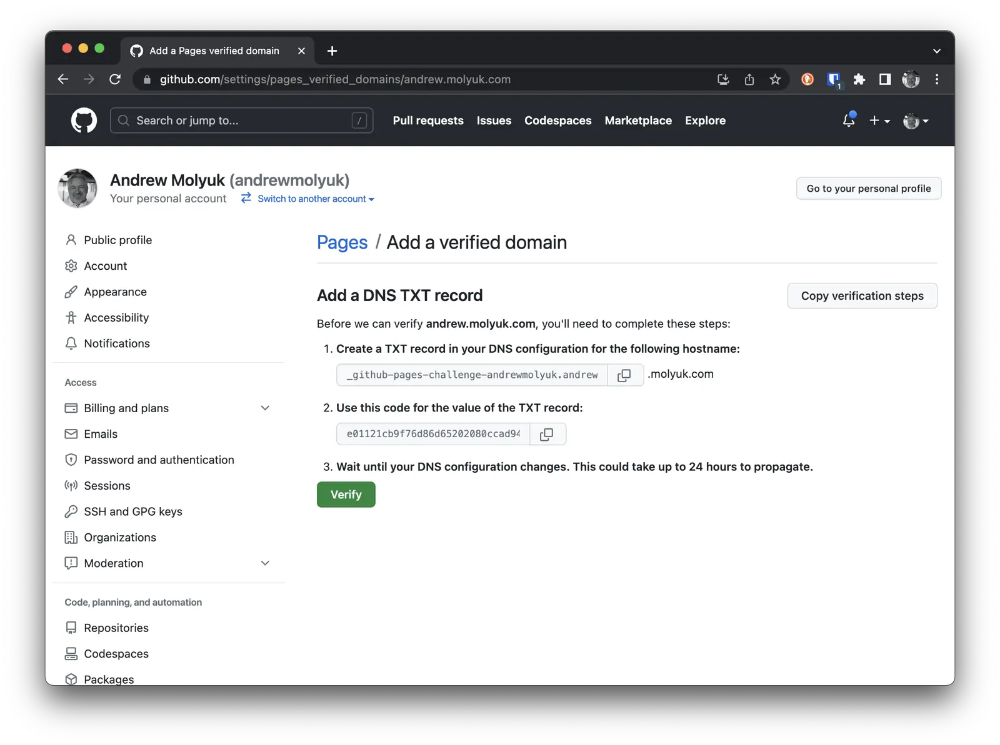
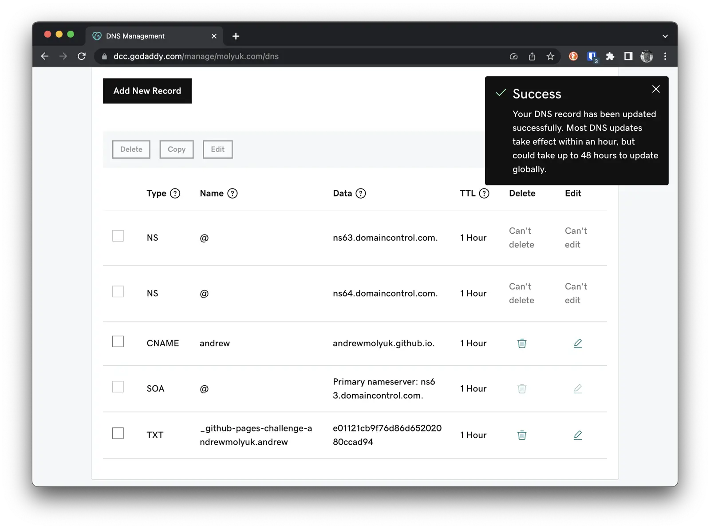
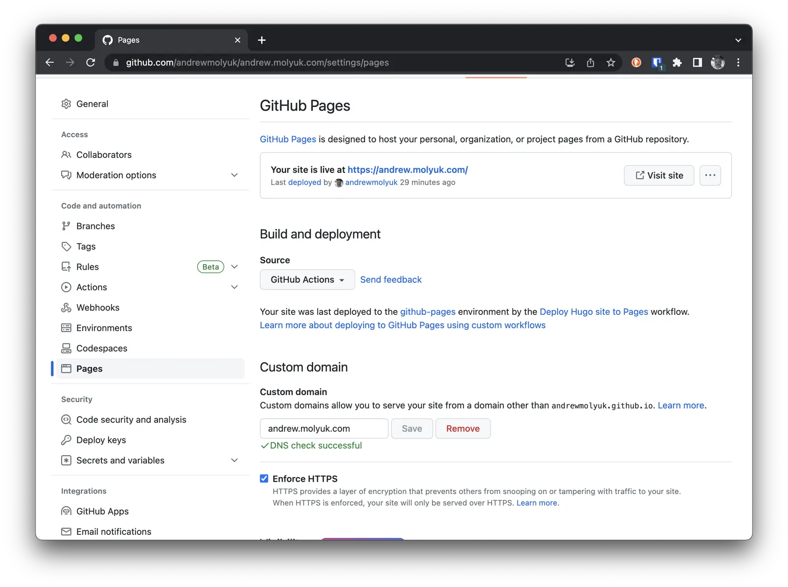

In order for the website to be accessible on the internet, it makes sense to publish it on some hosting platform. Such hosting platforms can be Netlify, GitHub Pages, GitLab Pages, Amazon S3, Google Cloud Storage, Firebase Hosting, Surge.sh, Aerobatic, CloudCannon, Neocities, GitBook, Heroku, Rackspace, OpenShift, CloudFront, Fastly, and others.

I decided to publish my website on GitHub Pages because it is free and convenient. Besides, since I already use GitHub to store and manage the source code of my website, it would be a logical choice. In this article, I will explain what needs to be done to publish a website on GitHub Pages using GitHub Actions.

<!--more-->

## Creating a workflow

In GitHub Actions, there is a concept called a workflow. A workflow is a set of tasks that are executed under specific conditions and events. For example, a workflow can be triggered on each push to the repository or when a pull request is created. A workflow can be triggered manually or on a schedule. It can also be triggered by specific events within the repository, such as the creation of a new issue or a new comment.

To publish a website on GitHub Pages, we need to create a workflow that will run on each push to the repository. While it's possible to create a workflow manually, in our case, it's not necessary because GitHub provides us with a template for working with Hugo. To use this template, we need to navigate to the Settings section in our repository and select Pages from the menu on the left. Then, in the Source section, choose GitHub Actions and click the Configure button for the Hugo template.



In general, you can use this template right away, but in our case, we need to make some changes. To avoid duplicating the command to build the website, you need to replace the following lines:

```yaml
run: |
  hugo \
    --minify \
    --baseURL "${{ steps.pages.outputs.base_url }}/"
```

with the following ones:

```yaml
run: make build
```

In this case, the make build command will be executed with the same parameters as in the original template on our local computer. Then, click on the Commit changes... button and then on the Commit changes button in the pop-up window.



After that, GitHub will create a file named `.github/workflows/hugo.yml` in our repository. This file is our workflow. In the future, we can modify this file to add new tasks or change the conditions for running the workflow.

From this point on, every push to the repository will trigger the workflow, which will build the website and publish it to GitHub Pages. We can switch to the "Actions" tab in our repository to view the workflow's results.



Once the workflow successfully completes, we can go to the "Settings" tab and then select "Pages" in our repository to see that the website is published and also find the link to it. By clicking on this link, we can view our website.



## Adding a Domain

By default, the website will be accessible at the address `https://andrewmolyuk.github.io/andrew.molyuk.com/`. However, we can add our own domain and make the website available at `https://andrew.molyuk.com/`.

To do this, we need to confirm that the domain belongs to us and verify it on GitHub. To accomplish this, we need to go to the "Settings" section of our account, not the repository. This is an important distinction. Then, select "Pages" from the left menu and click on the `Add domain` button.



Next, we proceed to the domain registrar and add a CNAME DNS record for the domain andrew.molyuk.com, pointing to andrewmolyuk.github.io, and a verification TXT DNS record for the domain \_github-challenge-andrew.molyuk.com.



Now, we need to wait for some time for the DNS records to update. After that, we can return to the "Settings" section of our account and verify the domain. Then, we go back to the "Settings" section of the repository and add the domain. Make sure to check the box for `Enforce HTTPS` - this will enable the use of the HTTPS protocol to access the website.



After this, the website will be accessible at the address `https://andrew.molyuk.com/`.

## Adding a Google Analytics 4

To add Google Analytics 4 to a Hugo site, you need to insert the following code into your file `layouts/partials/head.html`:

```html
{{ if .Site.IsServer }} {{ template "_internal/google_analytics.html" . }} {{ end }}
```

Next, you need to add the following parameters to the `config.toml` file:

```toml
googleAnalytics = 'G-J9DSCZ2KKH'
```

After that, you need to run the command `make build` and then push the changes to the repository. After this, Google Analytics 4 will start working on the website.

## Conclusion

In this article, we have discussed how to publish a Hugo website on GitHub Pages and how to add a custom domain to it. Additionally, we have added Google Analytics 4 to track website visits. All the source code can be found in the [GitHub repository](https://github.com/andrewmolyuk/andrew.molyuk.com) of this website.

If you enjoyed this article, please share it with your friends. If you have any questions, feel free to reach out to me.
