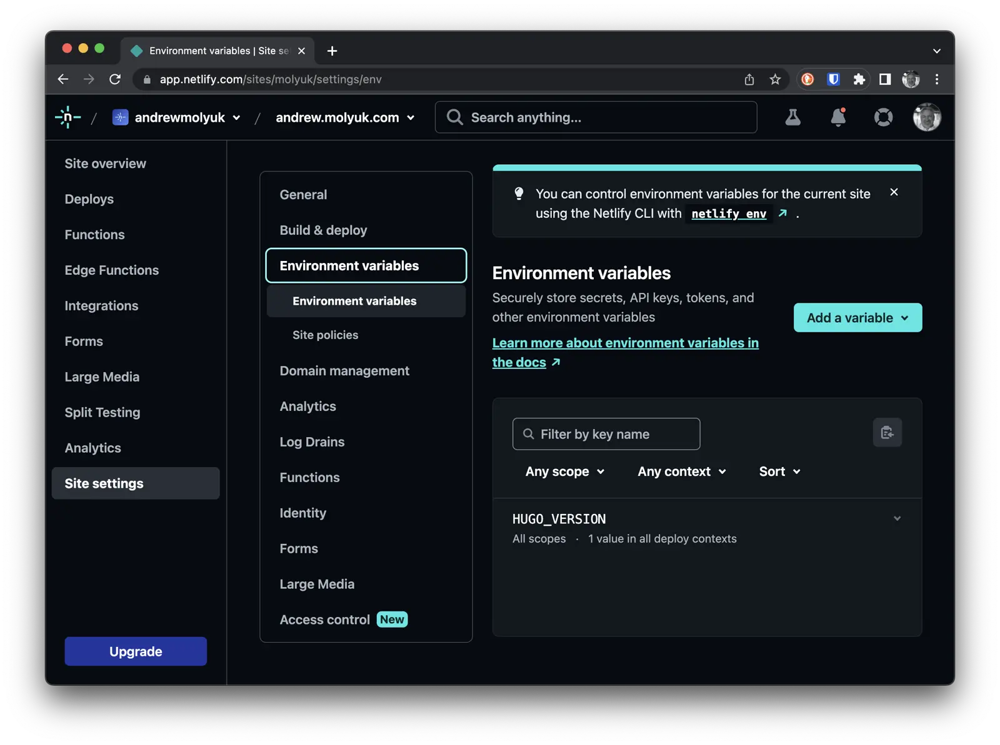

I wanted my site to be available under the following names: andrew.molyuk.com and molyuk.com, and I couldn't achieve this on GitHub Pages. So, I decided to use Netlify. As it turned out, deploying Hugo on Netlify is very simple. In this post, I'll tell you how I did it.

First, we need to create an account on Netlify. After that, we need to create a new site. Click on the "Add a new site" button and follow the instructions. Basically, that's all we need to do on Netlify to make the site publicly available.

<!--more-->

Additionally, I adjusted the build command so that Netlify could build my site. Now it looks like this:


To make my site available under the names andrew.molyuk.com and molyuk.com, I needed to configure DNS records. I logged into my GoDaddy account and added the corresponding DNS records. Here's what it looked like:


Then I added and verified the domains on Netlify. As a result, it turned out like this:


That's it - now my site is available at the addresses: andrew.molyuk.com and molyuk.com, and I can publish new posts without worrying about how to deploy them.

There's a small detail I'd like to mention. When I built my site on Netlify, I found that my local version of Hugo differed from the one used on Netlify. This led to build failures. I solved this problem by adding an environment variable `HUGO_VERSION` to the Netlify settings and specifying the Hugo version number in its value. In my case, it was version `0.111.3`. Now my build works both on my local machine and on Netlify.



n addition to everything else, Netlify provides a build status badge that can be placed in the README.md file.

```markdown
[](https://app.netlify.com/sites/molyuk/deploys)
```

## Conclusion

I hope this post will help you deploy your site on Netlify. If you have any questions, please feel free to ask me. Thanks for reading!
