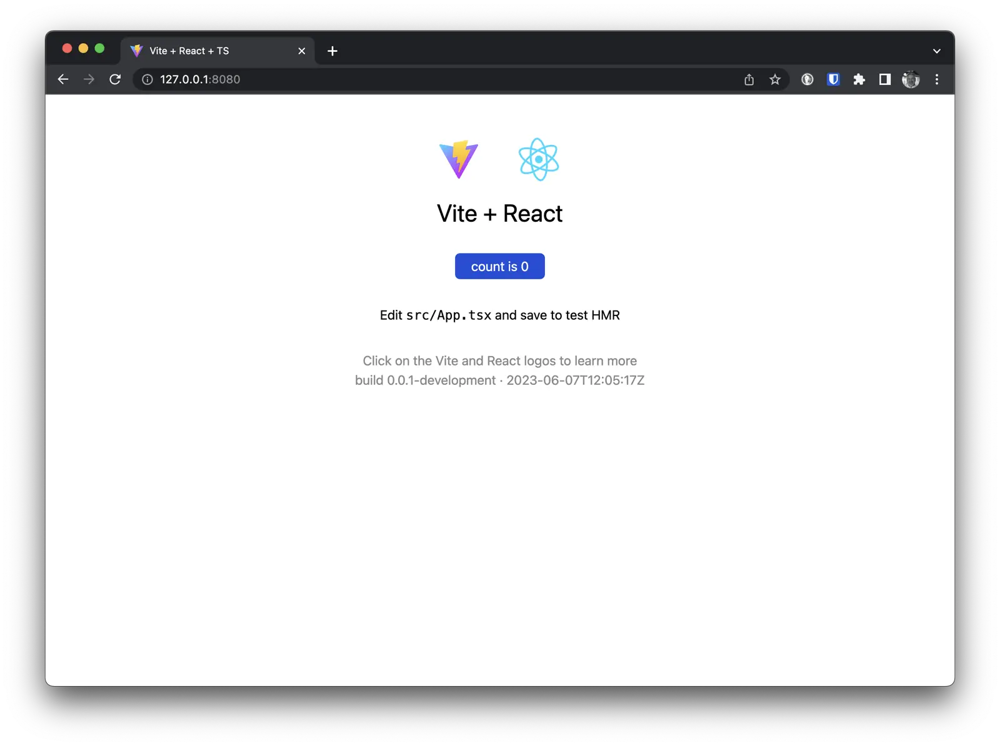

When we build a Docker image of our application, we already know which version of the application will be in it. But
often we don't bother passing this information inside the container. Especially when it comes to web applications.
However, this can be useful. For example, for error monitoring, it will definitely be helpful to know which version of
the application crashed and when it was built.

In this article, I'll explain how to pass information about the application version inside the container. This applies
to applications in Go as well as web applications in Node.js. I'll also show how to use this information inside the
container.

<!--more-->

## Arguments in Dockerfile

To pass information about the version inside the container, we need to provide this information during the build
process. We can use build arguments for this purpose. The `ARG` directive is used to pass build arguments into a
Dockerfile. Here's how we can pass the arguments `BUILD_REF` and `BUILD_DATE` into the container:

```dockerfile
ARG BUILD_REF
ARG BUILD_DATE
```

Next, we can use these arguments inside the Dockerfile. For example, here's how we can use version information in the
image metadata:

```dockerfile
LABEL org.opencontainers.image.revision="${BUILD_REF}" \
      org.opencontainers.image.created="${BUILD_DATE}"
```

I use [Open Container Initiative](https://opencontainers.org/) metadata, but you can use any metadata you prefer. It's
important that these metadata are accessible inside the container. However, I still recommend using
[Open Container Initiative](https://opencontainers.org/) metadata because they are standardized and supported by most
tools. For example, you can use these metadata in [Sentry](https://sentry.io/) to display the application version in
error reports. Or you can use them in [Prometheus](https://prometheus.io/) to display the application version in
metrics.

## Building a Go application

To pass version information into a Go application, we can use the `ldflags` compiler flag. For this, we need to specify
the following parameters in the Dockerfile for building the Go application:

```dockerfile
RUN go build -ldflags "-X main.BuildRef=${BUILD_REF} -X main.BuildDate=${BUILD_DATE}" -o /app
```

Please note that I'm using `main.BuildRef` and `main.BuildDate` variables. This means that these variables will be
accessible within the `main` package. If you want to use these variables in other packages, you'll need to use different
variable names.

Now, when we build our application, we'll be able to see version information inside the compiled binary file built
within the container:

```bash
docker run --rm -it go-app:latest /app -version
```

Certainly, to achieve this, we'll need to add code to our application that handles the `-version` flag. But it's not
complicated:

```go
package main

import (
	"flag"
	"fmt"
	"os"
)

var (
	BuildRef  string = "unknown"                         //nolint:gochecknoglobals // Populated by ldflags.
	BuildDate string = "Mon, 02 Jan 2006 15:04:05 -0700" //nolint:gochecknoglobals // Populated by ldflags.
)

func main() {
	version := flag.Bool("version", false, "Print version information")
	flag.Parse()

	if *version {
		fmt.Printf("Build: %s\n", BuildRef)
		fmt.Printf("Date: %s\n", BuildDate)
		os.Exit(0)
	}
}
```

The version information is passed into the application at build time. Therefore, if you want to update the version
information in an already built application, you'll need to rebuild the application.

## Environment Variables

To pass version information into a Node.js application, we can use environment variables. For this, we need to specify
the following parameters in the Dockerfile for building the Node.js application:

```dockerfile
ENV BUILD_REF=${BUILD_REF}
ENV BUILD_DATE=${BUILD_DATE}
```

Now, when we build our application, we'll be able to use these variables inside the application anywhere:

```javascript
console.log(`Build: ${process.env.BUILD_REF}`);
console.log(`Date: ${process.env.BUILD_DATE}`);
```

## Using package.json

Passing version information into the application through environment variables has its advantages and disadvantages. The
main advantage of this method is simplicity. On the other hand, this method sets the version information in the
application environment, which is not part of the application code itself. In most cases, this is not a problem, but I'm
not very comfortable with it, and I prefer to add version information during the build process to the `package.json`
file and use this information in the application.

Let's add the following parameters to the `package.json` file:

```json
{
  "version": "0.0.1",
  "buildRef": "unknown",
  "buildDate": "Mon, 02 Jan 2006 15:04:05 -0700"
}
```

Let's create a helper script `deploy/update-package-json.js`:

```javascript
// This script is used to update the package.json file with the build reference and build date from the build process.
import fs from 'fs';

const buildRef = process.argv[2];
const buildDate = process.argv[3];

if (!buildRef || !buildDate) {
  console.log('Please provide a build reference and build date');
  process.exit(1);
}

fs.readFile('./package.json', (err, data) => {
  if (err) throw err;

  let packageJsonObj = JSON.parse(data.toString());
  packageJsonObj.buildRef = `${buildRef}`;
  packageJsonObj.buildDate = `${buildDate}`;
  packageJsonObj = JSON.stringify(packageJsonObj);

  fs.writeFile('./package.json', packageJsonObj, (err) => {
    if (err) throw err;
    console.log('The file has been saved!');
  });
});
```

Now we can use this script in our `Dockerfile`:

```dockerfile
COPY deploy/update-package-json.js deploy/update-package-json.js

RUN chmod +x deploy/update-package-json.js && \
    node deploy/update-package-json.js "${BUILD_REF}" "${BUILD_DATE}"
```

Now, when we build our application, we'll be able to see version information inside the compiled web application in the
container. For example, we can use this information in one of the React application files:

```javascript
import packageJson from '../package.json';

console.log(`Build: ${packageJson.buildRef}`);
console.log(`Date: ${packageJson.buildDate}`);
```

Now we can use this information anywhere in our application.



## Building on GitHub Actions

Now that we know how to pass version information into our applications, let's see how we can do this during the build
process on GitHub Actions. For this, we'll need to use GitHub Actions' internal variables and pass them into our
application during the build. For example, we can use the following code in our workflow:

```yaml
- name: Set build reference and build date
  run: |
    echo "BUILD_REF=${{ github.sha }}" >> $GITHUB_ENV
    echo "BUILD_DATE=$(date -u '+%Y-%m-%d %H:%M:%S')" >> $GITHUB_ENV

- name: Display Environment Variables
    run: |
      echo "Build Ref: BUILD_REF"
      echo "Build Date: $BUILD_DATE"
```

You can notice that we use the internal GitHub variable `github.sha` to set the value of the `BUILD_REF` variable.
Alternatively, you can use a more traditional approach, like this:

```yaml
- name: Set build reference and build date
  run: |
    echo "BUILD_REF=$(git rev-parse HEAD)" >> $GITHUB_ENV
```

I think using GitHub's internal variables is more convenient as they are already available during the execution of our
workflow.

## Conclusion

In this article, we explored several examples and methods of passing version information into our applications. I showed
how I do this in my projects with Go and Node.js. I also demonstrated how to use GitHub Actions' internal variables to
pass version information during the build process. Additionally, we used version information in the Docker image
metadata. This can be useful if you want to track the versions of your images in your Docker registry. I hope you found
this article helpful and informative. Feel free to reach out to me if you have any questions or suggestions, and I'll be
happy to answer them.
