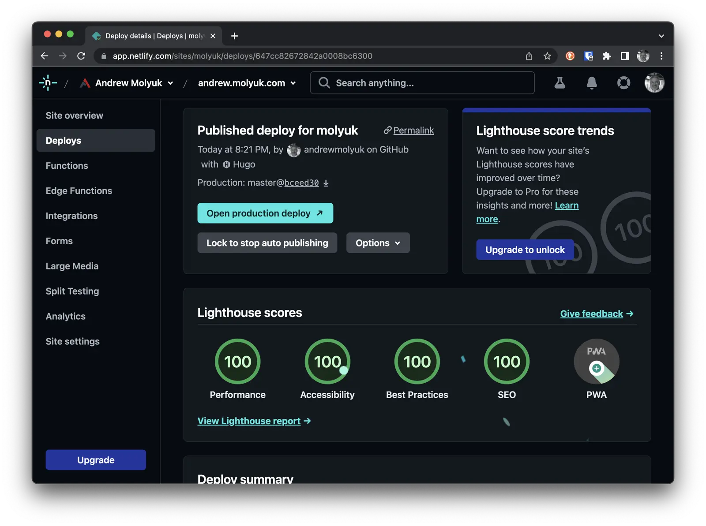

Recently, there's been increasing emphasis on website performance. It's no wonder, as people have become more demanding
about the speed of website loading. Therefore, it's crucial to monitor your site's performance. This can be done using
Lighthouse.

Lighthouse is a tool for analyzing web page performance, and Netlify provides the capability to run Lighthouse for each
deployment. This is very convenient as it allows you to track changes in your site's performance. By default, Lighthouse
runs only for the homepage. But what if you need to assess the performance of other pages? In this article, I'll explain
how to do that.

<!--more-->

## Setting Up Netlify

First, we need to configure Netlify. To do this, go to the `Build & deploy` section and click on the `Edit settings`
button in the `Post processing` section. In the pop-up window, enable the option
`Run Lighthouse tests after every deploy` and click on the `Save` button. Now, Lighthouse will run after each
deployment.



## Setting Up Lighthouse

We need to install Lighthouse as a local package. To do this, execute the following command:

```bash
npm install @netlify/plugin-lighthouse
```

There is no need to install Lighthouse as a global package. Netlify will use the local version, which we can configure
through the `netlify.toml` file.

To run Lighthouse not only for the homepage but also for other pages, we need to create a `netlify.toml` file in the
project's root. In this file, specify the list of pages to be audited by Lighthouse. In my case, it looks like this:

```toml
[[plugins]]
package = "@netlify/plugin-lighthouse"

[plugins.inputs.settings]
locale = "ru"

[plugins.inputs.thresholds]
performance = 0.9
accessibility = 0.9
best-practices = 0.9
seo = 0.9
pwa = 0.7

[[plugins.inputs.audits]]
path = "index.html"

[[plugins.inputs.audits]]
path = "blog/index.html"

[[plugins.inputs.audits]]
path = "projects/index.html"

[[plugins.inputs.audits]]
path = "blog/tags/hugo/index.html"

[[plugins.inputs.audits]]
path = "blog/howto-deploy-hugo-to-netlify/index.html"
```

In this file, I specified the list of pages to be audited. I also set the locale to `ru` and the threshold values for
all metrics. By default, the threshold values are `1.0`, but I lowered them to `0.9` to avoid errors during deployment.
I significantly reduced the threshold for the PWA metric since my site is not a PWA, and I don't intend to spend time
increasing this metric. Perhaps in the future, I will make my site a PWA, but not yet.

You can also deploy the results of each Lighthouse audit to your site. To do this, add the following:

```toml
[[plugins.inputs.audits]]
path = "index.html"
output_path = "lighthouse.html"
```

In this case, the audit results will be available at `https://andrew.molyuk.com/lighthouse.html`. However, I chose not
to do this as I don't want to clutter the site with extra pages. Instead, I use the Netlify dashboard, which allows me
to view the audit results.


It's worth noting that I intentionally configured Netlify via the UI rather than through `netlify.toml`. This allows me
not to store deployment configuration information in the repository from a security standpoint.

## Conclusion

In this article, I explained how to set up Lighthouse for Netlify. Now, you can check your site's performance after each
deployment, which is very convenient for tracking changes in your site's performance. I also described how to configure
Lighthouse to audit not only the homepage but also other pages. Now you have the ability to assess the performance of
any page on your site.

I hope this article was helpful, and you can apply it in practice. Feel free to ask questions, and I'll try to answer
them as soon as possible.
