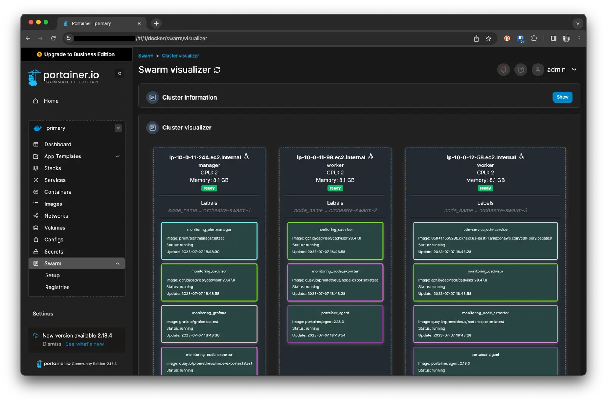
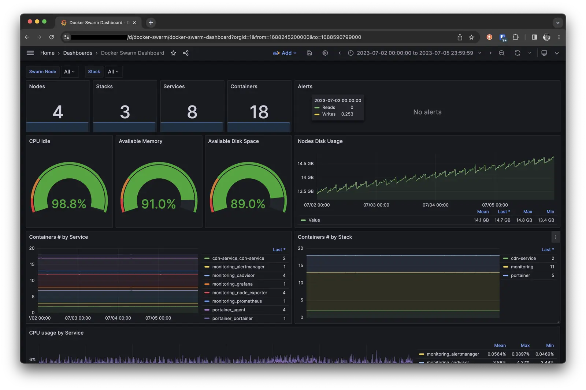
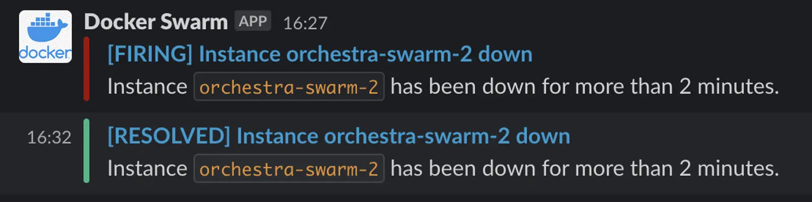

Scaling applications and ensuring service availability are essential parts of any project, and at some stage of
development, they become a necessity. Kubernetes is one of the tools that can address all these needs, but it comes with
its costs — support and setup. However, in the end, it's worth it for large projects. But what about small projects? To
avoid using a sledgehammer to crack a nut, we decided to use Docker Swarm. It doesn't require such hefty investments in
support and setup but still allows scaling applications and ensuring high-level service availability. In this article,
I'll explain how to set up a Docker Swarm cluster and configure monitoring using Prometheus and Grafana with Slack
notifications.

<!--more-->

There will be a lot of material, so I wanted to split it into several parts. But remembering how I myself searched for
information on this topic, I decided to gather everything in one article. Therefore, I'll warn you right away that the
article will be long and mostly technical. Let's get started!

## What is Docker Swarm?

Docker Swarm is a tool for orchestrating Docker containers. It tightly integrates with Docker Engine and allows you to
start working without installing additional software. Like any other orchestrator, Docker Swarm enables you to scale
applications and ensure service availability.

First, let's define some terminology. In Docker Swarm, there are several key concepts:

- **Node** - is a server running Docker Engine. A Docker Swarm cluster can have multiple nodes. Nodes can be both
  virtual and physical servers. The node where the Docker Swarm cluster is initialized is called the manager. Nodes that
  join the cluster are called worker nodes. The manager node stores the cluster's state and is responsible for its
  management. Worker nodes execute tasks assigned to them by the manager. Worker nodes do not store the cluster's state.

- **Stack** - is a set of services logically grouped together. For example, it can be a group of services responsible
  for a specific part of an application, such as monitoring. A Stack is described in a docker-compose.yml file and is
  deployed using the `docker stack deploy` command. A Docker Swarm cluster can have multiple stacks.

- **Service** - is a description of a single service in a stack. For example, it can be a description of a web server or
  a database. A Service is described in a docker-compose.yml file and is created using the `docker service create`
  command. A stack can have multiple services. We never launch a service directly, only within a stack.

- **Task** - is a running container. Each Service launches one or more tasks. Each task runs on one of the worker nodes
  in the cluster. If a node fails, the manager starts a task on another node, ensuring the service is always available.
  This term hasn't become widely adopted, and we still commonly use the word "container".

## Installing Docker Swarm and Setting Up the Cluster

First, we need to install Docker Engine on the servers that will be part of the cluster. In our case, we'll use 4 EC2
instances in AWS. To install Docker Engine on EC2 instances, you can use the following commands:

```bash
sudo yum update
sudo yum install docker
sudo usermod -a -G docker ec2-user
newgrp docker

wget https://github.com/docker/compose/releases/latest/download/docker-compose-$(uname -s)-$(uname -m)
sudo mv docker-compose-$(uname -s)-$(uname -m) /usr/local/bin/docker-compose
sudo chmod -v +x /usr/local/bin/docker-compose

sudo systemctl enable docker.service
sudo systemctl start docker.service

sudo systemctl status docker.service
docker version
docker-compose version
```

After installing Docker Engine on all servers, we can begin setting up the Docker Swarm cluster. To do this, execute the
following command on one of the servers:

```bash
docker swarm init
```

After running this command, you'll receive output containing a command to join other servers to the cluster. For
example:

```bash
docker swarm join --token SWMTKN-1-01234567890123456789012345678901234567890123456789-1234567890123456789012345 10.0.128.109:2377
```

Execute this command on all other servers. Then, you can check the status of the cluster using the command:

```bash
docker node ls
```

This command will display a list of all nodes in the cluster.

If the nodes cannot see each other, you need to open ports `2377`, `7946`, and `4789` in the AWS Security Group.

With that, the Docker Swarm cluster setup is complete. Now, we can deploy stacks and services on it.

## Installing Portainer

Portainer is a web interface for managing Docker. It allows you to control Docker Swarm, deploy stacks and services,
scale services, and more.

Portainer requires access to the Docker API via a socket, so make sure TCP Socket is enabled in Docker Engine.

Portainer can be launched as a regular container, but we'll deploy it as a stack. To do this, SSH into the manager node
and run the following commands:

```bash
curl -L https://downloads.portainer.io/ce2-18/portainer-agent-stack.yml -o portainer-agent-stack.yml
docker stack deploy --with-registry-auth --compose-file portainer-agent-stack.yml portainer
```

These commands will download the docker-compose.yml file with the stack description and deploy it.

Pay attention to the `--with-registry-auth` option. It's needed for Portainer to work with private Docker repositories
and pass the authentication token to worker nodes. We won't need this because we won't be deploying services through
Portainer.

Since our machine is in a private network, we don't have access to Portainer ports. To access it from the outside, we'll
use the SSM Agent with the command:

```bash
aws ssm start-session --target i-0123456789abcdef --document-name AWS-StartPortForwardingSessionToRemoteHost \
  --parameters '{"portNumber":["9443"], "localPortNumber":["9443"]}'
```

After that, Portainer will be available at `https://127.0.0.1:9443`. When you first launch Portainer, it will prompt you
to enter an admin password. After that, you'll land on the Portainer homepage. Among all available options, I
particularly like the visualization section. Here, you can see all cluster nodes, the containers running on them, and
their status.



But since we don't have many of them yet, let's move on to the next step.

## Installing Prometheus, Grafana, and Setting Up Slack Notifications

Prometheus is a monitoring and tracing system. It allows you to collect metrics from various services and visualize them
in Grafana. Prometheus consists of several components: a server, exporters, and clients. The server collects metrics
from exporters and stores them in a database. Clients gather metrics from applications and send them to the server.
Exporters collect metrics from various services and send them to the server.

We will use Prometheus to collect metrics from Docker Swarm and send them to Grafana. To collect metrics, we'll use
`cadvisor` and `node-exporter`. `cadvisor` collects metrics from containers, while `node-exporter` collects metrics from
nodes. For Slack notifications, we'll use `alertmanager`.

You can run Prometheus as a regular container, but we'll deploy it as a stack. To do this, SSH into the manager node and
create a `monitoring.yml` file with the following content:

```yaml
version: '3.8'

services:
  prometheus:
    image: prom/prometheus:latest
    ports:
      - '9090:9090'
    networks:
      - monitoring
    volumes:
      - /var/run/docker.sock:/var/run/docker.sock:ro
      - /etc/prometheus:/etc/prometheus
      - prometheus-data:/prometheus
    user: root # only user root can use the docker socket
    command: '--web.enable-lifecycle --config.file=/etc/prometheus/prometheus.yml'
    deploy:
      mode: replicated
      replicas: 1
      placement:
        constraints: [node.role == manager]
    depends_on:
      - cadvisor
      - node_exporter
      - alertmanager

  grafana:
    image: grafana/grafana:latest
    ports:
      - '3000:3000'
    networks:
      - monitoring
    volumes:
      - grafana-data:/var/lib/grafana
    deploy:
      mode: replicated
      replicas: 1
      placement:
        constraints: [node.role == manager]
    depends_on:
      - prometheus

  node_exporter:
    image: quay.io/prometheus/node-exporter:latest
    ports:
      - target: 9100
        published: 9100
        protocol: tcp
        mode: host
    command:
      - '--path.rootfs=/host'
    networks:
      - monitoring
    volumes:
      - '/:/host:ro,rslave'
    deploy:
      mode: global

  cadvisor:
    image: gcr.io/cadvisor/cadvisor:v0.47.0
    volumes:
      - /:/rootfs:ro
      - /var/run:/var/run:rw
      - /sys:/sys:ro
      - /var/lib/docker/:/var/lib/docker:ro
    ports:
      - target: 8080
        published: 8080
        protocol: tcp
        mode: host
    networks:
      - monitoring
    deploy:
      mode: global

  alertmanager:
    image: prom/alertmanager:latest
    command:
      - '--config.file=/etc/alertmanager/alertmanager.yml'
      - '--storage.path=/alertmanager'
    ports:
      - '9093:9093'
    networks:
      - monitoring
    volumes:
      - /etc/alertmanager:/etc/alertmanager
      - alertmanager-data:/alertmanager
    deploy:
      replicas: 1
      placement:
        constraints:
          - node.role==manager

volumes:
  prometheus-data:
    name: prometheus-data
    driver: local
  grafana-data:
    name: grafana-data
    driver: local
  alertmanager-data:
    name: alertmanager-data
    driver: local

networks:
  monitoring:
    driver: overlay
```

This file describes a Stack consisting of several services: `prometheus`, `grafana`, `node_exporter`, `cadvisor`, and
`alertmanager`. For each service, we specify the image, ports, networks, startup command, number of replicas, and so on.
For the `prometheus`, `grafana`, and `alertmanager` services, we indicate that they should only run on the manager node.
For the `node_exporter` and `cadvisor` services, we specify that they should run on all nodes.

There's no need for special configuration for the exporters, but for `prometheus` and `alertmanager`, we need to create
configuration files. For `prometheus`, we'll create a file `/etc/prometheus/prometheus.yml` with the following contents:

```yaml
# Prometheus global config
global:
  scrape_interval: 15s # Set the scrape interval to every 15 seconds. Default is every 1 minute.
  evaluation_interval: 15s # Evaluate rules every 15 seconds. The default is every 1 minute.

scrape_configs:
  - job_name: 'prometheus'
    static_configs:
      - targets: ['localhost:9090']

  - job_name: 'alertmanager'
    static_configs:
      - targets: ['alertmanager:9093']

  - job_name: 'docker'
    dockerswarm_sd_configs:
      - host: unix:///var/run/docker.sock
        role: nodes
    relabel_configs:
      # Fetch metrics on port 9323.
      - source_labels: [__meta_dockerswarm_node_address]
        target_label: __address__
        replacement: $1:9323
      # Set labels
      - source_labels: [__meta_dockerswarm_node_label_node_name]
        target_label: node_name
      - source_labels: [__meta_dockerswarm_node_hostname]
        target_label: instance

  - job_name: 'node'
    dockerswarm_sd_configs:
      - host: unix:///var/run/docker.sock
        role: nodes
    relabel_configs:
      # Fetch metrics on port 8080.
      - source_labels: [__meta_dockerswarm_node_address]
        target_label: __address__
        replacement: $1:9100
      # Set labels
      - source_labels: [__meta_dockerswarm_node_label_node_name]
        target_label: node_name
      - source_labels: [__meta_dockerswarm_node_hostname]
        target_label: instance

  - job_name: 'cadvisor'
    dockerswarm_sd_configs:
      - host: unix:///var/run/docker.sock
        role: nodes
    relabel_configs:
      # Fetch metrics on port 8080.
      - source_labels: [__meta_dockerswarm_node_address]
        target_label: __address__
        replacement: $1:8080
      # Set labels
      - source_labels: [__meta_dockerswarm_node_label_node_name]
        target_label: node_name
      - source_labels: [__meta_dockerswarm_node_hostname]
        target_label: instance

# Alertmanager configuration
rule_files:
  - 'alerts.yml'

alerting:
  alertmanagers:
    - scheme: http
      static_configs:
        - targets:
            - 'alertmanager:9093'
```

Note that when describing the exporters, we specify labels `node_name` and `instance`. This is necessary for subsequent
visualization in Grafana. Additionally, we specify the file with alert rules, `alerts.yml`, which we'll create in the
same folder with the following contents:

```yaml
groups:
  - name: Docker Swarm Alerts
    rules:
      # Alert for any instance that is unreachable for >2 minutes.
      - alert: service_down
        expr: sum(up{node_name!=""}) by(node_name) / count(up{node_name!=""}) by(node_name) != 1
        for: 2m
        annotations:
          title: 'Instance {{ $labels.node_name }} down'
          description: 'Instance `{{ $labels.node_name }}` has been down for more than 2 minutes.'

      # Alert for any instance that is over 60% load for >2 minute.
      - alert: node_high_load
        expr: sum(node_load1) by(node_name) / count(node_cpu_seconds_total{mode="idle"}) by (node_name) > 0.6
        for: 2m
        annotations:
          title: 'Instance {{ $labels.node_name }} under high load'
          description: 'Instance `{{ $labels.node_name }}` is over 60% load more than 2 minutes.'
```

In this file, we describe the rules for triggering alerts. In this case, we outline two rules - if a node goes down and
if a node is under load. We specify that the alert should trigger if the condition persists for more than 2 minutes.

These are basic rules that can be customized to fit your needs. You can add new rules or modify existing ones. We'll
have the opportunity to do all of this later.

For `alertmanager`, we'll create a file named `/etc/alertmanager/alertmanager.yml` with the following content:

```yaml
global:
  resolve_timeout: 1m

route:
  receiver: 'slack'
  group_by: ['...']
  repeat_interval: 1h

receivers:
  - name: 'slack'
    slack_configs:
      - api_url: 'https://hooks.slack.com/services/T012345678/ABCDABCD123/0123456789abcd0123456789abcd'
        channel: '#alerts'
        send_resolved: true
        username: 'Docker Swarm'
        title: |-
          [{{ .Status | toUpper }}] {{ range .Alerts -}}{{ .Annotations.title }}{{ end }}
        text: >-
          {{ range .Alerts -}}{{ .Annotations.description }}{{ end }}
```

Since we have a small cluster, there's no need to group alerts. However, in the case of a larger cluster, grouping
alerts by nodes or service types could be beneficial. We disabled alert grouping to receive notifications for each alert
separately.

You can obtain the API URL for Slack in the settings of the Incoming WebHooks integration.

To collect metrics directly from `docker`, we'll use its native metrics. For this purpose, we need to add the following
configuration to `/etc/docker/daemon.json`:

```json
{
  "dns": ["1.1.1.1", "8.8.8.8", "8.8.4.4"],
  "metrics-addr": "0.0.0.0:9323"
}
```

You can specify your own DNS servers. We've chosen DNS servers from Cloudflare and Google. You can also add them to
`/etc/resolv.conf` or in `docker-compose.yml` under the `dns` section.

After that, we can start the services using the command:

```bash
docker stack deploy -c monitoring.yml monitoring
```

Then, we can access Grafana and add Prometheus as a data source. After that, you can start creating visualizations and
dashboards.

In our case, we'll use customized dashboards for Docker Swarm, which can be found online. For example, here's how our
Docker Swarm dashboard looks:



You can download the dashboard [here](dashboard-swarm.json).

Alerts in Slack will look something like this:



You can customize them as per your preference. I prefer concise notifications in Slack over lengthy ones.

For easier access to Grafana, you can use an ELB. To do this, create an ELB and add all nodes from the cluster to it.
Don't forget to create a rule in the Security Group for incoming traffic to the ELB. Avoid exposing your infrastructure
services publicly. In our case, we only allowed access from our office and home addresses.

## Installing a Service from AWS ECR

We use GitHub Actions to build and publish Docker images to AWS ECR. It looks something like this:

```yaml
name: Deploy

on:
  push:
    branches:
      - 'main'

jobs:
  docker:
    runs-on: ubuntu-latest
    env:
      DOCKER_IMAGE: 1234567890.dkr.ecr.us-east-1.amazonaws.com/service
      AWS_ACCESS_KEY_ID: ${{ secrets.AWS_ACCESS_KEY_ID }}
      AWS_SECRET_ACCESS_KEY: ${{ secrets.AWS_SECRET_ACCESS_KEY }}
      AWS_REGION: us-east-1

    steps:
      - name: Checkout source code
        uses: actions/checkout@v3

      - name: Login to Amazon ECR
        id: login-ecr
        uses: aws-actions/amazon-ecr-login@v1

      - name: Build and push to Amazon ECR
        id: docker_build
        uses: docker/build-push-action@v4
        with:
          file: ./Dockerfile
          context: .
          push: true
          build-args: |
            BUILD_REF=${{ github.sha }}
            BUILD_DATE=$(date -u +"%Y-%m-%dT%H:%M:%SZ")
          tags: ${{ env.DOCKER_IMAGE }}:latest,${{ env.DOCKER_IMAGE }}:${{ github.sha }}

      - name: Read docker-compose file
        id: file
        uses: jaywcjlove/github-action-read-file@main
        with:
          path: 'docker-compose.prod.yml'

      - name: Update service in Docker Swarm
        uses: debugger24/action-aws-ssm-run-command@v1
        id: ssm
        with:
          aws-region: us-east-1
          instance-ids: ${{ vars.INSTANCE_ID }}
          working-directory: /home/ec2-user
          commands: |
            echo '${{ steps.file.outputs.content }}' > service.yml
            aws ecr get-login-password --region us-east-1 | docker login --username AWS --password-stdin 1234567890.dkr.ecr.us-east-1.amazonaws.com
            docker stack deploy --with-registry-auth --compose-file service.yml service

      - name: Get the SSM command id
        run: echo "The Command id is ${{ steps.ssm.outputs.command-id }}"
```

Here, the `--with-registry-auth` parameter is very important. Without it, Docker Swarm won't be able to push images to
the worker nodes of the cluster.

## Conclusion

In this article, we've explored how to set up a Docker Swarm cluster and configure monitoring using Prometheus and
Grafana. We've also configured notifications in Slack. All of this allows us to promptly respond to issues in the
cluster and address them. If you have any questions, feel free to ask by reaching out to me.
