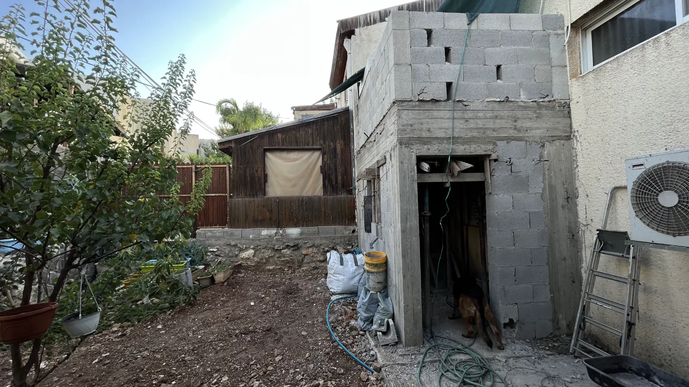
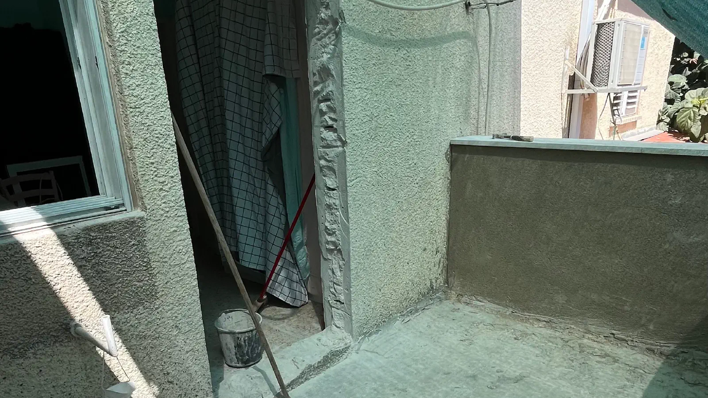

Good morning! I would like to apologize for the prolonged silence because I was busy building a room for my own office.
Historically, there are times when I work from home and I needed a place where I could fully dedicate myself to my
favorite work and not be distracted by household matters. So I decided to build myself an office room in my house. It
took about two months, and I was busy almost every day from morning till evening. But now all that is behind me, and I
can get back to my projects.

In addition to the office, my wife wanted us to have a glazed balcony where we could grow flowers, so the office
downstairs became the foundation for the balcony above. Here's what it looked like at the very beginning:

For the construction of the room, we needed to hire an architect who would develop the project and coordinate it with
the city authorities, and then develop a construction plan together with an engineer. When all the permits were
obtained, and we got permission to build, we started construction. There was no space for permitted construction in the
front yard, so we decided to build the room in the backyard. For the work, we decided to go with an Arab contractor,
and, jumping ahead, we were very pleased with the result.

At the very beginning, our plans were slightly disrupted by a rock on which the house stood, which required some changes
to the original plan, but the engineer approved everything, and we started pouring the foundation. It turned out a bit
larger because we couldn't dig into the rock, and a base had to be made for the columns. A huge truck with concrete
arrived, and the process began. To check the quality of the pour, a concrete sample is taken during pouring. The guys
arrived and took a sample straight from the mixer.

By morning, the concrete had hardened enough to start building the walls. We first launched the responsible four-legged
supervisor, and he immediately got down to business.

Then the workers came and started building the brick walls. Everything went quite quickly, and by evening, the walls
were almost ready.

The next day, the workers arrived and began to build formwork for the columns and then pour concrete. We left one column
for checking the quality of the concrete the next day.

After pouring the columns, they started building formwork for the ceiling. In the room itself, they placed columns and
laid wooden beams on them. Then they laid reinforcement. After that, the story with the mixer repeated itself, and we
poured the ceiling. As a bonus, we poured concrete between the building room and the pergola.

When the concrete on the balcony had set, we raised brick walls and laid the final layer of reinforcement and poured
concrete. The outlines of the room and the balcony appeared.

We removed the outer formwork, transplanted all the roses to the front yard, and scattered soil around the yard.

One of the air conditioners ended up in the passage, and the other was inside the room, so we moved them to the roof,
concealing all the pipes in boxes. We decided not to groove the walls. The heat was terrible, and the workers worked
from morning till night. But everything was done within the day. The guys did a great job. Everything was done quickly
and with quality.

We laid tiles on the balcony and window, then moved on to rough plastering.

After that, we applied the finishing touches. A tiler came and laid tiles in the room and the passage.

Jumping onto the balcony through the window got tiresome, so it was time to cut a door. The expansion on the second
floor began.

We sealed the balcony with bitumen and tiled it. Then we connected the electricity and water. The final finishing stage
began. We installed doors and windows. The walls were painted in a light sandy-yellow color. Most likely, we'll paint
the entire house like this.

When everything was completed, under the supervision of the responsible four-legged supervisor, we began to furnish the
room with furniture and appliances.

This is not the final version, but it's already workable. For now, all the items that were in the guest room where I
worked, we simply moved to the new office and will arrange them properly later.

That's the story. I am very pleased with the result. The room turned out to be very cozy and warm. I have spent several
evenings in it already and I really like it. I think it was a good investment of money and time. I hope you enjoyed this
story and you read it with pleasure.

Next on the agenda is the glazing of the balcony and the construction of a pergola over the entrance to the room.

See you soon!
