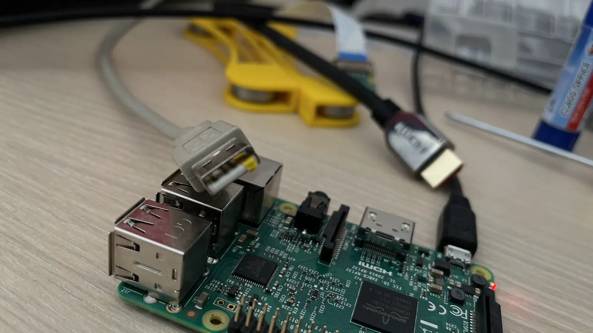

In the kitchen, the handle of my 3D-printed Geeetech MeCreator 2 broke, which was printed several years ago. I needed to
set up my old Raspberry Pi 3 to print a new handle. To avoid using the printer directly, I decided to install OctoPi on
it for easier control of the printing process.

There are various ways to install OctoPi, but I found the use of Raspberry Imager to be the quickest and most
convenient.

<!--more-->

First, you need to download the software from the original source - https://www.raspberrypi.com/software/. Then, run it
and select OctoPi from the extensive list of available operating systems. To access WiFi, you'll need to go to advanced
settings - click the gear icon on the right side of the screen.

There, choose network settings, select your network, and enter the password. Additionally, for security reasons, it's
advisable to change the default administrative username and password. If you need SSH access, check the box for it.

After configuring, you can proceed to write the disk image to the SD card.

Once the writing is complete, remove the card and insert it into the Raspberry Pi. Power it on and go to
http://octopi.local/. If you can't access it through this address, you can try accessing it via the IP address, which
can be found in the router settings. After a short and transparent setup process, everything should be up and running.

If you encounter a message about insufficient power supply, check if there are any unnecessary peripherals connected -
such as a monitor or keyboard. Only the printer and, at most, the camera should be connected. If you see that the
display on the printer lights up when the printer is turned off and the Raspberry Pi is on, it means the Raspberry Pi is
trying to power the printer, but it doesn't have enough voltage.

To prevent this, I cut a thin strip of electrical tape and covered the right positive contact on the USB connector. Now
it looks like this:

From this point on, I stopped receiving messages about insufficient voltage, and the printer only received power when it
was turned on.

Then I connected the camera and packed everything into a pre-prepared box.

That's it. Now you can access the OctoPi web interface and control the printer. If you enjoyed the article, feel free to
share it with your friends and give it a like. It will help me improve and write more. Happy printing!
