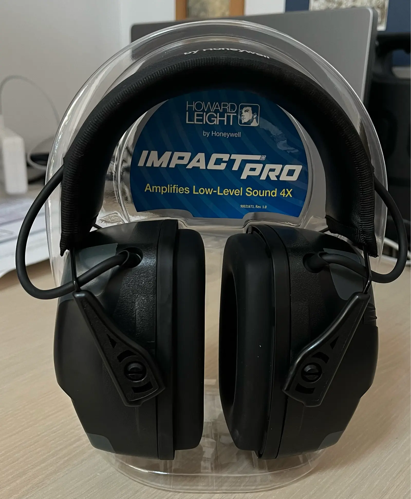

A new toy has arrived - the Howard Leight Impact Pro headphones. Purchased on [Amazon](https://www.amazon.com/dp/B007BGSI5U) for 58 American dollars, which turned out to be practically half price. The headphones came in a box containing the headphones themselves, instructions, 2 batteries, and a cable for connecting to a phone or MP3 player. The headphones are made of solid dark plastic and look quite high-quality. They have a decent weight, but not too heavy to be cumbersome.

<!--more-->

The Howard Leight Impact Pro headphones represent a professional version of active headphones developed by Howard Leight. Their outstanding feature lies in their maximum sound suppression with an SNR rating of 33 dB, making them leaders among counterparts from other manufacturers. Compared to other active headphones, such as Caldwell E-Max, Howard Leight Impact SportB, Peltor Tactical 6s, and Peltor Tactical 100, which have lower sound suppression ratings (ranging from 20 to 25 dB), the Impact Pro stands out with significantly higher noise suppression characteristics.

The active electronic system of the Howard Leight Impact Pro headphones includes separate stereo phones installed in the right and left ear cups. This allows for better orientation in the surrounding environment, enhancing comfort and safety during use. The system also features an intelligent function: built-in stereo microphones amplify ambient sounds up to a safe 82 dB, providing natural sound perception and enhanced communication. When the sound reaches or exceeds 82 dB, the headphones automatically switch to passive mode, blocking loud impulsive sounds to prevent hearing damage.

The thoughtful design of the Howard Leight Impact Pro headphones includes adjustable soft headband with telescopic height adjustment, providing a comfortable and secure fit. Rubberized pressure points prevent scratches on the headband, adding durability to the product. The external audio jack allows you to connect the headphones to various devices, which is a somewhat questionable feature, especially in today's era of total wireless connectivity.

Thanks to the use of multiple microphones, the headphones equalize background noise, highlight specific sounds such as whispers or footsteps, while suppressing sounds of machinery, such as car engine noise or gunfire.

The presence of two AAA batteries ensures long autonomous operation of the headphones (approximately 350 hours), and the automatic shutdown function after 4 hours of inactivity saves battery power. The Howard Leight Impact Pro provides a high level of hearing protection for shooters and shooting enthusiasts, while ensuring comfort and functionality at the highest level.

The Howard Leight Impact Pro headphones have two operating modes: active and passive. In passive mode, they function like regular headphones, simply reducing the volume of the sound. In active mode, they amplify sound, allowing you to hear sounds that you wouldn't hear in regular headphones. At the same time, they block gunshot sounds, preserving your hearing.

At the same time, the headphones do not block sounds that are not dangerous, such as human voices. Thus, you can talk to someone without removing the headphones. They also block wind noise, allowing you to hear the sounds of the wind without hearing the noise of the wind. This is very convenient, especially since the wind can be very loud, especially if you are outdoors.

They fit great on the head, snugly but not too tight. Even on my large head, they fit just right.

After testing the headphones at the shooting range, I was very satisfied with them. They excellently suppress the sound of gunshots while allowing you to comfortably converse with people and hear what's going on around you.

The only drawback I would note is that they amplify very weak sounds, such as whispers, quite well. This can be distracting, especially if someone opens a bag of chips and rustles them. On the other hand, this can be seen as part of the training :)

## Conclusion

In conclusion, the Howard Leight Impact Pro headphones turned out to be very comfortable and high-quality. They sit well on the head, are not too tight, and are quite comfortable and practical. They are not too expensive, but not too cheap either. They effectively suppress sound while not blocking sounds that are not dangerous. They are well suited for shooting or hunting. Personally, I give them an awesome and bold 5 with a plus sign. Very happy with the purchase.

I hope you enjoyed this review. If you have any questions or suggestions, please feel free to write to me, and I will be happy to answer all your questions.
