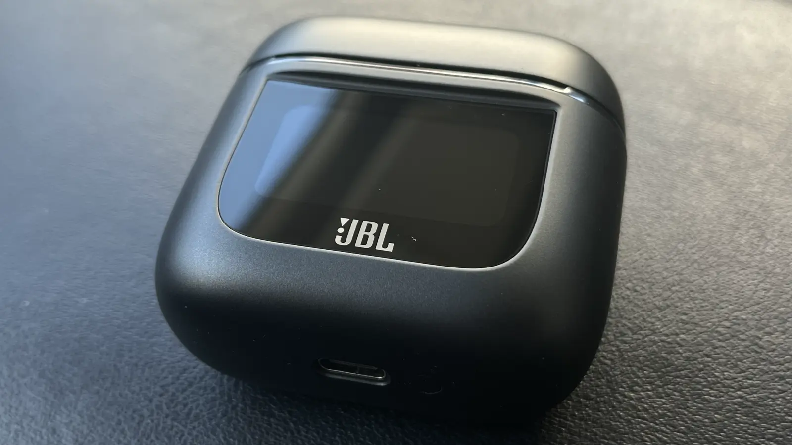
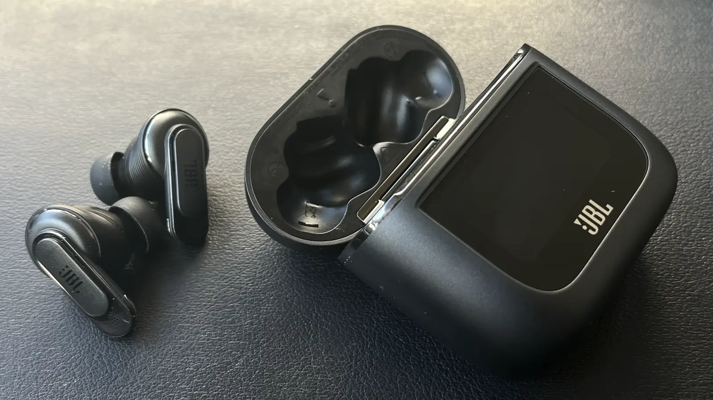
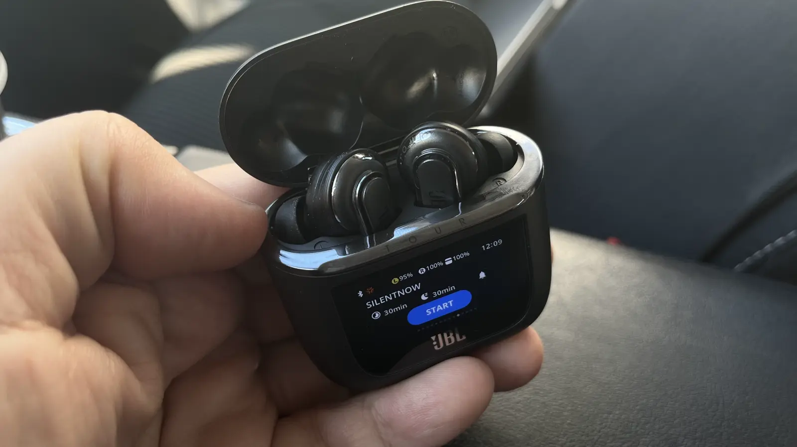

In this review, I'll talk about the JBL Tour Pro 2 headphones. These are wireless headphones with active noise
cancellation. I received them as a gift from Snegurochka for New Year's and decided to share my impressions. Let's go!

Less than a year ago, Apple patented a
[case for AirPods with a display](https://www.patentlyapple.com/2023/03/apple-invents-an-airpods-case-with-a-frontside-touch-display-allowing-users-to-interact-with-apps-for-music-apple-tv-maps.html)
on the front panel. This will allow users to interact with apps without taking the headphones out of the case or
launching the app on their phone. This is still just a patent, but it's quite possible that in the future we'll see such
a case on sale. For now, Apple is patenting what other manufacturers have already released on the market, which is a
clear reason for future legal disputes. One of the bright representatives of this trend is the case for the JBL Tour Pro
2 headphones.

Overall, the JBL Tour Pro 2 headphones are a serious competitor to Apple's products, especially considering the price.
In Europe, they are available for 249 euros, while the AirPods Pro 2 cost 299 euros on Apple's official website and also
249 euros from other sellers. If you're not a dedicated Apple fan and don't want to overpay for the brand, then the JBL
Tour Pro 2 headphones are an excellent choice.

Let's take a closer look at the case, which immediately grabs attention. There's a large touchscreen positioned right in
the middle, with the backside featuring a wireless charging pad, USB-C port, and a reset button at the bottom. The matte
plastic makes the case heavy and substantial, but its thickness may cause inconvenience when carrying it in jeans
pockets. However, for a bag or a larger pocket, this isn't an issue.

The JBL headphones provide a secure fit in the ears and have a less slippery surface, reducing the risk of accidental
dislodgement. Instead of the multitude of accessories offered for AirPods Pro 2, JBL Tour Pro 2 also provide various
cases, although I don't think the JBL case requires special protection except perhaps for screen protection.

The case screen plays a key role, providing convenient music playback control, noise cancellation adjustment, and much
more. With it, you can even decorate the screen with photos of your favorite cats. Bright and contrasty, it ensures
usability even in sunlight. The JBL screen becomes a key feature, setting these headphones apart from others, and
provides unique control capabilities without the need for a smartphone.

The screen perfectly complements the headphones, providing freedom from the need to extract the phone and adds
additional tactility. Track switching becomes special as it's done without touching the headphones or the smartphone
screen. Some may consider this unnecessary, but the screen here isn't just a detail, but a perfectly fitting addition,
especially if you're accustomed to constantly rotating and twirling the case.

One of the remarkable features of these headphones is their intelligent power-saving settings. In this mode, the
headphones go into sleep mode or shut down completely, allowing both the headphones and the case to retain charge almost
without losing it in the background. Even after a week in the case, the battery loss is only 5-10 percent. Deep sleep
mode ensures instant readiness for work and connection to the smartphone, although not as fast as with AirPods Pro 2.

The headphone app offers an impressive array of settings and modes, setting these headphones apart from many TWS models.
Upon initial connection, the headphones offer to determine the best fit, adjust noise cancellation, and choose a voice
assistant. Software updates may take up to 10 minutes, after which you can proceed to adjust noise cancellation, adapt
to ambient noise, and compensate for sound leakage.

The headphones provide the option of full noise cancellation or passing ambient sounds, including the TalkThru mode,
which slightly muffles all sounds around, amplifying only the speech of the person next to you. The equalizer offers
five preset settings and the ability to create a personal profile. All these functions emphasize the uniqueness and
personalization of these headphones, making them attractive to a wide range of users.

The results of the headphone sound tuning are saved, allowing for quick switching between settings before and after
tuning. The user can not only compare the headphone sound after tuning but also enhance their own voice during voice
chats, adjust the transparency of ambient sound, limit maximum volume, or try out proprietary spatial audio, adding
volume to all tracks.

A standout feature is the Quiet mode — SilentNow, which disconnects the headphones from the phone, creating a quiet
space with active noise cancellation. This mode also offers the ability to set the duration of the break and activate
the alarm after a certain time, which can be useful for short naps while traveling.

Among other settings, the user can reassign control of both headphones, enable or disable automatic playback when
removing or putting them on, find the headphones, and use smart optimization for music playback or video viewing with
minimal delay.

However, sound remains the focus. The JBL Tour Pro 2 impress with the quality of sound they provide right out of the
box, without additional settings. The headphones' sound is bright and juicy, and while by default it may seem lacking in
density and bass, noise cancellation quickly corrects this deficiency. The ability to customize via equalizers gives the
user full control over the sound experience. The headphones' battery life, quick charging, wireless charging, and splash
protection make them quite appealing.

Although the choice between JBL Tour Pro 2 and AirPods Pro 2 may depend on individual preferences, the JBL Tour Pro 2
impress not only with sound quality but also with long battery life and a variety of settings, making them an attractive
choice for those who value sound quality and functionality.

## Conclusion

In conclusion, the JBL Tour Pro 2 headphones are an impressive choice in the world of wireless headphones. They not only
successfully compete with Apple's products but also offer unique features. The smart case with a touchscreen, abundance
of settings in the app, thoughtful quiet mode, and, of course, impressive sound quality make them a wonderful choice for
those who appreciate innovation and high performance.

The ergonomic design of the headphones, allowing for safe and comfortable wearing, as well as the variety of case
covers, highlights attention to detail. Long battery life and quick charging ensure convenience throughout the day.
Despite the wealth of features, headphone control remains intuitive.

JBL Tour Pro 2 demonstrate that innovation and quality sound can be combined in one product. With the wide range of
functionality they offer, these headphones promise to satisfy the demands of both experienced audiophiles and ordinary
users, setting a high bar in the world of wireless headphones.

I hope you enjoyed this review. If you have any questions or suggestions, please write them in the comments below. I'll
be happy to hear from you and try to answer all your questions.
